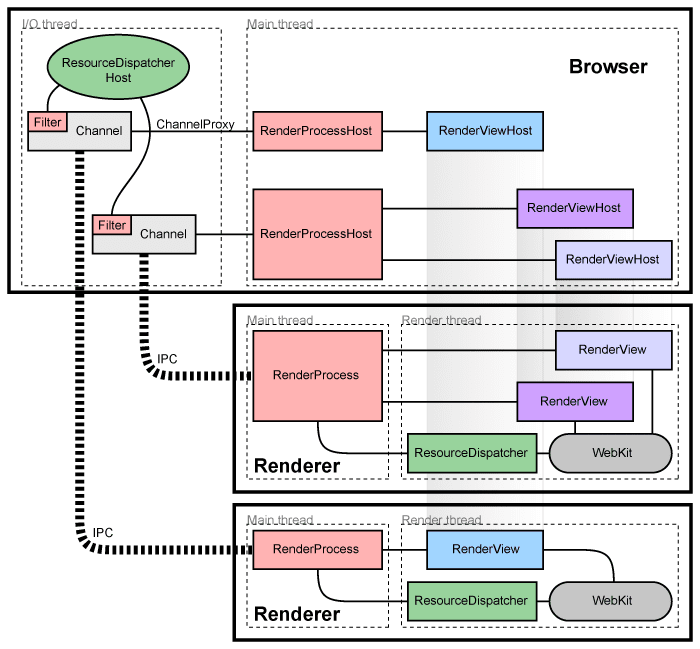
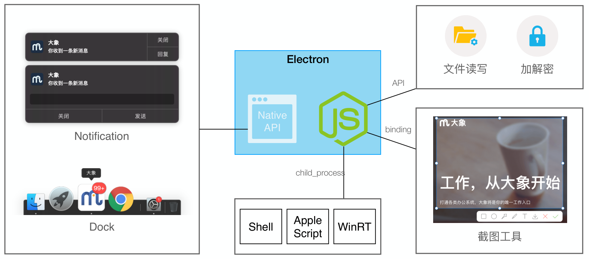
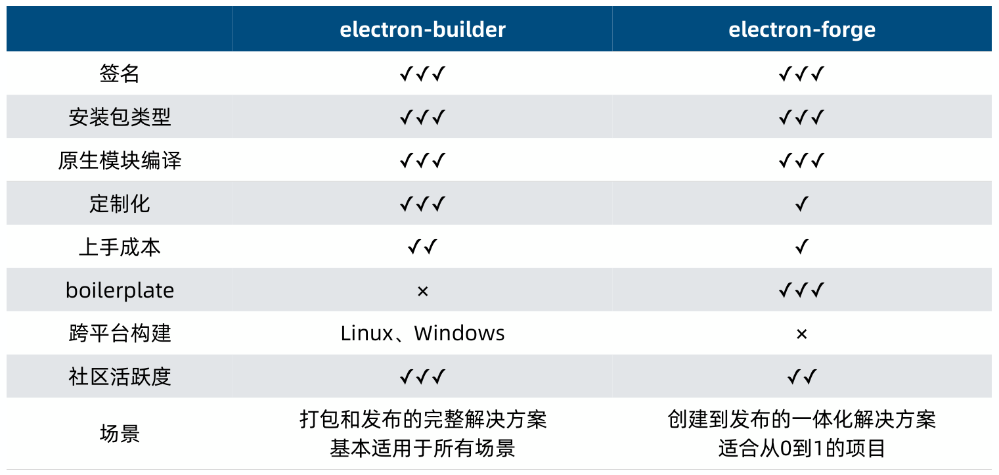

# 起步

[Electron](https://www.electronjs.org/) 是由 Github 开发，用 HTML ， CSS 和 JavaScript 来构建跨平台桌面应用程序的一个开源库。 Electron 通过将 Chromium 和 Node.js 合并到同一个运行时环境中，并将其打包为 Mac ， Windows 和 Linux 系统下的应用来实现这一目的。

运行系统需求： Windows 7 及以上版本； macOS 10.10 (Yosemite) 及以上版本； Ubuntu 12.04、Fedora 21、Debian 8 及其以上版本。

Node.js 的版本选择长期支持的就可以了。

简单来说就是， Electron 不但使用了 Web 页面作为 UI ，还使用了 Chromium 和 Node.js 提供桌面级应用的能力，如访问文件、打开窗口、系统通知等。总之就是，浏览器和 Node.js 能做到的， Electron 都能做到。

Chromium 架构：



Electron 应用的原生能力：



调用 OS 能力：（都是 nodeJS 第三方库）

- [NodeRT(Windows Runtime)](https://github.com/NodeRT/NodeRT): 使用本机 Windows 系统的功能。
- [node-applescript](https://github.com/TooTallNate/node-applescript): 围绕 macOS 系统 osascript 命令的简单包装。
- [node-ffi](https://github.com/node-ffi/node-ffi): 通过 `Foreign Function Interface` 调用动态链接库，俗称调 DLL ，实现调用 C/C++ 代码。
- 一些 c++ 编写， node 调用的库 ....

## 快速开始

官方提供一个快速开始的[实例](https://github.com/electron/electron-quick-start)，运行和其他普通的 js 项目相同：

``` shell
$ git clone https://github.com/electron/electron-quick-start
# 进入仓库
$ cd electron-quick-start
# 安装依赖库
$ npm install
# 运行应用
$ npm start
```

## 安装

若安装时卡在 `node install.js` ，可以修改 `~/.npmrc` 文件，添加上如下内容：

``` txt
registry=https://registry.npm.taobao.org
electron_mirror=https://npm.taobao.org/mirrors/electron/
```

使用上面方法修改包的源地址后，可能还会出现报错。例如我当前需要安装的是 8.0.3 版本，会报错 `HTTPError: Response code 404 (Not Found) for https://npm.taobao.org/mirrors/electron/v8.0.3/electron-v8.0.3-win32-ia32.zip` 。到淘宝镜像仓库看会发现，里面的版本号是不带 `v` 的。

解决办法是：

1. 手动把 zip 包下载下来 ([https://npm.taobao.org/mirrors/electron](https://npm.taobao.org/mirrors/electron))；
2. 在 `node_modules\electron\` 下创建 `dist` 文件夹。
3. 将下载的压缩包**解压到**刚刚创建的 `dist` 目录。
4. 在 `node_modules\electron\` 中创建 `path.txt` ，内容为 `electron.exe` 。

## 应用框架

主进程和渲染器进程：

- Electron 运行 `package.json` 的 `main` 脚本的进程被称为**主进程**。在主进程中运行的脚本通过创建 web 页面来展示用户界面。一个 Electron 应用总是有且**只有一个主进程**。

- Electron 使用了 Chromium 来展示 web 页面，所以 Chromium 的多进程架构也被使用到。每个 Electron 中的 web 页面运行在它自己的**渲染进程**中。

- 主进程使用 `BrowserWindow` 实例创建页面。每个 `BrowserWindow` 实例都在自己的渲染进程里运行页面。当一个 `BrowserWindow` 实例被销毁后，相应的渲染进程也会被终止。

- 主进程管理所有的 web 页面和它们对应的渲染进程。

- 每个渲染进程都是独立的，它只关心它所运行的 web 页面。

- 在页面中调用与 GUI 相关的原生 API 是不被允许的，因为在 web 页面里操作原生的 GUI 资源是非常危险的，而且容易造成资源泄露。 web 页面必须与主进程进行通讯，请求主进程进行相关的 GUI 操作。

### 使用 Node.js API

Electron 同时对主进程和渲染进程暴露了 **Node.js 所有的接口**，即可以使用原生 Node.js 模块和 npm 模块，语法也与在 Node.js 一致。如下：

``` js
const fs = require('fs')
```

在此之前，必须在创建渲染进程时指定参数：

``` js
const win = new BrowserWindow({
  // ...
  webPreferences: {
    // ...
    nodeIntegration: true, // 开启后，为渲染进程提供使用 nodeJs 模块(包括第三方)的能力。
  }
})
```

但由于 Electron 非常有可能使用一个与您的系统上所安装的 Node 不同的 V8 引擎，您所使用的模块将需要被重新编译。否则，当您尝试运行您的应用程序时，将会遇到以下的错误：

``` shell
Error: The module '/path/to/native/module.node'
was compiled against a different Node.js version using
NODE_MODULE_VERSION $XYZ. This version of Node.js requires
NODE_MODULE_VERSION $ABC. Please try re-compiling or re-installing
the module (for instance, using `npm rebuild` or `npm install`).
```

解决办法请看[官方答疑](https://www.electronjs.org/docs/tutorial/using-native-node-modules)。

若某个第三方 node 模块基于 C++ 编写，在不同的运行环境或不同的 nodeJS 版本都需要重新编译。以下有两种解决办法：

- 手动编译：
  - 运行命令 `npm rebuild --runtime=electron --disturl=https://atom.io/download/atom-shell --target=<electron版本> --abi=<对应版本abi>`
  - 上面的 `<electron版本>` 就是当前使用的 electron 版本。
  - 上面的 `<对应版本abi>` 可以先查看 node 版本，在到 [abi_crosswalk](https://github.com/mapbox/node-pre-gyp/blob/master/lib/util/abi_crosswalk.json) 查找对应的 abi 。

- 使用 `electron-rebuild` 工具：（推荐）
  - 安装： `npm i electron-rebuild -D`
  - 运行项目下的 `electron-rebuild`

### 使用 Electron API

Electron 在主进程和渲染进程中提供了大量 API 去帮助开发桌面应用程序，在主进程和渲染进程中，你可以通过 `require` 的方式将其包含在模块中以此，获取 Electron 的 API ，如下：

``` js
// 与 nodeJS API 类似，必须先设置 webPreferences.nodeIntegration 为 true
const electron = require('electron')
```

也可以在 `webPreferences.preload` 中配置，具体请看 [electron-quick-start_demo/main.js](./electron-quick-start_demo/app/main.js) 。

所有 Electron 的 API 都被指派给一种进程类型，但其中一些 API 可以同时在上述两种进程中使用。

</br>
</br>

# 命令行工具

## electron-forge

[electron-forge](https://www.electronforge.io/) 是一个用来构建现代化 Electron 应用的完善的工具，它将多个现有的(且有稳定维护的) Electron 构建工具整合为一个简单易用的工具包，所有人都可以用它来快速地搭建 Electron 开发环境。

## electron-builder

[Electron Builder](https://github.com/electron-userland/electron-builder) 是一个完备的 Electron 应用打包和分发解决方案，它致力于软件开发的集成体验。 electron-builder 出于简化的目的添加了一个依赖项，可以在内部管理所有更多的要求。

electron-builder 会将 Electron 维护者使用的模块和功能(例如: auto-updater) 替换为自定义的。 Electron Builder 打包的应用内组件的集成度会更高，同时与主流的 Electron 应用共同点也就更少了。

## electron-react-boilerplate

如果你不希望任何工具，而想要简单地从一个模板开始构建， CT Lin 的 [electron-react-boilerplate](https://github.com/electron-react-boilerplate/electron-react-boilerplate) 可能值得一看。 它在社区中很受欢迎，并在内部使用了 electron-builder 。

## 其他

["Awesome Electron"](https://github.com/sindresorhus/awesome-electron#boilerplates) 列表涵盖了众多可供选择的工具和模板。

</br>
</br>

# Electron 能力简介

这部分的内容主要看项目 [electron-quick-start_demo](./electron-quick-start_demo) 的代码。项目运行起来也能看到简单展示的效果。

有几点先提前介绍：

- 运行 electron 的叫**主线程**，只有一个，是基于 Chromium 运行的。
- 每个窗口（通过 `new BrowserWindow()` 创建）都是一个**渲染进程**，就是一个 Web 页面。
- 渲染进程不能直接访问主进程，需要通过 IPC 通信。

</br>
</br>

# 调试

对于调试渲染进程，可以在生成渲染进程是，调用其 `.webContents.openDevTools()` 方法，在页面的右边就会多出一个调试面板，与 chrome 浏览器的相同。启动代码如下：

``` js
const { BrowserWindow } = require('electron')
let win = new BrowserWindow()
// ...页面的其他配置省略...
win.webContents.openDevTools()  // 开启调试面板
```

对于主进程的调试，就与调试 Node.js 程序基本相同。下面提供了两个方法：(记得，调试前必须打断点)

- 使用 Chrome 浏览器调试：
  - 在 `package.json` 的 `"script"` 启动配置中，添加 `--inspect` 或 `--inspect-brk` 的参数，如 `"start": "electron . --inspect-brk=5858"` 。[关于两个参数的描述](https://nodejs.org/en/docs/guides/debugging-getting-started/)。
  - 地址栏输入 `chrome://inspect` ，进入调试工具面板。
  - 在 `Port forwarding settings` 按钮中配置调试地址，如上面的就配置端口号是 `5858` ，地址就是 `localhost` 。
  - 点击 `Open dedicated DevTools for Node` 打开调试面板。
  - 项目目录下 `npm run start` 启动项目，此时调试面板已经"有反应"了。

- 使用 VSCode 调试：
  - 在 `.vscode/launch.json` 配置文件中，为 `"configurations"` 数组添加如下配置：

    ``` json
      {
        "version": "0.2.0",
        "configurations": [{
          "name": "Debug Main Process",
          "type": "node",
          "request": "launch",
          "cwd": "${workspaceFolder}",
          "runtimeExecutable": "${workspaceFolder}/node_modules/.bin/electron",
          "windows": {
            "runtimeExecutable": "${workspaceFolder}/node_modules/.bin/electron.cmd"
          },
          "args": [ "." ]
        }]
      }
    ```

  - 然后就打开"调试"面板使用。

</br>
</br>

# electron 项目的一些优化

## "关于"界面

对于桌面应用，一般在托管图标右键时会有一个"关于"的选项。点击后会打开一个应用的描述界面。

我们可以使用 [`about-window`](https://www.npmjs.com/package/about-window) 快速生成，这个库也是针对 electron 的 nodeJS 库。

当然了，你需要高定制化，也可以单独做一个渲染窗口。

## 禁止多开

对于桌面端程序，一般只能有一个应用开启。当用户重复启动应用时，就打开原先已经启动的应用。

我们可以在主进程中使用方法 `app.requestSingleInstanceLock()` ，此方法会返回一个布尔值

``` js
const gotTheLock = app.requestSingleInstanceLock();
if(!gotTheLock) {
  app.quit()
} else {
  // 当启动第二个应用时，第一个应用会触发 second-instance 事件
  app.on("second-instance", (event, commandLine, workingDirectory) => {
    // 当运行第二个实例时，将会聚焦到这个窗口 (此方法是窗口的show方法)
    showMainWindow()
  })
  app.on("ready", () => {
    // ...
  })
}
```

## 窗口假关闭

有时候我们希望点击窗口的 "X" 按钮时不会退出应用，而是希望它最小化到托管图标。只有当点击"退出应用"时才会真正关闭窗口。

``` js
// 监听窗口关闭事件，取消默认行为
win.on("close", e => {
  // 定义一个全局变量 willQuitApp ，用于判断是否真的需要退出
  if(willQuitApp) {
    win = null  // 释放引用
  } else {
    e.preventDefault()
    win.hide()
  }
})

// 在 app 里面监听 before-quit
app.on("before-quit", e => {
  willQuitApp = true
  win.colse()
})
```

</br>
</br>

# 工程化

## 项目打包

electron 常用打包工具：



购买证书：

- MacOS: 开发者证书
- Windows: 赛门铁克、 WoSign

配置文件：

- 一般会在项目的 `package.json` 文件中配置。具体看 [官网](https://www.electron.build/configuration/configuration#configuration) 介绍。
- 还可以在 `electron-builder.yml` 文件中配置。
  - 公共配置 :

    ``` json
    {
      // ...
      "build": {
        "appId": "com.geektime.mercurius",  // 应用ID
        "productName": "Mercurius", // 应用名字
        "directories": {  // 目录配置
        "app": "dist",  // 打包的代码目录
        "buildResources": "resource", // 构建包的资源目录
        "output": "release" // 存放产包的目录
      },
      "asar": true, // 是否使用asar加密
      "copyright": "Copyright © 2020 dragon"  // 版权
      // ...
    }
    ```

  - MacOS :

    ``` json
    {
      // ...
      "build": {
        // ...
        "mac": {
          "target": ["dmg", "zip"], // 包格式
          "icon": "resources/icon.icns" // logo地址
        },
        "dmg": {  // dmg配置
          "background": "resources/background.png", // 背景图
          "window": { "width": 540, "height": 380}, // 安装窗口大小
          "contents": [ // dmg内容坐标
            {"x": 410, "y": 190, "type": "link", "path": "/Applications"},
            {"x": 130,"y": 190,"type": "file"}
          ],
          "iconSize": 128,  // logo大小
        },
        // ...
      }
    }
    ```

  - Windows :

    ``` json
    {
      // ...
      "build": {
        // ...
        "win": {
          "icon": "resources/icon.ico",   // logo地址
          "target": [ "nsis", "squirrel"] // 包格式
        },
        "nsis": { // nsis配置
          "oneClick": false,  // 一键安装
          "language": "2052", // 安装语言代码
          "perMachine": true, // 给机器上所有用户安装
          "allowToChangeInstallationDirectory": true  // 让用户选择目录
        },
        "squirrelWindows": {  // squirrel配置
          "loadingGif": "resources/loading.gif",  // 安装loading动画
          "iconUrl": "https://xxxxx.com/icon.ico" // icon的远端地址
        }
      }
    }
    ```

软件图片准备：

- 对于 MacOS 系统：
  - 软件图标是 icns 格式，通过 image2icon 或者 iconutil 生成。
  - dmg ，安装包的背景图。
  - 安装包图标 (非必须)
- 对于 Windows 系统：
  - ico ，软件图标。
  - installerIcon ，即安装的图标。(非必须)
  - installerIcon ，即卸载的图标。(非必须)

注意事项：

- 产品发布时版本号需升级，一般遵循 `semver` 语法，可以使用 `npm version patch/minor/major` 管理。
- Windows 下需要证书签名，否则可能被杀毒软件误杀。
- MacOS 下如果没有证书签名，无法使用 electron 自动更新。
- Windows 下打包可以写 `nsis` 脚本修改安装时的引导界面。
- 开源软件可以基于 Tracis 、 AppVeyor 持续继承。

延伸资料：

- [`nsis` 文档](https://nsis.sourceforge.io/Docs/Chapter1.html#intro-about)
- [`electron-builder`](https://www.electron.build/configuration/nsis)
- [electron-builder 介绍](https://zhuanlan.zhihu.com/p/45250432)
- [苹果证书](https://help.apple.com/xcode/mac/current/#/dev80c6204ec)

## 软件更新

Web 化：

- 将渲染进程（业务）放置在远程 https
- 优点：更新快、体验极好
- 缺点：无法离线使用、主进程更新复杂、多版本兼容问题
- 场景：重业务、壳子更新少

文件覆盖：

- 程序自动替换文件更新
- 优点：下载过程快
- 缺点：慢、实现比较复杂、稳定性差、写文件失败
- 适合场景：打补丁
- 如：[张鑫旭的更新方法](https://www.zhangxinxu.com/wordpress/2017/06/how-electron-online-update-hot-fix/?replytocom=361528)

官方自动更新：

- 基于 Squirrel 框架完成的自动更新
- 后台下载文件、重启即新版
- 优点：稳定、快、打扰少
- 缺点：实现复杂
- 适合场景：高频更新软件、体验要求高

`Electron-Updater`：

- Electron 官方 Updater 的改版，由 `electron-builder` 提出
- 优点：
  - 接入简单
  - Windows 支持签名验证
  - 支持进度条
  - 基于 `electron-builder` 非常容易使用
- 缺点
  - Windows 更新体验没有内置的好
  - Windows 存在权限问题
- 详见 [auto-update](https://www.electron.build/auto-update.html)

</br>
</br>

# 做一个"远程控制电脑"的软件需要什么

对于键盘鼠标：

1. 控制端监听对窗口的鼠标/键盘事件
2. 鼠标/键盘事件的坐标按比例转换，传输到傀儡端
3. 傀儡端使用 robotjs "还原"控制端的操作
    - 需要注意键盘的"组合键"，如检测事件的 `shift` 、 `ctrl` 等按键

对于桌面的投影：

1. 获取桌面流视频
2. 建立 WebRTC 传输
3. 传输流
4. `<video>` 播放流

需要用到的 nodeJS 库：

- [robotjs](https://www.npmjs.com/package/robotjs): 用于控制鼠标、键盘。
- [vkey](https://www.npmjs.com/package/vkey): 用于将键盘事件获取到的键盘值转换成键名。
