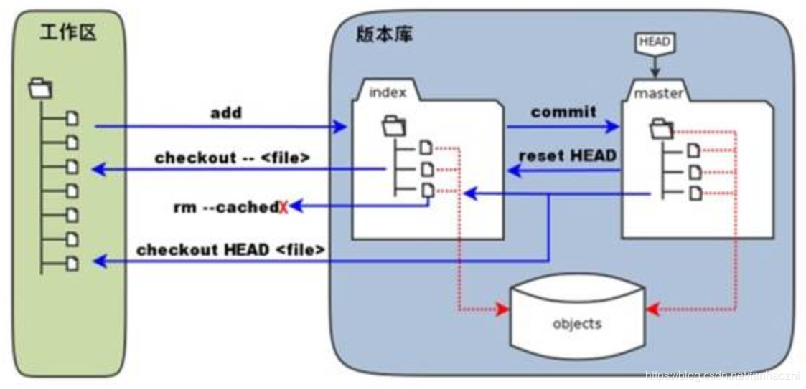
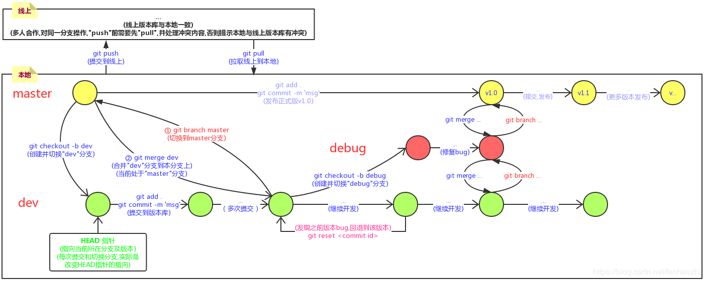

# 起步

1. 安装：安装过程很简单，到 [官网](https://git-scm.com/)，选择对应系统的安装包下载安装即可。

2. 首次使用可能需要初始化配置个人信息

    ``` shell
    # 配置个人信息
    $ git config --global user.name "Your Name"
    $ git config --global user.email "email@example.com"
    # 查看配置
    $ git config --list
    ```

3. 创建/克隆 git 仓库：

    首先要明确一点， git 并非一定要使用线上仓库，本地就有 git 仓库，线上只是把本地的仓库同步上去。创建 git 仓库有两种方式：本地初始化一个仓库；把线上仓库克隆下来接着使用。

    - 本地初始化新仓库：

      ``` shell
      # 初始化本地版本库
      $ git init
      # 设置线上版本库链接的别名为 "origin" (无需同步到线上可忽略下面的操作)
      $ git remote add origin https://...
      # 查看线上版本库链接列表
      $ git remote -v
      # 移除对线上版本库的别名
      $ git remote rm [origin name]
      ```

    - 克隆线上仓库：

      ``` shell
      # 除了https，还可以使用ssh
      $ git clone https://....
      # 自定义项目名称 ([project name]是可选参数)
      $ git clone https://.... [project name]
      ```

4. 相关博客

- [常用Git命令清单(阮一峰)](http://www.ruanyifeng.com/blog/2015/12/git-cheat-sheet.html)。
- [Git教程(廖雪峰)](https://www.liaoxuefeng.com/wiki/896043488029600)。
- [关于 Git 的一个"游戏"](https://learngitbranching.js.org/)。

</br>

# 使用

## "三个区域"



- 工作区(working directory)：就是电脑内能见的文件夹目录。
- 暂存区(staging area)：`git add .` 存放的位置。
- 版本库(repository)： `git commit -m "msg"` 把内容提交到当前分支节点上。

提交的流程有两步：

1. 被修改文件通过 `git add .` 把所有被修改的文件都添加到 **暂存区** 。
2. 然后通过 `git commit -m "msg"` 把缓存区的文件提交到 **版本库** 对应的分支中 (与此同时,"暂存区"的内容会被清除)。

涉及的命令如下：

``` shell
# 查看文件状态
$ git status
# 把所有被修改文件添加 ("."改为文件名可单独添加,多个文件用空格隔开)
$ git add .
# 把暂存区文件提交到版本库 (-m "xxx"表示上传时的预留信息)
$ git commit -m "xxx"
# 把本地版本库及文件推到线上 (忽略 "origin master" 操作当前分支) "origin" 为远程仓库地址的别名,默认就是"origin"
$ git push origin master
# 以暂存区文件覆盖工作区相应文件；带有"HEAD"的命令表示以版本库文件覆盖暂存区及工作区相应文件
$ git checkout --[file name]
$ git checkout HEAD --[file name]
# 移除暂存区的指定文件
$ git rm [file name]
```

</br>

## 分支

"分支"的处理是 git 中非常重要的一环。下图是开发中关于"分支"的使用。



初始化 git 仓库后，**首次提交**默认创建一个 `master` 主分支；但首次提交前创建分支，则无 `master` 分支。每个节点均可以创建子分支。

分支的常见用法：

- 多人合作。每个人操作自己的分支，最后操作主分支合并代码。

- 修复 bug 。例如正在开发 `v2.0` 版本，但发现 `v1.0` 版本存在 bug ，则回到 `v1.0` 节点上，创建子分支修复 bug ，其他分支继续开发，最后一起合并。

涉及的命令如下：

``` shell
# 获取所有分支名
$ git branch
# 切换到 "xxx" 分支
$ git branch "xxx"
# 创建&切换到 "xxx" 分支
$ git checkout -b xxx
# 把 "xxx" 分支内容合并到本分支
$ git merge "xxx"
```

### 合并分支的冲突处理

``` js
let title = '这是共同修改的代码文件';

 <<<<<<< HEAD
 function fn() {
     return '李四创建的函数'
 }
 =======
 let zs = '张三修改的内容'
 >>>>>>> zsworking
```

假设张三和李四同时在 `dev` 分支上开发，且修改了相同的文件，则出现上图情况(张三已经push,李四pull后所看到)。"3-9行" 是代码冲突检测的部分，`=====` 上方为本人(李四)修改的代码；下方则是冲突的部分。此时，本地文件已经被修改成上图所示，我们需要做的是：

- 删除多余符号
- 删除多余代码
- 提交修改

改变 `HEAD` 指针(版本回退/切换分支)前的注意事项：

`git reset <commit id>` 把 `HEAD` 指针指向之前的提交的版本，但工作区的文件并不会改变，所以改变 `HEAD` 指针前，需要把当前工作区暂存(`git stash`)。

### 场景：已在 `dev` 分支上开发，但 `master` 分支上需要修复 bug

``` shell
# 创建临时"储存"区
$ git stash
# 切换到 master 分支
$ git checkout master
# 创建并切换到 "debug-101" 分支
$ git checkout -b debug-101

# ...对 "debug-101" 分支修改 bug

# 切换回master分支
$ git checkout master
# 合并 "debug-101" 分支的内容
$ git merge --on-ff -m "merge bug debug-101" debug-101
# 切换回"dev"继续开发
$ git checkout dev
# 可查看 "stash" 的内容， "git stash pop" 后查看的为空
$ git stash list
# 取出"stash"
$ git stash pop
```

### "普通合并"与"快速合并"的区别

普通合并，合并后的会有新的"commit"提交；而"快速合并"则没有。

``` shell
# 快速合并
$ git merge [branch name]
# 普通合并
$ git merge --on-ff -m "message" [branch name]
```

</br>

## 撤销/删除/回退

若需要版本回退；或者文件恢复，请查阅这部分内容。

- 修改了工作区，但未 `git add` 到暂存区 (丢弃工作区,从版本库恢复到工作区)

  ``` shell
  # 查看文件状态
  $ git status
  # 丢弃当工作区的前文件，把file恢复到最新的版本库 （"git checkout ." 丢弃所有）
  $ git checkout --[file name]
  ```

- 修改了工作区，且 `git add` 到暂存区，但未 `git commit` 到版本库 (丢弃工作区并清除暂存区)

  ``` shell
  # 查看文件状态
  $ git status
  # 丢弃当工作区的前文件，把file恢复到最新一次 "commit" 版本
  $ git checkout --[file name]
  # 撤销暂存区(git add)的修改
  $ git reset HARD [file name]
  ```

- 修改了工作区，且 `git add` 到暂存区，并 `git commit` 到版本库 (版本回退)

  ``` shell
  # 查看提交的历史信息，'git commit -m xxx'后才会有
  $ git log
  # 显示单行，开头一大串"乱码"的是 commit_id
  $ git log --pretty=oneline
  # 查看"未来"版本,以便恢复错误回退
  $ git reflog
  # "HARD" 表示当前版本; "HARD^" 表示上个版本,如此类推。也可以用 commit_id 的前几位代替 "HARD^" 回退到指定版本
  $ git reset --hard HARD^
  ```

- 删除版本库的指定文件

  ``` shell
  # 并把版本库区域的该文件删除：
  $ git rm [file name]
  ```

</br>
</br>

# 标签管理 (`git tag`)

标签管理用于对某次提交(`git commit`)进行标记，如特定版本的发布，将其标记为 `v1.0` 。简单说就是"打标签"。

``` shell
# 获取提交记录 (添加 tag 前需要知道 "commit id")
$ git log --pretty --oneline
# 对特定的 "commit id" 打上标签名
$ git tag [tag name] [commit id]
# 也可以对 当前版本 打上标签
$ git tag [tag name]
# 也可以对特定的 标签信息 打上标签
$ git tag -a <tagname> -m "commit_msg"
# 查看所有 tag
$ git tag
# 查看指定tag的详细信息
$ git show [tag name]
# 删除指定标签
$ git tag -d [tag name]
```

</br>
</br>

# 提交时的忽略

关于提交忽略的有以下内容。主要还是使用 `.gitignore` 配置文件。在 [git 官网](https://git-scm.com/docs/gitignore) 有详细介绍。

- `.gitignore` 配置文件。用于指定哪些文件**忽略不提交**到版本库。配置规则如下：

  ``` shell (.gitignore)
  # 具体文件名
  ehthumbs.db
  # 指定文件名后缀
  *.db
  # 指定特定目录下的特定文件
  test/test.db
  # 指定目录
  dist/
  # 通配符使用
  # ** 表示多层目录； * 表示单层目录
  # src 中所有 ignore 文件夹
  src/**/ignore/

  # 具体规则如下：
  # 空行不表示匹配，可用于分割，便于可读。
  # 以#开头的是注释，如果要在开头使用#号，要转义\#。
  # 两端的空格可以忽略。
  # !表示否定，前面忽略的文件/目录将会被重新包含。如果父级目录被忽略，则子文件不能被再次包含。
  # 如果结尾有/，则表示只匹配目录。比如，a/表示a是目录。
  # 如果不包含/，则会全局匹配。比如a，匹配任何目录下的a。
  # 通配符*不能跨目录。
  # 如果开头有/，则表示匹配根目录。比如，/a表示根目录下的a。
  #     关于两个星号**：
  # 比如**/a，表示任何目录下的a。
  # 比如abc/**，递归匹配abc下的所有文件和目录。
  # 比如a/**/b，其中的**表示0到多层目录。
  # 其他情况下的两个*属于无效用法
  ```

- 强制提交被忽略的文件：

  ``` shell
  $ git add -f [file name]
  ```

- 检查被忽略文件与 ".gitignore" 内的哪行配置匹配：

  ``` shell
  $ git check-ignore -v App.class
  # 若显示".gitignore:3:*.class  App.class"，表示第3行的"*.class"匹配了该文件
  ```

</br>
</br>

# 使用 SSH 连接到 GitHub

这里是 [GitHub 官方教程](https://help.github.com/cn/github/authenticating-to-github/connecting-to-github-with-ssh) ，下面是总结。

## 查看已有 SSH 密钥

打开 Git Bash 终端，运行 `$ ls -al ~/.ssh` 查看已有 SSH 公钥 (若有)。默认情况下，公钥的文件名是以下之一：

- id_rsa.pub
- id_ecdsa.pub
- id_ed25519.pub

若无，或者不是您需要的，执行下面步骤创建 SSH 密钥。

</br>

## 生成新的 SSH 密钥

首先说明，下面代码，都是在 Git Bash 终端中执行，而且是 **window 系统** ，其他系统可能略有不同，请查阅 [官方教程](https://help.github.com/cn/github/authenticating-to-github/connecting-to-github-with-ssh) 。

1. 运行如下代码(替换为你的 GitHub 邮箱)，用于生成密钥。

    ``` shell
    $ ssh-keygen -t rsa -b 4096 -C "your_email@example.com"
    ```

    然后按提示输入即可(建议输出路径保持不变)，上面输入的就是你登录 GitHub 的账号密码，等同于生成登录凭证。

    注意，提示输入密码时，可以直接回车，表示不需要密码，否则每次提交/拉取代码时，都会提示输入证书密码。

2. 将 SSH 密钥添加到 ssh-agent 。请执行如下代码。

    ``` shell
    # 在后台启动 ssh-agent
    $ eval $(ssh-agent -s)
    # 将 SSH 私钥添加到 ssh-agent
    $ ssh-add ~/.ssh/id_rsa
    ```

3. 生成成功后，可以运行如下命令测试链接是否可用。

    ``` shell
    $ ssh -T git@github.com
    ```

    需要注意的是，你的网络可能会"墙"掉你的链接(若看到连接超时的提示,基本可以确定是)，请用手机热点重试。

4. 运行如下代码，用于复制刚才生成的公钥。

    ``` shell
    $ clip < ~/.ssh/id_rsa.pub
    ```

5. 登录个人 GitHub ，到个人中心的 **Settings** 的 **SSH and GPG keys** ，点击 **New SSH key** 按钮，然后把刚才复制的公钥粘贴上去(标题设置随意,方便个人查看即可)，然后就可以了。

6. 完成上述步骤后，可以连接远程 GitHub 仓库，并推送。

  ``` shell
  # 设置本地远程连接的仓库地址 (把地址替换成你的仓库地址)
  $ git remote add origin git@github.com:yourAccount/yourRepositories.git
  # 推送
  $ git push
  # 若远程仓库是新创建的，请执行：
  # git push -u origin master
  ```

实际是，步骤 2、3、4 都可以省略。

</br>
</br>

# 其他

- 以 HTTPS 方式连接的"免密"方法：(避免每次同步远程仓库时都要输入密码)

  1. 控制台输入命令 `git config --global credential.helper store`
  2. 执行同步操作(`git pull`或`git push`)，提示输入账号密码，输入后，会自动记录密码

- 优化 git 提交的消息的 node 插件：[cz-cli](https://github.com/commitizen/cz-cli)。
