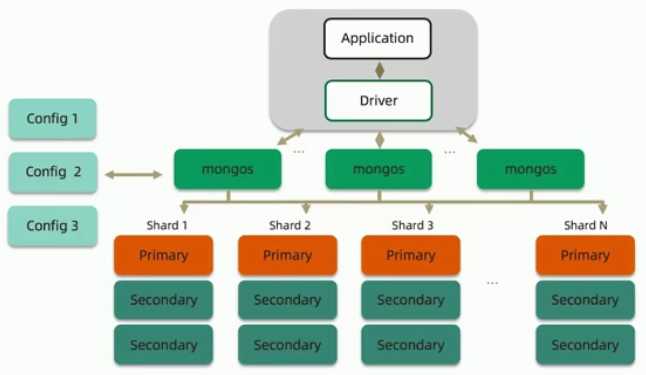

# 简介

[MongoDB](https://docs.mongodb.com/manual/introduction/) 是一个以 JSON 为数据模型的文档数据库。

其中，"文档"一词来自于"JSON Deocument"。

主要用途是作为应用数据库。

图形化软件建议使用 MongoDB Compass 。

</br>
</br>

# 基础知识

从大到小，分别是**数据库实例**、**数据库**、**集合**、**文档**、**内嵌文档**，都是前者包含多个后者。

## 文档

文档是 MongoDB 中数据的**基本单元**。文档就等同于 JavaScript 的对象。

每个文档都有一个特殊的键 **"_id"**，在所属的集合中是唯一的(不同集合中可以相同)。当添加数据时，若不指定，会自动添加此键值对`_id: ObjectId()`。

## 集合

集合就是一组文档。集合是**动态模式**的，也就是说里面的文档数据结构不固定。如同一个集合中，可以存`{name: "lisi"}`，也可以存`{age: 20}`。

## 基本数据类型

- JSON 的6种数据类型：null、布尔、数字、字符串、数组、对象。
- 数值默认是64位**浮点数**；使用`NumberInt()`和`NumberLong()`可分别创建 4字节 和 8字节 带符号的**整数**，如`NumberInt("3")`。
- **日期**、**正则**、**数组**、**对象** 都与 JavaScript 一致。
- 文档中还能存放 **JavaScript 代码**。
- **二进制流**。
- **ObjectId**，通过函数`ObjectId()`生成，是一个12字节的ID，标识集合中的唯一文档，是`_id`的默认类型。

总结一句就是，基本与 JavaScript 的对象一致，还额外添加了整数类型和ObjectId类型。

> ObjectId() 的 12 字节组成
>
> ``` txt
> 0 | 1 | 2 | 3 | 4 | 5 | 6 | 7 | 8 | 9 | 10 | 11
>     时间戳     |    机器   |  PID  |  计数器
> ```

## 命名规则

- 不能是空字符串 ("")。
- 区分大小写。
- 不能含有 \0 字符 (空字符)、$。
- 集合名不能以 "system." 开头，这是为系统集合保留的。
- 数据库名最多64字节。
- 数据库名不能使用文件名禁用的字符，因为数据库有对应的同名文件。
- 数据库名有三个保留：admin、local、config。

## MongoDB shell 的使用注意

### shell 内置帮助文档

``` shell
> help
    db.help()                    help on db methods
    db.mycoll.help()             help on collection methods
    sh.help()                    sharding helpers
    ...
    show dbs                     show database names
    show collections             show collections in current database
    ...
```

### shell 中加载js脚本

要注意的时，load() 函数无法解析 ~ 符号。

``` shell
> load("script.js")
```

### shell 辅助函数对应的 JavaScript 函数

|     辅助函数     |        等价函数         |
|:----------------:|:-----------------------:|
|     use foo      |  db.getSisterDb("foo")  |
|     show dbs     | db.getMongo().getDBs()  |
| show collections | db.getCollectionNames() |

### .mongorc.js 文件

这是一个 JavaScript 脚本文件，在启动 mongoDB shell 时会自动执行。该文件只要放下启动 shell 的目录下即可。可用于给全局添加辅助函数。

## 获取集合的注意事项

当集合名与 `db` 中的属性或方法重名时，不能通过 `db.<collectionName>` 获得集合，需要使用 `db.getCollection(<collectionName>)` 获取。

</br>
</br>

# 文档的"增删改查"

## 插入

``` shell
// 插入单个
> db.collectionName.insert({"key", "value"})

// 批量插入文档
> db.collectionName.batchInsert([{"key1", "value1"}, {"key2", "value2"}])
```

使用集合中 `insert(<doc>)` 和 `batchInsert(<docs>)` 的方法即可插入数据。其中批量插入有两点需要注意：

- 批量插入数据的最大限制为48M，若超出该大小，会被拆分成"多个48M"的请求。
- 当批量插入中有一个文档插入失败，会导致后面的文档都插入失败，但前面的文档还是会成功插入。

</br>

## 删除文档

``` shell
// 清空集合中的所有文档
> db.collectionName.remove()

// 删除特定条件的文件
> db.collectionName.remove({"key": "value"})

// .remove()方法对"内嵌文档"同样有效
> db.collectionName.subDoc.remove({"key1": "value1"})
```

</br>

## 更新文档

一般情况下，我们直接使用`db.collectionName.update()`传入查询文档和修改文档即可，但很多时候我们只需要对文档的特定字段修改，这时候 **"修改器"** 就很有用了。

``` js
// 下面例子的目标文档的结构如下：
{
  "_id": ...,
  "serchKey": "value",
  "changeKey": "foo",
  "subDoc": {"a":"1", "b": "2"},
  "count": 1,
  "arr": ["x"]
}
```

### $set 和 $unset

"$set" 的作用：**修改或添加**。当字段存在，则修改；当字段不存在，则添加。

``` shell
// 下面语句会把查询到的文档的 "changeKey" 属性值改为 "baz"
> db.collectionName.update({"serchKey": "value"}, {"$set": {"changeKey": "baz"}})

// 下面语句会把查询到的文档添加键值对 "changeKey1": "baz1"
> db.collectionName.update({"serchKey": "value"}, {"$set": {"changeKey1": "baz1"}})

// 选择器同样适用于内嵌文档的修改(准确说是update方法能对内嵌文档查询并修改)
> db.collectionName.update({"serchKey.subDoc": "1"}, {"$set": {"serchKey.subDo": "100"}})

// "$unset"的作用就比较干脆了，删除目标键值对；没有指定的键值对则忽略
> db.collectionName.update({"serchKey": "value"}, {"$unset": {"changeKey1": "baz1"}})
```

### $setOnInsert

作用： **仅在目标字段不存在时，才执行插入操作**，否则忽略。

``` shell
// 若文档中已有键 "foo" ，则忽略操作；否则才会插入键值对。
> db.collectionName.update({"serchKey": "value"}, {"$setOnInsert": {"foo": "baz"}})
```

### $inc

作用：**增加或减少**值。作为计数器，如点赞数、游戏计分等。当键不存在时，会自动创建。需要注意的是，若值类型不是数字类型，会导致操作失败。

``` shell
// "count" 的值会由原来的 1 变为 101
> db.collectionName.update({"serchKey": "value"}, {"$inc": {"count": 100}})
```

注意：

- 若增量的值为 `NaN` ，操作也会成功，更新的值会变为 `NaN` ；
- 若目标字段原来就有值，且为 `NaN` ，即使增量的值是合法的，更新后的值依然是 `NaN` 。
- 若目标字段原来就有值，且类型不为数值，执行更新操作会导致报错。

### $push 和 $each

"$push" 作用：向已有的**数组末尾添加元素**；若字段不存在，会自动创建新的数组并添加该元素。同样，值类型不为数组时，会导致操作失败。

以下均为子操作符：

- "$each" 的值是一个数组，表示对数组的所有元素都执行一次 "$push" 。
- "$slice" 的值必须是负整数，表示只保留数组的最后若干个。
- 对于存放对象的数组，"$sort" 的值是一个对象，"键"是表示用于排序的键，"值"是 `±1` ；对于存放值类型的数组，"$sort" 的值则值是 `±1` 。

``` shell
// "$push" 只添加一个元素
> db.collectionName.update({"serchKey": "value"}, {"$push": {"arr": "y"}})

// "$push" 只添加多个元素，需要配合 "$each" 使用
> db.collectionName.update({"serchKey": "value"}, {"$push": {"arr": {"$each" :["a", "b", "c"]}}})

// 使用多个子操作符，表示先【排序】后，只保留最后10个。
> db.collectionName.update({"serchKey": "value"}, {"$push": {"arr": {
  ...   "$each" :["a", "b", "c"],
  ...   "$slice": -10,
  ...   "$sort": 1
  ...  }}})
```

### $addToSet

"$addToSet" 作用：作用于值类型为数组的字段，**保证插入的元素不与原数组成员重复**。

``` shell
// 使用 "$addToSet" 且配合 "$each" 添加多个元素
> db.collectionName.update({"serchKey": "value"}, {"$addToSet": {"arr": {"$each" :["a", "b1", "c"]}}})
```

### $pop

作用： 根据数据的索引顺序，**移除数组的元素**。

``` shell
// 删除最后一个元素
> db.collectionName.update({"serchKey": "value"}, {"$pop": {"arr": -1}})
```

### $pull

作用： 同样是**移除数组元素**，不同的是使用条件删除。需要注意的是，此修改器会把所有与目标值相同的元素都删除。

``` shell
// 从数组中删除所有"x"
> db.collectionName.update({"serchKey": "value"}, {"$pull": {"arr": "x"}})
```

### $ (作用于修改器)

"$" 一般针对"内嵌文档数组"。当我们查询"内嵌文档数组"时，得到的结果并不知道它的索引值，此时可以用"$"指代当前索引。

``` shell
> db.collectionName.find()
{
  arr: [{foo: 1}]
}
// 把"arr"数组中，"foo"的值为1的元素，修改其值为2
> db.collectionName.update({"arr.foo": {"bar": 1},
  ...   {"$set": {"arr.$.foo": 2}}
  ... )
```

### "upsert"模式

"upsert"模式是一种特殊的更新，表示**若没有找到**符合更新条件的文档时，会以这个条件和更新文档作为基础**创建一份新的文档**；找到匹配文档则正常更新。使用方法也很简单，就是 `update()` 方法的第3个参数设为true。

``` shell
// 查询文档没有结果，则会添加文档 {"serchKey1": "value", "changeKey": "foo"}
> db.collectionName.update({"serchKey1": "value"}, {"$set": {"changeKey": "foo"}}, true)
```

### 仅更新查询文档的第一个

默认情况下，`update()`方法会更新所有匹配的文档。当设置第4个参数为`false`时，才会只更新第一个匹配的文档。

### findAndModify 命令

`db.runCommand()` 可以执行特定命令，"findAndModify"是其中的一个，作用跟`update()`函数类似，也是查询并修改。但"findAndModify"命令可以返回修改前或修改后的文档。

``` shell
> db.runCommand("findAndModify": "collectionName",
  ...   "query": {"serchKey1": "value"},
  ...   "sort": {"count": -1},
  ...   "update": {"changeKey": "bar"}
  ... )
// ......(执行上面语句后会返回更新前/后的文档)
```

findAndModify 命令可以使用的字段：

- `query`   查询文档，用于检索文件的条件。必选。
- `sort`    排序结果的条件。可选。
- `update`  修改器文档，用于对文档进行更新。（update与remove必须指定一个）
- `remove`  布尔类型，表示是否删除文档。（update与remove必须指定一个）
- `new`     布尔类型，表示是否返回更新后的文档，默认为false。可选。
- `fields`  文档中需要返回的字段。可选。
- `upsert`  布尔类型，表示使用upsert，默认为false。可选。

</br>

## 查询

使用集合的`find()`或`findOne()`函数可以查询文档；其第一个参数都是"查询文档"，用于给查询添加过滤条件，默认是`{}`，表示查询所有。如`db.collectionName.find()`。

与"修改器"类似，查询同样有 **"查询条件"**，下面具体介绍。

### 比较操作符

"$lt"、"$lte"、"$gt"、"$gte" 分别对应 <、<=、>、>= 。一般用于数值的查询。

``` shell
// 如下语句表示查询"age"在10~20之间的所有文档。
> db.collectionName.find({"age": {"$lte": 20, "$gte": 10}})
```

### $ne

作用： 表示"不相等"，即查询不等于目标值的所有文档。

``` shell
// 查询"name"不是"Tom"的所有文档
> db.collectionName.find({"name": {"$ne": "Tom"}})
```

### $in 和 $nin

"$in" 作用： 表示"包含于"，即目标值被包含在查询值数组中。其值是一个数组。当已知你需要的值是"有限个"时，可以使用。

"$nin" 则刚好相反，表示"不包含于"。

``` shell
// 查询"age"是10、20、30的所有文档
> db.collectionName.find({"age": {"$in": [10, 20, 30]}})
// 相反的，查询"age"不是10、20、30的所有文档
> db.collectionName.find({"age": {"$nin": [10, 20, 30]}})
```

### 元操作符

"$and"、"$or"、"$not"、"$nor" 都是元操作符，即可以用在其他条件之上。

"$or"接受一个包含所有可能条件的数组作为参数。

"$not"和"$and"都是字面意思，接受一个条件作为参数。

"$nor"就等同于"$or"基础上取反，也是接受一个条件数组作为参数。

### 取模运算

"$mod" 会将查询的值除以第一个值，与第二个值比较，若相等，则匹配成功。

``` shell
// 查询"age"为 6、11、16、17... 的所有文档
> db.collectionName.find({"age": {"$mod": [5, 1]}})
```

### null 与 $exists

当我们直接使用`null`作为查询条件，会返回不包含该键值的文档。"$exists" 用于判定键值是否存在。

``` shell
> db.c.find()
{ "_id":Object("..."), "y": null}
{ "_id":Object("..."), "z": 1}
// 只用 null 作为查询条件，会返回不含"y"的文档
> db.c.find({"y": null})
{ "_id":Object("..."), "y": null}
{ "_id":Object("..."), "z": 1}
// 使用$exists则可以过滤只含有该字段的文档 (因为没有"$eq"操作符,所以只能用"$in"代替)
> db.c.find({"y": {"$in": [null], "$exists": true}})
{ "_id":Object("..."), "y": null}
```

### 使用正则表达式

MongoDB 是支持使用正则表达式作为匹配条件，用法和 JavaScript 一致。值得注意的是，正则表达式还能匹配自身。

``` shell
> db.collectionName.find({"foo": /bar/i})
```

### $all 和 $size

$all 和 $size 都是针对"内嵌文档数组"使用。

$all 的值为数组，表示目标与查询的数组成员必须完全一致。注意，顺序是无关紧要的；对空数组无效。

$size 的值为整数，表示查询指定大小的数组。

注意， $all 和 $size 都是针对类型为数据的字段，类数组(即包含"length"属性的对象)及非数组类型的数据都会被忽略。

### find 或 findOne 的第二个参数

`find()`或`findOne()`的第二个参数用来指定想要的键。即只返回特定的字段，而非完整文档。看如下例子：

``` shell
// 第二个参数同样是"文档"，"键"就是目标字段，"值"可以是0或1，1表示字段需要，0表示字段不需要
> db.collectionName.find({}, {"username": 1, "_id": 0})
{
  "username": "joe"
}
```

如果目标字段是数组，还可以使用 **"$slice"** 对数组截取，值为整数。若指定值为正整数，则返回前若干个；若值为负整数，则返回后若干个。

``` shell
// 只返回 "arr" 的前10个元素
> db.collectionName.find({...}, {"arr": {"$slice": 10}})
```

### $ (作用于查询器)

"$" 针对"内嵌文档数组"使用。当我们查询"内嵌文档数组"时，得到的结果并不知道它的索引值，此时可以用"$"指代当前索引。一般用于返回"内嵌文档数组"中的一个元素。

``` shell
// 只返回"内嵌文档数组"中被查询到的元素
> db.collectionName.find({"arr.foo": {"bar"}}, {"arr.$": 1})
{
  "_id": ...,
  "arr": [
    {"foo": "bar"}
  ]
}
```

### $elemMatch

"$elemMatch" 针对"内嵌数组"使用，表示对"内嵌数组"中每个元素进行比对，返回合适文档。

``` shell
// 查询"内嵌数组"中元素大于10的文档
> db.c.find({"arr": {"$elemMatch": {"$gt": 10}}})
{
  "arr": [5, 10]
}
// 查询"内嵌文档"数组中元素合条件的文档
> db.c.find({"arr": {"$elemMatch": {"foo": 1, "baz": 2}}})
{
  "arr": [{"foo": 1, "baz": 2}]
}
```

### $where

"$where" 是最强大的一个查询器，值为 JavaScript 代码。缺点就是性能和安全性都比较差。(注意，不支持"箭头函数")

``` js
db.coll.find({
  "$where": function () {
    let val = 12
    if (this.age === val) return true
    else return false
  }
})
```

### 游标

游标的获取很简单，`find`函数的返回值就是一个游标，即`var cursor = db.c.find()`。

而所谓的游标，就是一个**迭代器**。**游标被定义时，不会马上执行查询**，只有当将结果放在全局变量或者就没有放在变量中，MongoDB shell 会自动迭代，就像我们上面直接在 shell 执行`db.c.find()`所看到的效果。

(游标的生命周期)有以下几种情况会导致游标失效：

- 游标遍历尽所有结果
- 客户端发来消息要求终止
- 客户端的游标已经不在作用域内
- 游标在 10 分钟内没有使用

游标对象上的方法：

- `hasNext()`     检查是否有后续的结果存在。
- `next()`        迭代器的"标配"，获取下一个数据，可以用`hasNext()`判断是否有后续数据再使用本方法获取数据。
- `length()`        迭代器的"标配"，获取下一个数据，可以用`hasNext()`判断是否有后续数据再使用本方法获取数据。
- `limit(<int>)`  限制结果的数据。如`db.c.find().limit(3)`表示只返回最多三个结果。
- `skip(<int>)`   忽略前N个结果。如`db.c.find().skip(3)`表示忽略前三个结果。(注意,即使是被"略过"的数据,也是需要先被查询,所以仍会占用资源)
- `sort(<obj>)`   指定排序规则，`1`表示升序；`-1`表示降序；越靠前的字段优先级越高。如`db.c.find().sort({"foo":1,"baz":-1})`表示优先使用"foo"字段**升序**排序；然后使用"baz"字段**降序**排序。

`limit`、`skip`、`sort` 这三个方法返回的都是游标对象，因此可以使用"链式操作"，即`db.c.find().limit(3).skip(3)`。

当一个键可能有多种类型的值，`sort()`排序的大小优先级如下(从小到大)：

1. `-Infinity`
2. `null`
3. 数值 (`NaN`最"小")
4. `String`
5. 对象/文档
6. `Array`
7. 二进制数据
8. `ObjectId`
9. `Boolean`
10. `Date`
11. 时间戳
12. 正则表达式
13. `Infinity`

几种场景的优化：

- 分页查询：(skip 的性能问题)

  ``` shell
  // 当我们查询第一页数据时，无需使用skip，也没有性能上可优化的
  > db.c.find().sort({"date": -1}).limit(100)
  // 当我们查询第二或以上的页的数据时，直接使用skip"略过"数据，会导致性能上的问题，因为被"略过"的数据也会被查询
  > db.c.find().sort({"date": -1}).skip(100).limit(100)

  // 优化方法：使用上次查询的最后一个文档作为查询条件，我们就可以避免使用skip方法
  > let page1 = db.c.find().sort({"date": -1}).limit(100)
  > let lastest = null
  > while(page1.hasNext()){
    ...   lastest = page1.next()
    ...   doSomething(lastest)
    ... }
  > let page2 = db.c.find({"date": {"$gt": lastest.date}).sort({"date": -1}).limit(100)
  ```

- 抽奖系统：(随机抽取文档)

  ``` shell
  // 一般的做法是先获取文档总数，再对应生成随机数，再抽取。但当文档树较大，这会有很严重的性能问题。
  > let total = db.c.count()
  > let random = Math.floor(Math.random() * total)
  > db.c.find().skip(random).limit(1)

  // 优化方法：插入文档时就添加一个字段"random"，作为抽奖的随机数。然后自己生成随机数，与文档中"random"值比大小，得到最接近的结果文档。
  > let random = Math.random()
  > let result = db.c.findOne({"random": {"$gte": random}})
  // 避免自己生成的随机数比所有文档的随机数都大
  > if(!result){
    ...   result = db.c.findOne({"random": {"$lte": random}})
    ... }
  ```

### 高级查询选项

通过使用游标上的 `_addSpecial()` 方法可以为查询条件添加额外的"高级选项"。如`db.c.find()._addSpecial("$maxscan": 20)`。

类似"$maxscan"的有如下几个：

- `$maxscan`  值为正整数。设置最大的扫描数量。当你不知道集合有多大，且不希望扫面时间过长，可以使用此选项。
- `$min`      值为查询文档。设置查询的开始条件。
- `$max`      值为查询文档。设置查询的结束条件。
- `$showDiskLoc`  值为布尔类型，默认`false`。设为`true`时，自动为每个结果的文档添加一个`"$diskLoc"`字段，用于显示本文档所在的磁盘位置。

### 结果的一致性

如果集合较大，MongoDB **可能会多次返回同一个文档**。原因在于，我们查询文档后，可能会对文档数据进行修改，使得**文档体积变大，原位置放不下，该文档会被移动到集合的末端**，当我们不断往查询时，就可以再次"遇到"它了。

解决办法：对查询进行**快照**，只需要调用游标上的 `snapshot()` 方法即可。如果使用这个选项，查询就在 "_id" 索引上执行，就保证了每个文档只被返回一次。

``` shell
> db.c.find().snapshot()
```

但需要注意的时，**快照会使查询变慢**。

### 数据库命令

通常，只使用 shell 辅助函数(如`db.drop()`等)就可以了。但当我们使用旧版本的 shell 连接到新版本的数据库上时，这个 shell 可能不支持新版本的数据库的一些命令，这时候我们就需要使用 **`runCommand()`**。

在 shell 中运行 `db.listCommands()` 获取所有的数据库命令。

数据库命令总会返回一个包含 "ok" 键的文档，若值为 1 ，说明命令执行成功；若值为 0 ，则命令执行失败，失败原因在 "errmsg" 字段上查看。

</br>
</br>

# 索引

索引支持在 MongoDB 中高效执行查询。没有索引， MongoDB 必须执行集合扫描，即扫描集合中的每个文档，以选择与查询语句匹配的那些文档。如果查询存在适当的索引，则 MongoDB 可以使用该索引来限制它必须检查的文档数。

## 相关术语

- Index：提供快速查找的功能。类似于书本的目录页。
- Key：索引。类似于书本目录页的关键字。
- DataPage：数据页。类似于书本目录页的关键字对应的具体页码。
- Covered Query：查询覆盖。若查询的字段都在索引中，就可以不需要从数据页加载数据，这就是查询覆盖。例子：`db.human.createIndex({firstNmae:1,lastName:1,age:1})`。
- IXSCAN (Index Scan)：索引扫描。对索引项的查询。
- COLLSACN (Collection Scan)：集合扫面。对整个集合的项的查询。
- Big O Notation：时间复杂度。
- Query Shape：查询的形状。就是查询条件用到哪些字段。
- Index Prefix：索引前缀。
  - 表示创建索引时，如`db.human.createIndex({firstNmae:1,lastName:1,age:1})`，它有两个前缀：
    - `{firstNmae:1}`
    - `{firstNmae:1,lastName:1}`
  - 所有索引前缀都可以被索引覆盖，没有必要针对这些查询建立额外的索引
- Selectivity：过滤性。索引尽量放在记录数少的 KEY 上，可以加快过滤掉无效数据。

## 组合索引(Compound Index)的最佳方式

- 假设我们需要这样的一个查询 `db.members.find({ gender: "F", age: {$gte: 18} }).sort("join_date": 1)`
- 最佳的方式是 **ESR** 原则，即：
  - 精确 (**E**qual)：精确匹配的字段放在最**前面**
  - 排序 (**S**ort)：需要排序的字段放**中间**
  - 范围 (**R**ange)：范围匹配的字段放最**后面**
- 因此，例子应该选用索引 `{gender: 1, join_date: 1, age: 1}`

## 实操

创建索引的方法是 [`db.collection.createIndex(keys, options?)`](https://docs.mongodb.com/manual/reference/method/db.collection.createIndex/#db.collection.createIndex) ，当然可以也通过 `db.collection.createIndexes([keyPatterns, ]options)` 批量创建。下面给出前者的例子：

``` js
// 下面例子中，表示对"name"字段和"age"字段组合创建索引，其中 1 表示升序； -1 表示降序
db.coll.createIndex({ name: 1, age: -1 })
// 对于嵌套文档。下面例子表示对"location"嵌套文档的"state"字段创建索引
db.coll2.createIndex({ "location.state": 1 })
// "options"就不详细介绍了，作用就是对索引功能的额外设置，具体请看官网
```

通过 [`db.collection.getIndexes()`](https://docs.mongodb.com/manual/reference/method/db.collection.getIndexes/) 可以查询到所有索引。请看下面的查询结果：

``` js
[
  {
    "v" : 2,
    "key" : {
      "_id" : 1
    },
    "name" : "_id_",
    "ns" : "test.coll"
  },
  {
    "v" : 2,
    "key" : {
      "name" : 1,
      "age" : -1
    },
    "name" : "name_1_age_-1",
    "ns" : "test.coll"
  }
]
```

其中，数组中第一个是默认创建的，基于 `_id` 。若我们创建索引时不指定名字，系统默认是使用下划线作为分隔符的索引键和索引中每个键的方向(1或-1)的串联，如 `name_1_age_-1` 。

</br>
</br>

# 聚合

MongoDB 聚合框架 (Aggregation Framework) 是一个计算框架，它可以：

- 作用在一个或多个集合上；
- 对集合中的数据进行的一系列运算；
- 将这些数据转化为期望的形式。

整个聚合运算的过程称为**管道(Pipeline)**，它是由多个**步骤(Stage)**组成的，每个管道：

- 接受一系列文档（原始数据）；
- 每个步骤对这些文档进行一系列运算；
- 结果文档输出给下一个步骤；
- 最终得到结果。

例子如下：

``` js
db.orders.aggregate([
  // 第一阶段：该$match阶段按status字段过滤文档，然后将status等于的文档传递到下一阶段"A"。
  { $match: { status: "A" } },
  // 第二阶段：该$group阶段按cust_id字段将文档分组，以计算每个唯一值的金额之和cust_id。
  { $group: { _id: "$cust_id", total: { $sum: "$amount" } } }
])
```

</br>
</br>

# 数据模型

数据模型是一组由符号、文本组成的集合，用以准确表达信息，达到有效交流、沟通的目的。

数据模型设计的元素有：

- 实体(Entity): 描述业务的主要数据集合。即，谁、什么、合适、何地、为何、如何。
- 属性(Attribute): 描述实体里面的单个信息。
- 关系(Relationship): 描述实体与实体之间的数据规则。结构规则有，"1-N"、"N-1"、"N-N"、"1-1"，意思是"n对n的关系"。

## 传统模型设计

概念 ——→ 逻辑 ——→ 物理：

|                |                     概念模型(CDM)                     |                  逻辑模型(LDM)                   |                            物理模型(PDM)                             |
|:--------------:|:-----------------------------------------------------:|:------------------------------------------------:|:--------------------------------------------------------------------:|
|    **目的**    |               描述业务系统要管理的对象                | 基于概念模型，详细列出所有实体、实体的属性及关系 | 根据逻辑模型，结合数据库的物理结构，设置具体的表结构、字段列表及主键 |
|    **特点**    | 用概念名词来描述显示中的实体及业务规则</br>如"联系人" |         基于业务的描述</br>和数据库无关          |          技术实现细节(技术选型)</br>和具体的数据库类型相关           |
| **主要使用者** |                   用户、需求分析师                    |            需求分析师、架构师、开发者            |                             开发者、DBA                              |

遵循第三范式的原则 ———— 数据在库里尽量不存在冗余。

## 文档模型设计简介

文档模型设计处于物理模型设计阶段(PDM)，由于其设计与逻辑层类似，所以"逻辑"和"物理"是可以复用，但概念模型设计是必不可少的。

不遵循第三范式，允许冗余。

与关系型模型的对比：

|                  |        关系型数据库        |    JSON文档模型    |
|:----------------:|:--------------------------:|:------------------:|
| **模型设计层次** | 概念模型→逻辑模型→物理模型 | 概念模型→逻辑模型  |
|   **模型实体**   |             表             |        集合        |
|   **模型属性**   |             列             |        字段        |
|   **模型关系**   |      关联关系，主外键      | 内嵌数组，引用字段 |

### 设计基础

1. 业务需求及逻辑模型 ——————————————(逻辑导向)——→ 基础建模 ————————→ 集合、字段、基础形状
    - 根据概念模型或业务需求，推导出逻辑模型 - 找到对象
    - 列出实体之间的关系(及基数,及n对n的关系) - 明确关系
      - 若"1-1"，主要以内嵌对象为主。这种情况不涉及数据冗余。
      - 若"1-N"，主要以内嵌数组为主。这种情况也不涉及数据冗余。例外情况是，数组长度不确定，或数组长度过大。
      - 若"N-N"，一般用内嵌数组。会存在数据冗余。例外情况是，数组长度不确定，或数组长度过大。
      - 以上的方式都要注意，文档对象不能超过 16M 。
    - 套用逻辑设计原则来决定**内嵌方式** - **进行建模**
    - 完成基础模型的构建

2. 技术需求：读写比例、方式、数量 ———(技术导向)——→ 工况细化 ————————→ 引用及关联
    - 工况细化的点：
      - 最频繁的数据查询模式；
      - 最常用的查询参数；
      - 最频繁的数据写入模式；
      - 读写操作的比例；
      - 数据量的大小。
    - 什么时候使用**引用**方式：
      - 内嵌文档台打，MB 级的数据或超过 16MB ；
      - 内嵌文档或数组元素会频繁被修改；
      - 内嵌数组元素会持续增长，且没有封顶(如用户的订单记录)。
    - 引用设计的限制：
      - MongoDB 对使用的引用的集合之间并无主外键检查，有可能用于关联其他文档的ID会找不到数据；
      - MongoDB 使用聚合框架的 `$lookup` 来模仿关联查询；
      - 但 `$lookup` 的关联目标不能是分片表。

3. 经验和学习 —————————————————————(模型导向)——→  套用设计模式 —————→ 最终模式
    - 使用优秀的设计模式，去优化我们的数据结构。
    - MongoDB 设计模式：
      - 列转行：多个同类型的字段，可以放在一个数组中，以减少索引量。如`{release_USK:"2017/07/23",release_UK:"2017/08/24",...}`可以改写成`{releases:[{country:"USK",date:"2017/07/23"},{country:"UK",date:"2017/08/24"},...]}`。
      - 文档版本：添加多一个"版本"的字段，用于描述当前文档所处的版本号。
      - 近似处理：解决如"网页点击量"统计，不需要精确数据的，可以采取每隔10次或若干次写入。
      - 预聚合：解决如"销售额"统计，要求数值的准确定性，可以采取多添加几个字段，如"周统计"、"月统计"等的字段，每次写入的时候，统计字段都会相应的增加，而不必查询的时候再聚合计算。
      - 分桶：常用于如物联网设备的信息采集统计，每分钟的数据采集存储量很大，可以用一个文档存储一个小时的数据量。

</br>
</br>

# 事务

MongoDB 从 4.2 开始已经全面支持多文档事务，但并不代表可以毫无节制地使用它。相关，对事务的使用原则时，能不用尽量不用。

通过合理地设计文档模型，可以规避绝大部分使用事务的必要性。

因为事务等于锁、节点协调、额外开销、性能影响。

## writeConcern

MongoDB 有可能丢失数据的情况是，在主节点写入一条数据，但未同步到其他节点，此时刚好主节点宕机，其他节点被投票称为新节点，那新写入的一条数据就可能会丢失。

`writeConcern` 就是解决上面说的问题。它是一个对象，用于提供事务性，写入操作的时候提供，如 `de.test.insert({count:1}, {writeConcern:{w:"majority"}})` ，具体实现看相关的 API 。

可选属性如下：

- `w` 属性，定义写操作落到多少个节点上才算成功，取值包括：(默认值是`1`)
  - `0`: 表示不关心是否写入成功。
  - `1` ~ `<集群最大节点数>`: 表示写操作需要被复制到指定节点数才算成功。
  - `"majority"`: 表示写操作需要被复制到大多数节点才算成功。

  通常情况下，设置为超过半数的节点或`majority`才是比较安全的。

- `journal` 属性，定义如何才算写操作成功，取值包括：
  - `true`: 写操作落到 journal 文件中才算成功，即写入到磁盘文件。
  - `false`: 写操作到达内存即算成功。

- `wtimeout` 属性，定义最多等待多长时间，单位是秒。

注意事项：

- 虽然多余半数的 `writeConcern.w` 都是安全的，但通常只会设为 `"majority"` ，因为这是等待写入延迟时间最短的选择；
- 不要设置 `writeConcern.w` 等于总节点数，因为一旦有一个节点故障，所有写操作都将失败；
- `writeConcern` 虽然会增加写操作的延迟时间，但不会显著增加集群压力，因此无论是否等待，写操作最终都会复制到所有节点上，设置 `writeConcern` 只是让写操作等待复制后再返回而已；
- 对于重要数据用 `{w: "majority"}` ，对于普通数据用 `{w: 1}` 以确保最佳性能。

## readPreference

readPreference 用于解决数据从哪里读。

可选值有：

- `"primary"`: 只选择主节点。
- `"primaryPreferred"`: 优先选择主节点，如果主节点不可用则选择从节点。
- `"secondary"`: 只选择从节点。对于生成报表这种时效性不高，但资源需求大，可以在从节点单独处理，避免对线上用户造成影响。
- `"secondaryPreferred"`: 优先选择从节点，如果从节点不可用则选择主节点。
- `"nearest"`: 选择最近的节点。
- `<tag>`: 节点可以打标签，可指定标签值。

如何选择 readPreference 的值：(以电商为例)

- 对实时性比较高，如用户下单后需要马上查看订单详情，从节点可能还没复制到新订单。应该选择 `"primary"` 或 `"primaryPreferred"` 。
- 对实时性不高，如用户查询历史订单。应该选择 `"secondary"` 或 `"secondaryPreferred"` 。
- 对实时性不高，且系统资源需求大，如生成报表。应选择 `"secondary"` 。
- 对于全球性的，方便用户就近读取资源。应选择 `"nearest"` 。

配置 readPreference 的例子：

- 通过 MongoDB 连接参数： `mongodb://host1:27107,host2:27108,host3:27109/?replacaSet=rs&readPreference=secondary` ；
- 通过 MongoDB 驱动程序 API ： `MongoCollection.withReadPreference(ReadPreference readPref)` ；
- 通过 Mongo Shell ： `db.collection.find({}).readPref("secondary")` 。

注意事项：

- 要注意高可用问题。如设为 `"primary"` 时，发生故障转移不存在 primary 节点，即无节点可读。若业务允许，应该选择 `"primaryPreferred"` 。
- 使用 Tag 也会遇到上面的问题。

## readConcern

readConcern 用于指定"哪些数据可以读"，类似于关系型数据库的隔离级别。

可选值包括：

- `"available"`: 读取所有可用的数据。
- `"local"`: 读取所有可用且属于当前分片的数据。默认值。
- `"majority"`: 读取在大多数节点上已经提交完成的数据，保证读取的数据不会被"回滚"，避免了脏读。
- `"linearizable"`: 读取大多数节点确认过的数据。比`"majority"`更严格，但消耗的资源也更多，耗时可能也很长，建议配合使用 `maxTimeMS` 。一般情况不建议使用。
- `"snapshot"`: 读取最近快照中的数据。

</br>
</br>

# Change Stream

Change Stream 是 MongoDB 用于实现变更追踪的解决方案，它是异步的。

Change Stream 只推送已经在大多数节点上提交的变更操作，即必须开启 `{readConcern: "majority"}` 。

当集群无法满足 `{w: "majority"}` 时，不会触发 Change Stream 。

Change Stream 故障恢复：若想从上次中断的地方继续获取变更流，只需要保留上次变更通知的 `_id` 即可，如 `let cs = db.collection.watch([], {resumeAfter: <_id>})` 。

示例：

``` shell
> db.collection.watch([], {maxAwaitTimeMS: 30000})
```

使用场景：

- 跨集群的变更复制。
- 微服务联动。
- 其他任何需要系统联动的场景。

注意事项：

- Change Stream 依赖于 oplog ，因此终端时间不可超过 oplog 回收的最大时间窗。
- 执行 update 操作时，如果只更新了部分数据，那么 Change Stream 通知的也是增量部分。
- 同理，删除数据时通知的仅是删除数据的 `_id` 。

</br>
</br>

# 关于开发的小总结

- 连接到 MongoDB 常用的连接字符串参数：
  - `maxPoolSize`: 连接池大小。
  - `MaxWaitTime`: 最大等待时间，自动杀死太慢的查询。
  - `WriteConcern`: 建议 majority 保证数据安全。
  - `ReadConcern`: 对于数据一致性要求较高的场景适合使用。

- 不要在 mongos 前面使用负载均衡，否则：
  - 驱动会无法探测具体哪个节点存活，从而无法完成自动故障恢复；
  - 驱动会无法判断游标是在哪个节点创建的，从而遍历游标时出错。

- 使用域名连接集群：
  - 在配置进群时使用域名可以为集群变更时提供一层额外的保护。当主机变更时直接修改域名解析即可。
  - MongoDB 还提供 `mongodb+srv://` 协议，可以提供额外一层的保护。改协议允许通过域名解析得到所有 mongos 或节点的地址，而不是卸载连接字符串中。

- 游标的使用：
  - 若游标遍历完会自动关闭；
  - 若游标没有遍历完，则需要手动 `close()` ，否则游标会在服务器存活 10 分钟(默认)后释放，造成不必要的资源浪费。
  - 通常游标不能遍历完，意味着查询条件太宽泛，应考虑收紧查询条件。

- 关于查询及索引：
  - 每一个查询都必须要有对应的索引。
  - 尽量使用覆盖索引 Covered Indexes (可以避免读写数据文件)
  - 使用 projection 来减少返回到客户端的文档的内容。

- 关于写入：
  - 在 update 语句里只包括需要更新的字段。
  - 尽可能使用批量插入来提升写入性能。
  - 使用 TTL 自动过期日志类型的数据。

- 关于文档结构：
  - 防止使用太长的字段名(浪费空间)
  - 防止使用太深的数组嵌套 (超过2层操作比较复杂)
  - 不使用中文、标点符号等非拉丁字母作为字段名

- 处理分页问题：
  - 避免使用 `count` ，如 `db.coll.count({x: 100})` ，当集合有 1kw 条数据，则会遍历所有数据才会得到结果。
  - 避免使用 `skip` 或 `limit` 形式的分页，特别是在数据量大的时候。替代方案是，利用上一次查询结果的最后一个的 `_id` 作为查询条件。如下：
    - 第一页： `db.coll.find({}).sort({_id: 1}).limit(20);`
    - 第二页： `db.coll.find({_id: {$gt: <第一页最后一个_id>}}).sort({_id: 1}).limit(20);`
    - 第三页： `db.coll.find({_id: {$gt: <第二页最后一个_id>}}).sort({_id: 1}).limit(20);`
    - ......

- 使用事务的原则：
  - 无论何时，事务的使用总是能免则免。
  - 模型设计先于事务，尽可能用模型设计规避事务。
  - 不要使用过大的事务(尽量控制在1000个文档更新以内)。
  - 当必须使用事务时，尽可能让涉及事务的文档分布在同一个分片上，这将有效地提高效率。

</br>
</br>

# 分片集群

分片集群，就是把原本一份的数据，分成若干份，分别存放到各个物理库中。一个分片中，必须是复制集，不能是单节点。

分片集群可以有效解决性能瓶颈及系统扩容问题。分片额外消耗较多，管理复杂，尽量不要分片。

特点：

- 应用全透明，无特殊处理；
- 数据自动均衡；
- 动态扩容，无需下线；
- 提供三种分片方式：
  - 基于范围：选择若干个字段的值的范围作为分片规则。
    - 优点：片键范围查询性能好
    - 缺点：数据可能分布不均
  - 基于Hash：简单理解就是随机选取分片写入，各个区愤怒篇的负载都比较平均。
    - 优点：数据分布均匀，写优化
    - 缺点：范围查询效率低
    - 使用：日志、物联网等高并发场景
  - 基于zone/tag：根据地域选取分片，适用于全球性的。

完整的分片集群：



上图的各部分说明：

- **mongos**: **路由节点**。
  - 提供集群单一入口
  - 转发应用端请求
  - 选择合适数据节点进行读写
  - 合并多个数据节点的返回
  - 至少要有 2 个，主要用于"高可用"
- **Config**: **配置节点**。
  - 本质是普通的 MongoDB 实例，多个组成复制集，提供"高可用"。
  - 提供集群元数据存储，如分片数据分布的映射。
- **Primary**&**Secondary**: **数据节点**。
  - 以复制集为单位 (必须是复制集)
  - 分片(shard)之间数据不重复，最大 1024 分片
  - 所有分片在一起才可完整工作，因此所有分片都必须保证"高可用"

选择合适的片键：

- 取值基数(Cardinality)：所谓的基数就是值的范围。基数要选择大的，方便之后的水平扩展，如时间值。
- 取值分布：若片键分布不均，会导致某些块的数据量急剧增大，压力鸭随之增大。取值分布应尽量均匀，如哈希值。
- 定向性好：若读取某个数据需要在多个分片中读取，那读取消耗的时间就是最慢的一个分片。所以读取数据尽量只在一个片区读取。
- 被尽可能多的业务场景用到
- 避免单调递增或递减的片键，如自增ID。
- 建议使用**组合片键**，即使用多个键的组合，如用户ID和时间值。尽量满足基数大、写分布好、查询定向性好。

</br>
</br>

# 监控

工具:

- MongoDB Ops Manager
- Percona
- 通用监控平台
- 程序脚本

监控报警的考量：

- 具备一定的容错机制以减少误报的发生；
- 总结应用各指标峰值，针对不同应用使用不同的指标峰值；
- 使用调整报警经阈值；
- 留出足够的处理时间。

建议监控的指标：

|              指标              |                                                                          意义                                                                          |                                                                                              获取方式                                                                                               |
|:------------------------------:|:------------------------------------------------------------------------------------------------------------------------------------------------------:|:---------------------------------------------------------------------------------------------------------------------------------------------------------------------------------------------------:|
|        `opcounters` ()         |                                                         增删改查、 getmore 及其他命令的数量。                                                          |                                                                                   `db.serverStatus().opcounters`                                                                                    |
|        `tickets` (令牌)        |                                      对 WiredTiger 存储引擎的读/写令牌数量 (表示可以进入存储引擎的并发操作数量)。                                      |                                                                        `db.serverStatus().wiredTiger.concurrentTransactions`                                                                        |
|  `replication lag` (复制延迟)  |                              代表写操作到达从节点所需的最小时间，过高的 replication lag 会减少从节点的价值 (关注`w>1`)。                               |                                                                             `db.adminCommand({'replSetGetStatus': 1})`                                                                              |
|  `oplog window` (复制时间窗)   |                            代表 oplog 可以容纳多长时间的写操作，即一个从节点离线多长时间仍能够追上主节点 (建议大于24小时)。                            |                                         `db.oplog.rs.find().sort({$natural: -1}).limit(1).next() - db.oplog.rs.find().sort({$natural: 1}).limit(1).next()`                                          |
|     `connections` (连接数)     |                                            连接数也应作为监控指标的一部分，指定特定数量作为低峰/正常/高峰。                                            |                                                                                   `db.serverStatus().connections`                                                                                   |
| `Query targeting` (查询专注度) | 索引键或文档扫描数量与返回的文档数量的比值，按秒平均。若该值比较高表示查询系需要进行很多低效的扫描来满足。这情况通常代表索引不当或缺少索引来支持查询。 | `var status = db.serverStatus()`</br>`status.metrics.queryExecutor.scanned / status.metrics.document.returned`</br>`status.metrics.queryExecutor.scannedObjects / status.metrics.document.returned` |
|  `ScanAndOrder` (扫描和排序)   |                                    每秒钟内存排序操作所占的平均比例。如果有适当索引的情况下，内存排序时可以避免的。                                    |                                               `var status = db.serverStatus()`</br>`status.metrics.operation.scanAndOrder / status.opcounters.query`                                                |
|            节点状态            |                             每个节点的运行状态。若节点不是PRIMARY、SECONDARY、ARBRTER中的一个，或无法执行上述命令则报警。                              |                                                                                     `db.runCommand('isMaster')`                                                                                     |
|     `dataSize` (数据大小)      |                                                                整个实例数据总量(压缩前)                                                                |                                                                                       每个DB执行`db.stats()`                                                                                        |
|  `StroageSize` (磁盘空间大小)  |                                                             已使用的磁盘占总空间的百分比。                                                             |                                                                                                                                                                                                     |

监控信息的来源:

- `db.serverStatus()`: 这是主要的手段。注意，包含监控信息是从上次开机到现在位置的累计数据。包含如下常用属性：
  - `connections`:  关于连接数的信息
  - `locks`: 关于已使用的锁情况
  - `network`: 网络使用情况统计
  - `opcounters`: CRUD的执行次数统计
  - `repl`: 复制集配置信息
  - `wiredTiger`: 包含大量 WiredTiger 执行情况的信息，包含如下常用属性：
    - `block-manager`: WT数据块的读写情况
    - `session`: session使用数量
    - `concurrentTransactions`: Ticket使用情况
  - `mem`: 内存使用情况
  - `metrics`: 一系列性能指标统计信息
  - ......
- `db.isMaster()`: 这是次要的手段。
- mongostats 命令行工具: 只有部分信息。

</br>
</br>

# 备份

普通复制集只能防止硬件故障引起的数据丢失。而认位错误删除的数据，或者需要回溯数据，则可以：

- 方案一： 设置**延时节点**用于备份

- 方案二： 全量备份 + oplog 。全量备份有以下几种：
  - 复制数据库文件。注意：
    - 必须先关闭节点才能复制，否则复制到的文件无效；
    - 也可以选择 `db.fsyncLock()` 锁定节点，完成后不要忘了 `db.fsyncUnlock()` 解锁；
    - 必须在从节点上完成；
    - 该方法会暂时宕机一个从节点，所以要注意整个过程中投票节点的总数。
  - 文件系统快照。注意：
    - MongoDB 支持使用文件系统快照直接获取数据文件在某一时刻的镜像；
    - 快照过程中可以把不用停机；
    - 数据文件和 Journal 必须在同一卷上；
    - 快照完成后请尽快复制文件并删除快照。
  - mongodump 。注意：
    - 使用 mongodump 备份最灵活，但速度上(较前两者)也是最慢的；
    - (若数据较大)备份时间时间较常，在此期间数据可能会被更新，最终备份到的数据是没有期间被更新的值；
    - 解决上面的问题，可以备份的时候 `mongodump --oplog` ，可以把备份期间的 oplog 都输出到 `dump/oplog.bson` ；
    - `mongorestore` 恢复备份的时候使用 `--oplogFile` 指定需要回放的 oplog 文件；使用 `--oplogLimit` 还能指定回放 oplog 的时间点。

</br>
</br>

# 安全

## 认证(AUTHENTICATION)

用户认证：

|     认证方式      |              描述               |       备注       |
|:-----------------:|:-------------------------------:|:----------------:|
|   用户名 + 密码   |      SCRAM-SHA-1 哈希算法       | 默认没有用户密码 |
|                   | 用户信息存于 MongoDB 本地数据库 |                  |
|     证书方式      |   服务端需要提供证书文件启动    |    X.509 标准    |
|                   |  客户端需要证书文件连接服务器   |                  |
|                   |    证书有外部或内部 CA 颁发     |                  |
|   LDAP 外部认证   |     连接到外部 LDAP 服务器      |    企业版功能    |
| Kerberos 外部认证 |   连接到外部 Kerberos 服务器    |    企业版功能    |

集群节点认证：

- **Keyfile**：将统一 Keyfile 文件拷贝到不同的节点。(Keyfile 就是一个随机字符串)
- **X.509**：基于证书的认证模式，推荐不同的节点使用不同的证书。(更加安全)

## 鉴权(AUTHORRZATION)

MongoDB 授权是基于角色的权限控制，不同权限的用户对数据库的操作不同。

还可以使用 `db.createRole` 自定义角色，针对特定的业务场景。

## 审计(AUDTING)

数据库等记录型系统通常使用**审计**来监控数据库相关的一些活动，以及对一些可疑的操作进行调查。审计是企业版功能。

审计记录的格式是 JSON ，记录的方式以本地文件或 syslog ，记录的内容有 `Schema change (DDL)`、`CRUD 操作 (DML)`、用户认证。

审计配置参数举例：

- 审计日志记录到 syslog ： `--auditDestination syslog` 。
- 审计日志记录写到指定文件： `--auditDestination file --auditFormat JSON --auditPath /path/to/auditLog.json` 。
- 对删表和创建表动作进行审计日志记录： `--auditDestination file --auditFormat JSON --auditPath auditLog.json --auditFilter {atype: {$in: ["createCollection", "dropCollection"]}}` 。

## 加密(ENCRYPTION)

**传输加密**： MongoDB 支持 TLS/SSL 来加密 MongoDB 的所有网络传输(包括客户端和服务端之间、内部复制集之间)。

**落盘加密**：这是企业版的功能。其流程包括：

1. 生成 master key ，用来加密每一个数据库的 key 。
2. 生成每一个数据库的 key ，用来加密各自的数据库。
3. 基于生成的数据库 key 加密各个数据库中的数据。
4. key 管理 (只针对 master key ，数据库 key 保存在数据库内部)。

**字段级加密**：

- 针对某个字段进行加密
- 数据库只看见密文


## 实践

1. 启用身份认证。设置用户密码。
2. 权限管理。基于 Deny All 原则，不多给权限。
3. 加密和审计。启用数据传输加密、数据保护和活动审计。
4. 网络加固。内网部署服务器，设置防火墙，设置操作系统(不建议使用操作系统的root用户运行MongoDB)。
5. 遵循安全准则。遵循不同行业或地区安全标准合规性要求。

</br>
</br>

</br>
</br>

</br>
</br>

</br>
</br>

</br>
</br>

</br>
</br>

</br>
</br>
