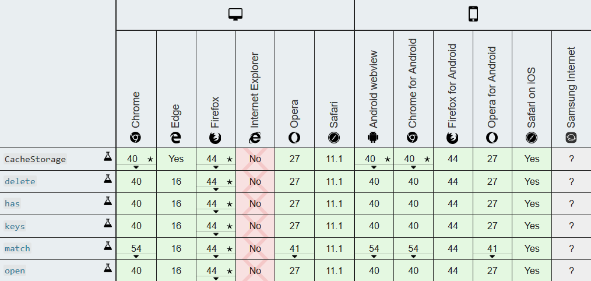

# 简介

使用此 API 可以对缓存操作。但此 API 操作的缓存与 HTTP 头设置的缓存不是同一个东西，两个是独立的。

CacheStorage 属于 **Service Worker API** 标准中的一个，但可以脱离 service worker 使用。

</br>
</br>

# 基本API

## API 的参数说明

- `cacheName`： 字符串， Cache 的名字，也叫版本号。

- `options`：

  ``` js
  {
    ignoreSearch, // 布尔值，是否忽略 url 中的 query 部分 (即?后面的值)。默认false。
    ignoreMethod, // 布尔值，是否忽略 http 方法 (GET、POST之类的)。默认false。
    ignoreVary, // 布尔值，是否忽略 HTTP 头部的 Vary。默认false。
    cacheName // 字符串，代表一个具体的要被搜索的缓存。(注意，该选项被 Cache API 所忽略。)
  }
  ```

- `request`： 可以是一个 `Request` 对象，也可以是 URL。

- `requests`： 就是`request`组成的数组。

- `response`： `Response` 对象。可以通过 `fetch(<url>).then(response=>{})` 获取；或者 `new Response()` 得到。

</br>

## CacheStorage API

### caches.open(cacheName)

返回一个 `resolve` 为**匹配 `cacheName` 的 Cache 对象**的 Promise ；若不存在名为 `cacheName` 的 Cache ，则 Promise 的 resolve 值为**新创建的 Cache 对象**。

``` js
caches.open('v1').then(cache => {
    // 对缓存的"增删查" (略)
});
```

### caches.match(request[, options])

用法和 `cache.match` 类似，不过 `caches.match` 是**针对整个 CacheStorage 对象进行搜索**。返回一个 Promise ，其 `resolve` 值为匹配的 `response` 对象。

``` js
caches.match(request, options).then(response => {
  // 对response做操作
});
```

### caches.keys()

遍历整个 CacheStorage 对象。返回一个 Promise ，其 resolve 值为**所有 Cache 对象的名字的列表**，即字符串数组。

``` js
caches.keys().then(keyList => {
  // 对keyList做操作
});
```

### caches.has(cacheName)

检索整个 CacheStorage 对象。返回一个 Promise ，若其中匹配到 `cacheName` 的 Cache 对象，则 `resolve` 值为 `true` ；否则为 `false` 。

``` js
caches.has(cacheName).then(boolean => {
  // true: 缓存存在； false: 缓存不存在
});
```

### caches.delete(cacheName)

检索整个 CacheStorage 对象，返回一个 `resolve` 为 `true` 的 Promise，如果找到键值为 `cacheName` 的 Cache 对象，删除它， `resolve` 值为 `true` ；否则为 `false` 。

</br>

## Cache API

Cache 依赖于 CacheStorage，使用 `CacheStorage.open(cacheName)` 打开一个Cache 对象，再使用 Cache 对象的方法去处理缓存。

### 增

1. `cache.add(request)`

    `Cache.add/Cache.addAll` 不会缓存 `Response.status` 值不在 `200` 范围内的响应。

    该函数返回的是 Promise。当请求成功，成功添加到缓存时， resolve 的参数是 undefined ；当请求失败，不能添加到缓存中，reject 的参数是错误对象。

    传入URL时，会抓取这个URL, 检索并把返回的 `response` 对象添加到给定的 Cache 对象。这在功能上等同于调用 `fetch()`, 然后使用 `Cache.put()` 将 `response` 添加到 cache 中。

    假如在缓存中存在相同 key 的 `response`，则覆盖他。

2. `cache.addAll(requests)`

    与 `cache.add()` 用法类似，不同的是传参为 `request` 的数组。

3. `cache.put(request, response)`

    此函数是同时抓取一个请求及其响应，并将其添加到给定的 cache 。

    上面介绍到，`Cache.add/Cache.addAll` 不会缓存 `Response.status` 值不在 `200` 范围内的响应。但 `Cache.put` 可以。

    ``` js
    // 以下代码等效于 cache.add()
    fetch(url).then(response => {
      if (!response.ok) {
        throw new TypeError('Bad response status');
      }
      return cache.put(url, response);
    });
    ```

    此函数不会发起实际的网络请求，因为第二个传参就是 Response 对象，包含返回的内容。利用此点，可以把旧的 Resopnse 复制到新的 Cache 中。如下例子：

    ``` js
    // 在'cache-v2'前有'cache-v1'
    caches.open('cache-v2').then(cache => {
        return caches.match(url).then(response => {
            // 从'cache-v1'复制到'cache-v2'中
            return cache.put(url, response)
        });
    });
    ```

### 删

`cache.delete(request[, options])`

  搜索 key 值为 `request` 的 Cache 条目。如果找到，则删除该 Cache 条目，并且返回一个 resolve 为`true`的 Promise 对象；如果未找到，则返回一个 resolve 为`false`的 Promise 对象。

  除了上述用法，还能传入`cache.match()`查询到的`response`，用法如下。

### 查

1. `cache.match(request[, options])`

    ``` js
    cache.match(request, options).then(response => {
      // resolve 的结果是跟 Cache 对象匹配的第一个已经缓存的请求，无则为 undefined。
      // response 其中一个用途是作为 cache.delete() 的参数，如下：
      return cache.delete(response);
    }).then(isDeleted => {
      // 删除成功或否
    });
    ```

2. `cache.matchAll(request[, options])`

    与 `cache.match()` 的基本一致，不过多介绍。除了返回的 Promise 的 **resolve 的结果是跟 Cache 对象匹配的所有请求组成的数组，无则为空数组**。

3. `cache.keys(request[, options])`

    与 `cache.matchAll()` 几乎一样。（暂时没看出有什么不同）

</br>
</br>

# 注意事项

- CacheStorage 遵循**同源策略**，添加和读取缓存时，使用相对路径即可。
- 浏览器对本地存储都会有限制，**旧版本的缓存应该手动删除**。

</br>
</br>

# 兼容性


