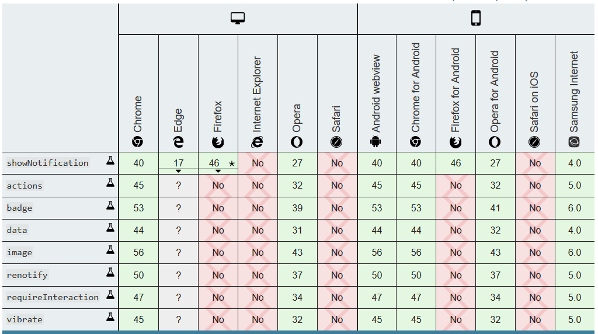

# 简述

[Notification API](https://developer.mozilla.org/zh-CN/docs/Web/API/notification) 可以让网页或 service worker 创建并控制系统通知的显示。通知会显示在浏览器的外部（设备的UI上），不依赖于任何浏览器窗口或标签页。

</br>

# 创建

使用 Notification API 之前，需要获取用户的许可。

``` js
// 调用 Notification.requestPermission() 后会弹出提示，询问用户是否同意接收通知
Notification.requestPermission().then(permission => {
    // permission 的值有三种可能： default(没同意也没拒绝)、 granted(同意)、 denied(拒绝)。
    console.log(permission)
    // 也可以在这里创建通知
});
// 通过 Notification.permission 可以查询权限状态，返回的字符串就是上面说的三种中的一个
console.log(Notification.permission);
```

取得用户同意后，就可以推送通知了。

移动端浏览器，除了 chrome 和 Firefox 都不支持，虽然三星浏览器支持，但默认把权限设为 `denied` 且无法修改。

经测试(2019.12|三星S8手机|window10系统)，有如下情况：

- Firefox 不支持 `actions` 、 `vibrate` 等属性，仅能显示"标题"、"图标"、"正文"，而 chrome 可以显示 actions 按钮组；
- Firefox 能通过 `new Notification()` 和 `ServiceWorkerGlobalScope.registration.showNotification()` 两种方式创建"通知实例"；
- chrome 在HTTP中只支持 `new Notification()` 创建通知，且不支持 `actions` 属性，在HTTPS只支持 `ServiceWorkerGlobalScope.registration.showNotification()` 创建通知，反之会报错；
- chrome 和 Firefox 都没看错 `badge` 属性的作用，但确实会发起该图片地址的请求。
- chrome 不支持 `dir` 属性，但 Firefox 支持。
- chrome 和 Firefox 都不支持 `vibrate`、`noscreen`、`silent`、`sound` 属性。

创建 Notification 实例的方法：

``` js
/** 
 * service worker 中创建通知对象
 * @function ServiceWorkerRegistration.showNotification(title,options?)
 * 1@param {String} title 通知的标题
 * 2@param {String} options 通知实例的参数(下面看详细介绍)
 * @returns {Promise<undefined>}
 */
self.registration.showNotification('Notification Title', {
  body: '这是一条 Notification ',
  icon: '/notified_icon.png', // 在通知中显示的图片URL地址
  image: '/test.png', // 在通知中显示的图像的URL地址
  // 操作器对象数据(通知的底部的功能按钮,最多2个) (serviceWorkder内通过onnotificationclick监听事件)
  actions: [{
    action: 'action1', // 按钮名称 (相当于事件名,事件对象的action属性就是此值)
    title: 'action1', // 操作按钮的标题
    icon: '/notified_action1.png' // 操作按钮图标地址
  }, {
    action: 'action2',
    title: 'action2',
    icon: '/notified_action2.png'
  }],
  tag: '1', // 通知的唯一标识 (已有同名通知在显示,旧通知会被覆盖;否则添加新通知)
  renotify: true, // 旧消息被替换时是否更新通知 (默认false时,旧消息只会被悄然替换;当设置true时,设备会再次震动或提示音吸引用户注意新消息)
  data: [1, 22, 333], // 通知携带的数据(任意数据类型)
  dir: 'ltr', // 在通知中显示的文本方向，两个可选值："ltr"(默认)、"rtl"
  badge: '/notified_badge.png', // 徽章图片地址 (用于标识不同类型的通知)
  // lang: '', // 通知文本的主要语言
  // vibrate: [200, 100, 300], // 接收整形数组。设置震动频率(支持震动的设备) (示例中表示震动200ms,后停顿100ms,再震动300ms,如此循环) (不支持)
  // noscreen: true, // 用来指定设备的屏幕是否会被这个通知打开 (不支持)
  // silent: false, // 用来指定通知是否静默(即没有震动或声音) (不支持)
  // sound: '/notified_sound.mp3' // 通知时播放的音效文件 (不支持)
});

/* 页面中创建通知对象 (options与上面一致,不再赘述) */
new Notification('Notification Title', options);
```

</br>

# 获取实例对象

在 service worker 中可以通过 `ServiceWorkerRegistration.getNotifications()` 查询 Notification 。

``` js
/**
 * 获取所有符合要求的 Notification 实例
 * @function ServiceWorkerRegistration.getNotifications(options?)
 * @param {{tag:String}} options 只有一个参数 tag
 * @returns {Promise<Notification[]>} Notification数组,可能为空数组
 */
self.registration.getNotifications(options).then(NotificationsList => {
    // ...
});
```

此外， `new Notification()` 会返回一个 Notification 实例对象。

</br>

# 事件

Notification 实例对象上的 `onclick` 、 `onclose` 、 `onerror` 、 `onshow` 属性都可以添加监听器，作用也明显，不过多赘述。

通过 `ServiceWorkerRegistration.showNotification()` 创建的 Notification 实例，是无法通过该函数的返回值得到。一般的做法是在 service worker 中统一对所有的 Notification 实例监听。代码如下：

``` js
// 下面是添加 onnotificationclick 监听器，当"通知框"被点击时触发
// 同类型的监听器还有 onnotificationclose 和 onactivate ，分别对应"通知框"被关闭和activate按钮被点击时触发
self.addEventListener('notificationclick', e => {
    console.log('notificationclose', e)
})
```

</br>

# 属性/方法

Notification 实例对象上的属性基本与创建时的`options`参数相同，都是只读属性，具体可以看[文档](https://developer.mozilla.org/zh-CN/docs/Web/API/notification)。

其中，值得一提的是 `Notification.close()` ，让开发者可以主动关闭通知。

</br>

# 兼容性



</br>

# Notification 没有"第二次机会"

一旦用户对 `Notification.requestPermission()` 的权限请求拒绝后，你将不能再请求了 (除非用户手动修改权限)。

合适的做法是，制作自己的**权限UI**，用户决绝的也只是你的页面，下次还有机会再询问用户获取权限。
