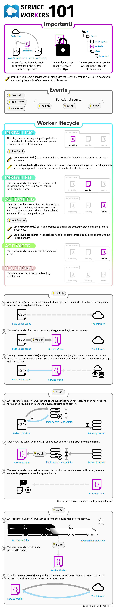
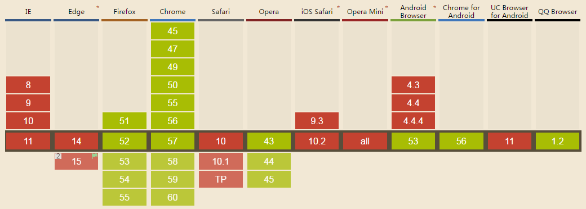

# 简介

service worker 相当于是页面与服务器之间的一个中间层。它可以把页面请求拦截；对于请求失败可以自动重发；可以把请求保存到缓存中以便离线使用；等功能。

使用 service worker 需要两个前提：

1. 浏览器支持所需 API
2. 必须是 HTTPS 的网站 (除非是本地调试的"localhost")

页面通过 `navigator.serviceWorker.register(<url>, <options>)` 注册 service worker ，值得注意的是，`register` 方法可以指向一个空的`.js`问文件。

</br>
</br>
</br>

# 生命周期

## 示意图

``` txt
installing --> installed/waiting --> activating --> activated --> redunant
 (安装中)        (已安装/等待中)        (激活中)       (已激活)       (废弃)
   ╎                                                                 ↑
   └-----------------------------------------------------------------┘
                          [安装失败时]
```

## 状态说明

- installing(安装中)： 当页面注册一个新的 serviceWorker 时，下载完成后进入
- installed(已安装)： 安装成功后进入
- redunant(废弃)： 安装失败后进入
- waiting(等待中)： 当 installing 后发现有另一个 serviceWorker 在控制页面，本 serviceWorker 就会进入此状态
- activating(激活中)： 接管页面控制前
- activated(已激活)： 可以监听功能性事件(如fetch)。需要注意，页面加载早于此状态，页面不受 serviceWorker 控制，所以首次加载 serviceWorker 是不能控制页面的

## 注意事项

- serviceWorker 独立于所有页面，当页面注册已安装的 serviceWorker ，就不会再次触发安装。
- serviceWorker 中，使用 `event.waitUntil(<Promise>)` 可以延长事件的存活事件，直到`<Promise>`完成或失败。
- 当页面还在打开，旧的 serviceWorker 对页面还有控制权，刷新后，旧的 serviceWorker 仍处于"已激活"状态，新的 serviceWorker 就只能处于"等待中"，旧 serviceWorker 控制的所有页面，使得旧的 serviceWorker 变为"废弃"状态，新的 serviceWorker 才能正常使用。
- 对于 serviceWorker 最大的过期时间为24小时，即使服务器响应头中设置超过24小时。

</br>
</br>
</br>

# 开发调试

Chrome 开发者工具中的 Application → Service Workers 部分，勾选 "Update on reload" ，方便刷新后激活新的 serviceWorker 。

开发者工具：

-  谷歌： \
   展示当前设备上激活和存储的SW： `chrome://inspect/#service-workers` \
   开始/暂停/调试 worker 的进程： `chrome://serviceworker-internals/`
- 火狐： \
   更新/注销SW： `about:serviceworkers` \
   调试工具： `about:debugging#workers`

</br>
</br>
</br>

# 详细介绍图



</br>
</br>
</br>

# 兼容性




