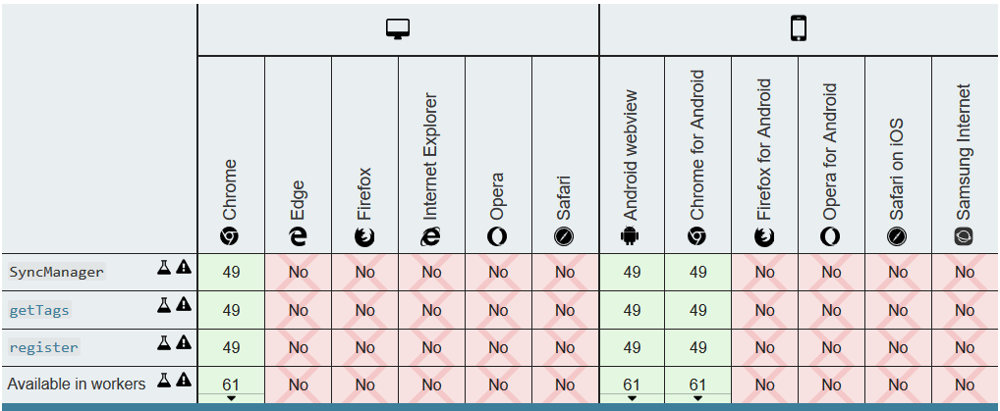

# 简介

[SyncManager](https://developer.mozilla.org/en-US/docs/Web/API/SyncManager) 是 service worker 的一个接口，让我们可以注册 sync 事件，并获取当前已注册的 sync 事件列表。

任何与 sync 事件的交互，都是通过 SyncManager 完成的。

通过 `ServiceWorkerRegistration.sync` 可以获取 SyncManager 对象。

# 注册 sync 事件

  ``` js
  // (页面)注册一个 sync 事件
  navigator.serviceWorker.ready.then(registration => {
    registration.sync.register('myEventName1')
  })
  // (service worker)注册一个 sync 事件
  self.registration.sync.register('myEventName2')
  // 或
  self.registration.ready.then(registration => {
    registration.sync.register('myEventName3')
  })
  ```

  注意，如果在 SyncManager 注册一个已存在的标签，会被忽略。

- 获取已注册 sync 事件列表：

``` js
// 一个包含 标签名 的数组的 Promise
self.registration.sync.getTags().then(tags => {
  // do something ...
})
```

# sync 事件执行的"最后机会"

当 sync 事件并不能无限次重试，可以通过 sync 事件的 lastChance 属性判断当前是否为"最后机会"，并决定该如何应对。

``` js
self.addEventListener('sync', e => {
  if(e.tag !== 'mySyncName') return
  e.waitUntil(
    myPromise().then(res => {
      // 成功了固然好...
      return Promise.resolve()
    }).catch(err => {
      // 失败了就看是否"最后机会"
      if(e.lastChance){
        return Promise.reject('我尽力了...(或者其他Promise操作)')
      }
      return Promise.reject()
    })
  )
})
```

# 兼容性

其实这 API 的兼容性并不好，**只有 chrome 和 安卓浏览器 支持**。如下图：


