# 说明

本文总结于 《图解TCP/IP(第5版)》，插图也取自于该书。

# 网络基础知识

## 协议

简单来说，协议就是计算机与计算机之间通过网络实现通信时，事先达成的一种"约定"。计算机之间，只要遵循相同的协议就能够实现通信。

下图是各种网络体系结构及其协议：

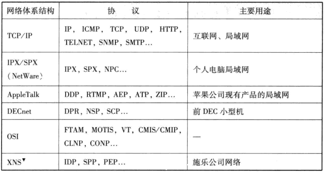

## OSI 参考模型

这模型总共分了 7 层，每个分层都接收由它下一层所提供的特定服务，并且负责为自己的上一层提供特定服务。上下层之间进行交互时遵循的约定叫做"接口"。同一层之间的交互所遵循的叫做"协议"。

OSI 参考模型的建议时比较理想化的。

网络工程师在讨论协议相关的问题时也经常以 OSI 参考模型的分层为原型。

但 OSI 参考模型终究是一个"模型"，它只是对各层的作用做了一系列粗略的界定，并没有对协议和接口进行详细的定义。

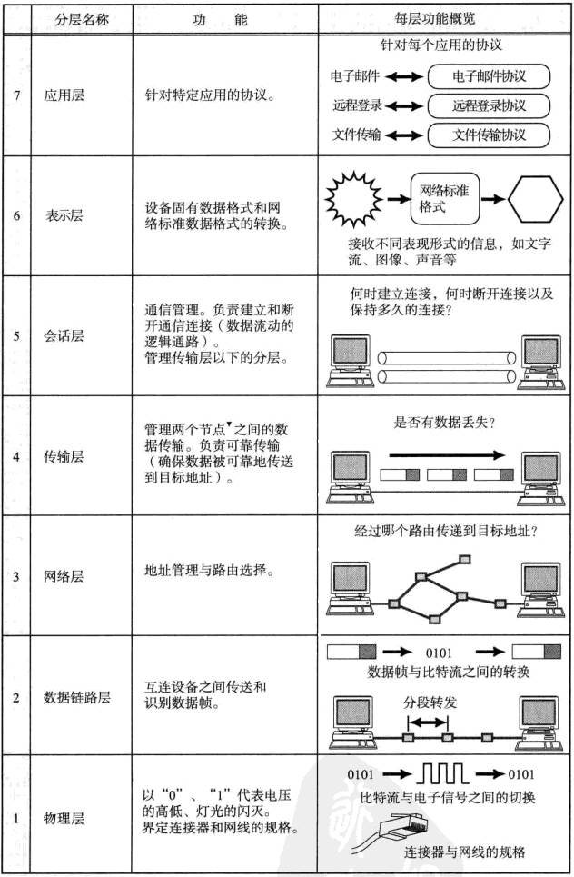

各层的作用：

- 应用层：为应用程序提供服务并规定应用程序中通信相关的细节。包括文件传输、电子邮件、远程登陆等协议。

- 表示层：将应用处理的信息转换为适合网络传输的格式，或将来自下一层的数据转换位上层能够处理的格式。因此它主要负责数据格式的转换。更关注的是数据的具体表现形式。

- 会话层：负责建立和断开通信连接（数据流动的逻辑同理），以及数据的分割等数据传输相关的管理。
  - 主要责任是决定采用何种连接方法。

- 传输层：起着可靠传输的作用。
  - 进行建立或断开连接的**处理**，它的主要作用是在两个主机之间创建逻辑上的通信连接。
  - 要注意，此层是"建立或断开连接的处理"，而会话层是处理"建立或断开连接的时机"。

- 网络层：将数据传输到目标地址。因此它主要负责寻址和路由的选择。

- 数据链路层：负责物理层面上互联的、节点之间的通信传输。

- 物理层：负责将 0、1 比特流于电压的高低、光的闪灭之间的户互换。

## 传输方式的分类

以网络收发数据的方式，可以分为 **面向有连接型** 和 **面向无连接型** ：

- 面向有连接型：在发送数据前，需要在收发主机之间连接一个通信线路。如打电话，必须我方拨号，对方接通，才能通信。

- 面向无连接型：不要求建立和断开连接，发送端可于任何时候自由发送数据；反之，接收端也永远不知道自己会在何时从哪里接收到数据。

以网络通信的方式，可以分为 **电路交换** 和 **分组交换** ：

- 电路交换：在电路交换中，交换机主要负责数据的中转处理。
  - 计算机首先被连接到交换机上，而交换机与交换机之间则由众多通信线路再继续连接。
  - 因此计算机之间在发送数据时，需要通过交换机与目标主机建立通信电路。称之为建立连接。
  - 建立好连接之后，用户就可以与i之使用这条电路，直到该连接断开位置。
  - 缺点是，一台主机在收发信息时，会独占整个电路，其他主机只能等待这台主机处理结束后才有机会使用这条电路收发数据。

- 分组交换：解决了电路交换的不足。让连接到通信电路的主机将所要发送的数据丰城多个数据包(Packet)，按照一定的顺序排列后分别发送。大致处理过程如下：
  - 发送端计算机将数据分组发送给路由器，
  - 路由器收到这些分组数据后，缓存到自己的缓冲区，
  - 然后再转发给目标计算机。
  - 因此，分组交换也有另一个名字：**蓄积交换**。

以接收端数量的方法，可以分为 **单播(Unicast)** 、 **广播(Broadcast)** 、 **多播(Multicast)** 、 **任播(Anycast)** 。

- 单播："uni"表示"1"，即 1 对 1 通信。如早期的固定电话。

- 广播：从 1 台主机发送给与之相连的所有主机。如广播电视。

- 多播：与广播类似。但多播可以限定某一组主机作为接收端。如视频会议。

- 任播：在特定多台主机中选出 1 台作为接收端。通常，被选中的主机会返回一个单播信号，随后发送端只会跟这台主机通信。如 DNS 服务器。

## 地址

在通信传输中，发送端和接收端可以被视为通信主题，他们都由一个所谓的"地址"信息加以标识出来。

地址必须具有**唯一性**。

若想高效的找出通信目标，地址需要具备**层次性**。如电话号码包含地区信息。

## 网络的构成要素

如下图：

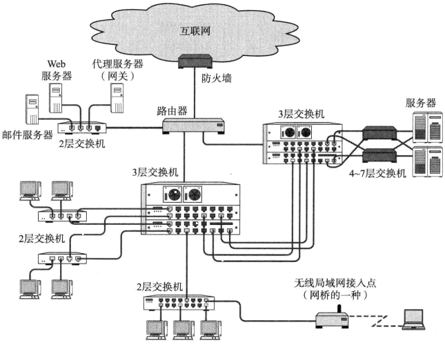

**计算机网络**是指计算机与计算机相连而成的网络。他们通过电缆互相连接。各种数据链路一览：

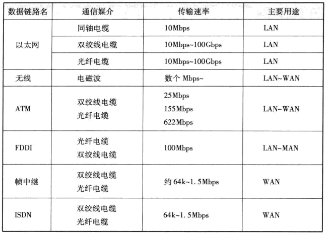

- **网卡** 是任何一台计算机连接网络时必须要使用的设备。其全称是网络接口卡(NIC,Network Interface)，有时也被叫做网络是配置、LAN卡。

- **中继器**(Repeater) 是在 OSI 模型的第 1 层，即物理层面上延长网络的设备。它将电缆传过来的电/光信号经有中继器的波形调整和方法在传给另一个电缆。
  - 对减弱的信号进行放大和发送的设备。
  - 通过物理层的连接延长网络。
  - 即使在数据链路层出现某些错误，中继器仍然转发数据。
  - 无法改变传输速度。
  - 单纯负责信号在 0/1 比特流之间的替换，不负责检测错误。

- **网桥**(Bridge) 是在 OSI 模型的第 2 层，即数据链路层面上连接两个网络的设备。
  - 能够识别数据链路层的数据帧，并将这些数据帧临时存储于内存，在重新生成信号作为一个全新的帧转发给相连的另一个网段。
  - 数据链路的数据帧中有一个数据为叫做 FCS(用CRC校验,即循环冗余校验码) ，用来校验数据是否正确到达目的地。网桥通过检测这各域中的值，将损坏的数据丢弃，避免发送给其他网段。
  - 能够判断是否将数据报文转发给相邻网段的网桥叫**自学式网桥**。这类网桥会记住曾经通过自己转发的所有数据帧的MAC地址，并保存到内存表中，后续用于判断。
  - 以太网等网络中经常使用的**交换集线器**，也属于网桥的一种。交换集线器中连接电缆的每个端口都能提供类似网桥的功能。

- **路由器**(Router) 是在 OSI 模型的第 3 层，即网络层面上连接两个网络，并对分组报文进行转发的设备。
  - 根据 IP 地址进行处理的。
  - 可以连接不同的数据链路。例如连接两个以太网，或连接一个以太网与一个 FDDI 。

- **网关**(Gateway) 是在 OSI 模型中负责从*传输层到应用层*的数据进行*转换*和*转发*的设备。防火墙就是一款通过网关通信，针对不同应用提高安全性的产品。

下图是各种设备及其对应用网络分层概览：

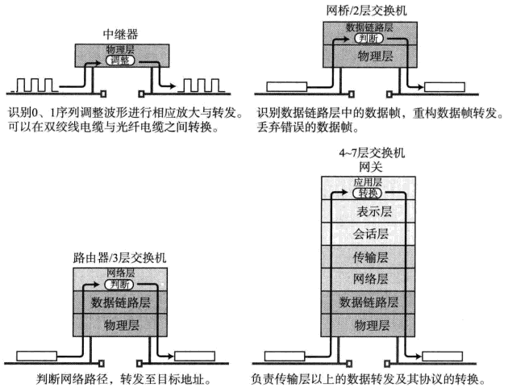

 

# TCP/IP 基础知识

TCP(Transmission Control Protocol) 和 IP(Internet Protocol) 是互联网的众多通信协议中最为著名的。

## TCP/IP 的标准化

很多情况下， TCP/IP 指的是利用 IP 进行通信时所必须用到的协议群的同城。因此，有时候也成 TCP/IP 为国际协议族。下图为 TCP/IP 协议群：

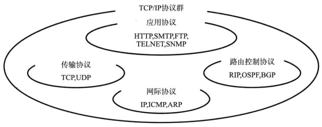

TCP/IP 由两大特点：

1. 开放性：协议由 IETF 讨论制定的，而 IETF 本身就是一个允许任何人假如进行讨论的组织。
2. 注重实用性：在 TCP/IP 的标准化过程中，指定某一协议的规范本身已不再那么重要，而首要的任务是实现真正能够实现通信的技术。

TCP/IP 的规范：

- 需要标准化的协议，都被列入 **RFC**(Request For Comment) 文档，并在互联网上公布。
- 但每当对 RFC 进行修改时都要产生新的 RFC 编号。为了方便管理，人们就采用 **STD**(Standard)，用来记载哪个编号指定哪个协议，如 STD5 就包含 ICMP 的 IP 协议标准。
- 与 STD 类似， **FYI**(For Your Infomation) 为了人们方便检索，在其每个编号里涵盖了所有涉及的 RFC 编号。

TCP/IP 的标准化流程，分为四个阶段：

- 互联网草案阶段。
- 提议标准阶段。
- 草案准备阶段。
- 真正的标准阶段。

标准的获取方法：

- RFC：[http://www.rfc-editor.org/rfc/](http://www.rfc-editor.org/rfc/)、[ftp://ftp.rfc-editor.org/in-notes](ftp://ftp.rfc-editor.org/in-notes)。
- STD：[http://www.rfc-editor.org/in-notes/std/](http://www.rfc-editor.org/in-notes/std/)
- FYI：[http://www.rfc-editor.org/in-notes/fyi/](http://www.rfc-editor.org/in-notes/fyi/)
- I-D(Internet Draft)：[http://www.rfc-editor.org/internet-drafts/](http://www.rfc-editor.org/internet-drafts/)

## 互联网基础知识

互联网进行通信时，需要相应的网络协议， TCP/IP 原本就是为使用互联网而开发制定的协议族。

互联网中的每个网络都是由 **骨干网**(BackBone) 和 **末端网**(Stub) 组成的。

每个网络之间通过 **NOC**(Network Operation Center,网络操作中心) 相连。

如果网络运营商不同，它的网络连接方式和使用方法也会不同。连接这种异构网络需要由 **IX**(Internet Exchange,网络交换中心) 的支持。

总结来说，互联网就是众多异构的网络通过 IX 互联的一个巨型网络。如下图：

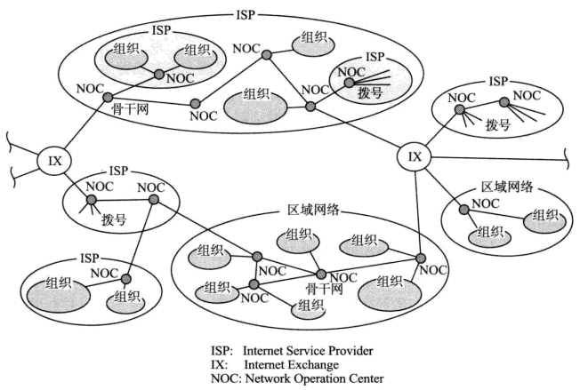

## TCP/IP 协议分层模型

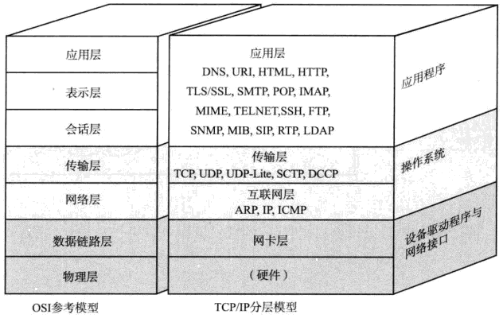

- TCP/IP 分层模型的最底层是负责数据传输的 **硬件** 。如以太网或电话线路等物理层的设备。

- **网卡层** 利用以太网中的数据链路层进行通信，因此属于接口层。也就是说，把它当作让 NIC 起作用的"驱动程序"也无妨。

- **互联网层** 使用 IP 协议。
  - **IP**：是跨越网络传送数据包，使整个互联网都能收到数据的协议。但它不具有重发机制，属于**非可靠传输协议**。
  - **ICMP**：当数据在发送途中发生异常，导致无法到达对端目标时，需要给发送端发送一个异常通知，这就是 ICMP 的作用。有时也被用来**网络的健康诊断**。
  - **ARP**：从分组数据包的 IP 地址中**解析出物理地址**的一种协议。

- **传输层** 最主要的功能就是能够让应用程序之间实现通信。因为一台主机运行着多个程序，必须加以区分。
  - **TCP**：一种**面向有连接**的传输层协议。保证两端通信主机之间的通信可达。能够正确处理在传输过程中丢包、传输顺序乱掉等异常情况。能够有效利用带宽，缓解网络拥堵。
  - **UDP**：一种**面向无连接**的传输层协议。不会关注关注对端是否真的收到数据。常用于分组数据较少或多播、广播通信以及视频通信等多媒体领域。

- **应用层** 将 OSI 模型中的会话层、表示层、应用层的功能都集中到应用程序中实现，这些功能可能由一个或多个程序实现。

每个分层中，都会对所发送的数据附加一个**首部**，这个首部中包含了该层必要的信息(至少包含收发端地址和上层协议类型)，如发送的目的地以及协议相关信息。

在下一层看来，从上一层收到的包全部都被认位时本层的数据。如下图：

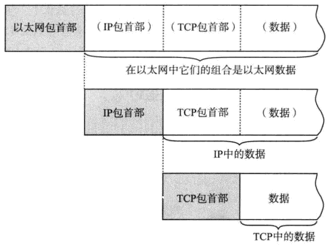

下图是分层中包的结构：

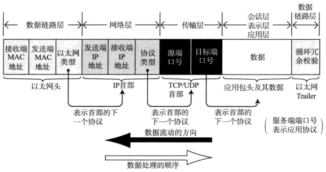

 

# 数据链路

略...

 

# IP 协议

IP 相当于 OSI 参考模型的第 3 层，网络层的主要作用是"实现终端节点之间的通信"，也叫"点对点(point-to-point)通信"。

## IP 基础知识

IP 大致分为三个作用模块，分别是 **IP 寻址** 、 **路由** 、 **IP 分包与组包** 。

### 路由控制

路由控制(Routing) 是指将分组数据发送到最终目标地址的功能。

IP 包正是在网络中一个个**跳间**被转发。因此， IP 路由也被叫做**多跳路由**。

**一跳**(1 Hop) 是指利用数据链路层以下分层的功能传输数据帧的一个区间。在以太网等数据链路中，它就是主机或路由器网卡不经其他路由器而能直接到达的相邻主机或路由网卡之间的一个区间。

**多跳路由** 是指路由器或主机在转发 IP 数据包时只指定下一个路由器或主机，而不是将到最终目标地址为止的所有通路都指定出来。类似于快递包裹，但它只知道下一个中转站，而不知道最终目的地。

为了将数据包发送给目标主机，所有主机都维护者一张 **路由控制表**(Routing Table) ，该表记录着 IP 数据在下一步应该发送到那个路由器。

### 数据链路的抽象化

IP 是实现多个数据链路之间通信的协议。对这些不同数据链路的相异特性进行抽象化也是 IP 的重要作用之一。

不同数据链路的最大区别是其最大传输单位不同。传输单位，MTU(Maximum Transmission Unit)。

IP 的上层可能会要求传送比 MTU 更多字节的数据。为此， IP 需要进行 **分片处理**(IP Fragmentation) 。

分片处理，就是将较大的 IP 包分成多个较小的 IP 包，分片的包到了对端目标地址之后再被组合起来传给上一层。

对于 IP 的上层，无需在乎数据包在途中的各个数据链路上的 MTU 。

### 为什么 IP 要采用面向无连接

两点原因：一是**简化**，二是**提速**。假若每次通信前都要建立连接，会导致速度降低，连接的功能可以委托上一层提供。

## IP 地址

IPv4 的地址由 32 位二进制表示。以每 8 位为一组，分成 4 组，每组以 "." 隔开。一般我们看到的都是转换成十进制的，如"192.168.1.1"。

IP 地址由 **网络标识(网络地址)** 和 **主机标识(主机地址)** 两部分组成。

关于前多少位算是网络标识，约定俗成由两种。起初以分类区分，如A/B/C/D类；现在基本以**子网掩码(网络前缀)**区分。

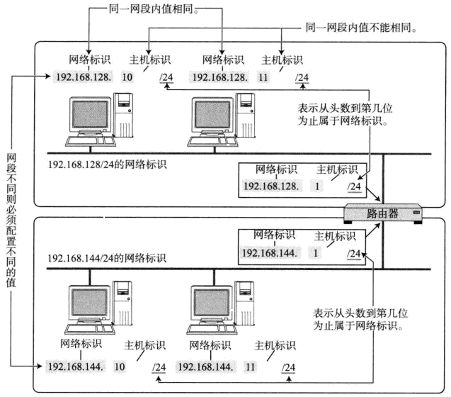

### IP 地址的分类

首先说明，**主机标识位**不可以全部是 0 或全部是 1 。因为**全部为 0** 表示该 IP 地址**不可获知**的情况；**全部为 1** 作为**广播地址**。

IP 地址分为四个级别，分别是 A/B/C/D 类。

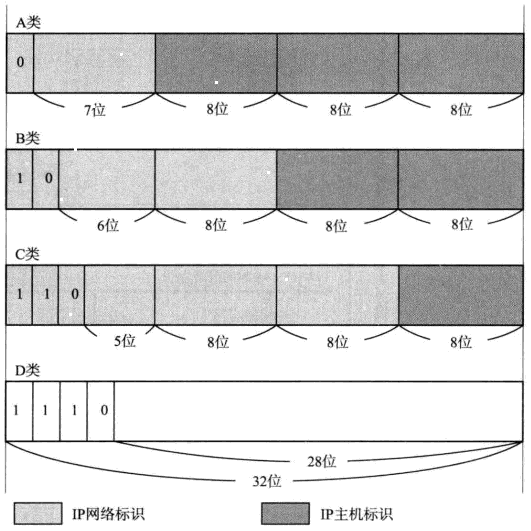

- A 类：首位以"0"开头，从 1~8 位是网络标识，后 24 位相当于主机标识位。用十进制表示是 0.0.0.0 ~ 127.0.0.0 。其容量上限位 16777214(2^24 - 2) 台主机。
- B 类：首位以"10"开头，从 1~16 位是网络标识，后 16 位相当于主机标识位。用十进制表示是 128.0.0.0 ~ 191.255.0.0 。其容量上限位 65534 台主机。
- C 类：首位以"110"开头，从 1~24 位是网络标识，后 8 位相当于主机标识位。用十进制表示是 192.0.0.0 ~ 223.255.255.255 。其容量上限位 254 台主机。
- D 类：首位以"1110"开头，从 1~32 位是网络标识，没有主机标识位，常用于多播。用十进制表示是 224.0.0.0 ~ 239.255.255.255 。

### 广播地址

广播分为 **本地广播** 和 **直接广播** 。

- 本地广播：在本地网络内的广播。如网络地址为 192.168.0.0/24 的情况下，广播地址为 192.168.0.255 ，因广播地址的 IP 包会被路由器屏蔽，所以不会到达 192.168.0.0/24 以外的其他链路上。
- 直接广播：在不同网络之间的广播。如 192.168.0.0/24 的主机向 192.168.1.255/24 的目标地址发送 IP 包，收到这个包的路由器将数据转发给 192.168.1.0/24 ，从而使 192.168.1.1 ~ 192.168.1.254 的主机都能收到。（由于安全问题，多数情况下路由器设置为不转发）

### IP 多播

多播用于将包发送给特定组内的所有主机。

多播使用 D 类地址。从 224.0.0.0 到 239.255.255.255 都是多播地址的可用范围。

其中 224.0.0.0 ~ 239.0.0.255 的范围不需要路由控制，在同一链路内也能实现多播。范围之外的会给全网所有组内成员发送多播的包。

利用 IP 多播实现通信，除了地址外还需要 IGMP 等协议的支持。

### 子网掩码

自从引入子网以后，一个 IP 地址就有两种识别码，一个是 IP 地址本身，一个是**子网掩码**。

子网掩码必须是 IP 地址的首位开始**连续**的 "1" 。它对应 IP 地址**网络标识**部分的为全部为"1"，对应 IP 地址**主机标识**的部分则是全部为"0"。

以 C 类网络为例，子网掩码就是 255.255.255.0 。

子网掩码由两种表示方式：

- IP 地址与子网掩码分别列出：（例子中,26位网络标识位,6位主机标识位）
  - IP 地址： 172.20.100.52
  - 子网掩码：255.255.255.192

- "后缀"表示法，在每个 IP 地址后面追加网络地址的位数，用"/"隔开。
  - IP 地址： 172.20.100.52 / 26

### CIDR 与 VLSM

由于 IP 地址分类会对 IP 资源的浪费，尤其是 B 类地址。

人们开始放弃 IP 地址的分类，采用任意长度分割 IP 地址的网络标识和主机标识，这种方式叫做 **CIDR**(Classless Inter-Domain Routing)，意为"无类型域间选路"。

为了架构一个高效的网络架构，产生了一种可以随机修改组织内各部门的子网掩码长度的机制，叫做 VLSM(Variable Length Subnet Mask)，意为"可变长子网掩码"。

### 全局地址与私有地址

由于 IPv4 的容量有限，不可能给没天主机或路由器都分配一个固定的 IP 地址。

包含如下范围内的 IP 地址都属于私有 IP ，范围之外的 IP 地址都称为全局 IP ：

- 10.0.0.0 ~ 10.255.255.255 (10/8) A类
- 172.16.0.0 ~ 172.31.255.255 (172.16/12) B类
- 192.168.0.0 ~ 192.168.255.255 (192.168/16) C类

## 路由控制_

实现 IP 通信的主机和路由器都必须持有一张路由控制表。

路由控制表的形成方式有两种：管理员手动设置(**静态路由控制**)；路由器与其他路由器相互交换信息时刷新(**动态路由控制**)。

**默认路由**(Default Route) 是指路由表任何一个地址都能与之匹配的记录。一般标记为 0.0.0.0/0 或 default 。

**主机路由**(Host Route) 是指整个 IP 地址的所有位都参与路由。即"IP地址/32"。

**环回地址** 是在**同一台计算机**上的**程序之间**进行网络网络通信时所使用的一个默认地址，数据包不会流向网络。有 127.0.0.1 或 localhost 。

## IP 分割处理与再构成处理

[前面](#数据链路的抽象化)说到，每种数据链路的最大传输单元(MTU)都不尽相同。下图是各种数据链路及其 MTU ：

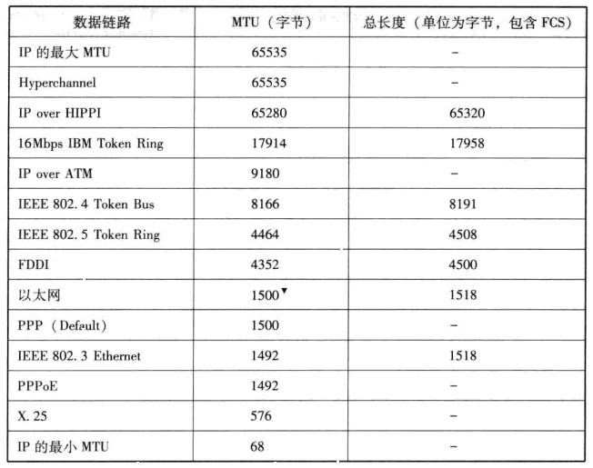

任何一台主机都有必要对 **IP 分片**(IP Fragmentation)进行相应的处理。分片往往在网络上遇到比较大的报文无法一下子发送出去时才会进行处理。

经过分片之后的 IP 数据包在被重组的时候，只能由目标主机进行。路由器虽然会做分片，但不会进行重组。

分片机制也有他的**不足**：

- 路由器的处理负荷加重。
- 在分片处理中，一旦某个分片丢失，整个 IP 数据包作废。

为了应对上述问题，产生了"**路径 MTU 发现**"(Path MTU Discovery)。

所谓的"路径 MTU "，是指从发送端主机到接收端主机之间不需要分片时最大 MTU 大小，即路径中存在的所有数据链路中最小的 MTU 。而"路径 MTU 发现"从发送主机按照"路径 MTU "的大小将数据包分片后进行发送。

因此，"路径 MTU 发现"可以避免在中途路由器上进行分片处理。

## IPv6

IPv6(IP version 6) 为了根本解决 IPv4 地址耗尽的问题而被标准化的国际协议。

IPv6 的地址长度是 128 比特，每 16 比特为一组，每组以冒号(":")隔开。如果出现连续的 0 时还可以将这些 0 省略，并用双冒号("::")隔开。但是，一个 IP 地址只允许出现一次双冒号。

IPv6 具有以下几个特点：

- IP 地址的扩大与路由控制表的聚合： IP 地址依然适应互联网分层构造。分配与其地址结构相适应的 IP 地址，尽可能避免路由表膨大。
- 性能提升：包首部长度采用固定的 40 字节，不在采用首部校验码。简化首部结构，减轻路由器负荷。路由器不再做分片处理(通过"路径 MTU 发现"只由发送端主机进行分片处理)。
- 支持即插即用功能：即使没有 DHCP 服务器也可以实现自动分配 IP 地址。
- 采用认证与加密功能：应对伪造 IP 地址的网络安全功能以及防止线路窃听的功能(IPsec)。
- 多播、Mobile IP 成为扩展功能。

IPv6 地址结构：

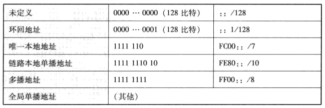

**全局单播地址**：

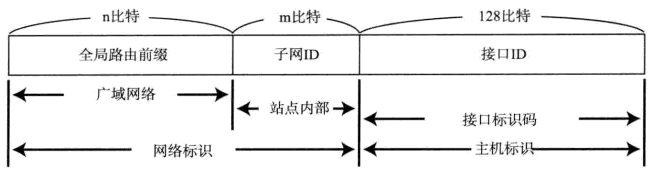

**链路本地单播地址**，是指在同一个数据链路内唯一的地址，不经过路由器，接口 ID 保存 64 比特版的 MAC 地址：

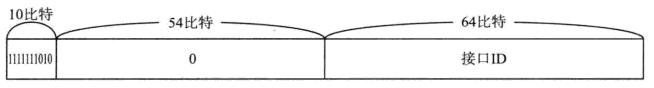

**唯一本地地址**，是不进行互联网通信时所使用的地址，如企业内部网络：

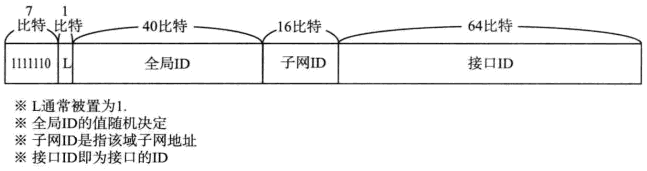

## IP 首部

IP 首部中包含着用于 IP 协议进行发包控制时所有的必要信息。

### IPv4 首部

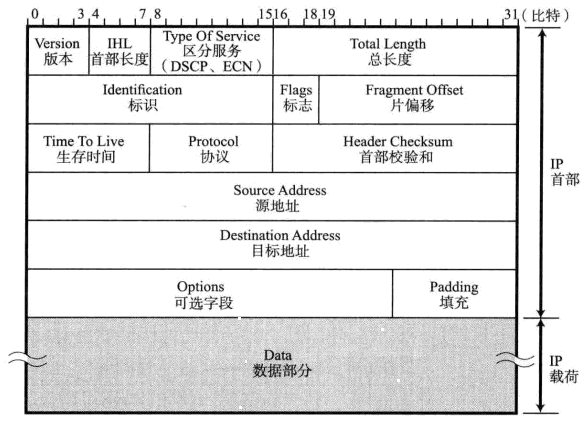

- 版本(Version)：表示标识 IP 首部的版本。在 IPv4 中就是 4 。

- 首部长度(IHL, Internet Header Length)：表明首部的大小，单位是"4字节"。如，此值设为 5 (没有可选字段的情况)， IP 首部的长度为 4*5 字节。

- 区分服务(TOS, Type Of Service)：表明服务质量。这个值通常由应用指定，但一般网络都无视这字段。有人提出将此字段在划分成 DSCP 和 ECN 两个字段：
  - DSCP(Differential Service Codepoint, 差分服务代码)，占 TOS 的前 6 个比特，用来进行质量控制。
  - ECN(Explicit Congestion Notification, 显式拥塞报告)，占 TOS 的剩下 2 比特，用来报告网络拥堵情况。

- 总长度(Total Length)：表示 IP 首部与数据部分合起来的总字节数。

- 标识(ID, Identification)：用于分片重组。通常每发送一个 IP 包，它的值都逐渐递增。

- 标志(Flags)：表示包被分片的相关信息。每一位比特的具体含义如下：
  - 0：未使用。现在必须是 0 。
  - 1：标识是否进行分片(don't fragment)， 0 = false ；1 = true 。
  - 2：包被分片的情况下，表示是否为最后一个包(more fragment)， 0 = false ；1 = true 。

- 片偏移(FO, Fragment Offset)：用来标识被分片的每一个分段相对于原始数据的位置。

- 生存时间(TTL, Time To Live)：可以中转多少个路由器。没经过一个路由器， TTL 会减少 1 ，直到变成 0 则丢弃该包。

- 协议(Protocol)：表示 IP 包传输层的上层协议编号。[协议编号一览表](http://www.iana.org/assignments/protocol-numbers)。

- 首部检验和(Header Checksum)：也叫 IP 首部校验和。该字段只校验数据包的首部，不校验数据部分。主要用来确保 IP 数据包不被破坏。
  - 校验和的计算过程：以16比特为单位划分IP首部；然后用**1补数**计算所有16位的和；得到的和再用1补数计算，赋值给此字段。

- 源地址(Source Address)：表示发送端 IP 地址。

- 目标地址(Destination Address)：表示接收端 IP 地址。

- 可选项(Options)：长度可变，通常只在进行实验或诊断时使用。包含如下几点信息：
  - 安全级别
  - 源路径
  - 路径记录
  - 时间戳

- 填充(Padding)：在有可选项的情况下，填充剩余的比特，保证 可选项+填充 = 32 比特。

### IPv6 首部

IPv6 为了减轻路由器的负担，省略了首部的检验和字段，路由器不再需要计算校验和，从而提高了包的转发效率。

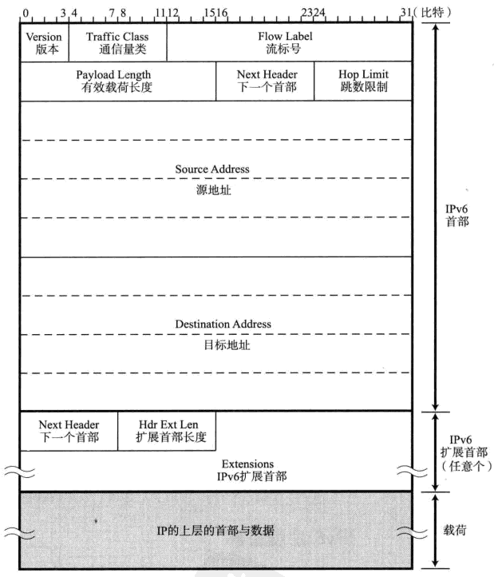

- 版本(Version)：表示标识 IP 首部的版本。在 IPv6 中就是 6 。

- 通信量类(Traffic Class)：相当于 IPv4 的 TOS 字段。与服务质量有关。

- 流标号(Flow Label)：准备用于服务质量(QoS, Quality Of Service)控制。不使用 QoS 时全设为 0 。

- 有效载荷长度(Payload Length)：有效载荷指的是包的数据部分。即此值是不包含首部大小。

- 下一个首部(Next Header)：表示后面第一个**扩展首部**的协议类型。

- 跳数限制(Hop Limit)：与 IPv4 的 TTL 意思相同。即每经过一个路由器就减 1 。

- 源地址(Source Address)：表示发送端 IP 地址。

- 目标地址(Destination Address)：表示接收端 IP 地址。

关于**扩展首部**：

IPv6 的首部长度是固定的，无法加入可选项。取而代之的是通过扩展首部对功能进行有效扩展。

扩展首部通常介于 IPv6 首部与 TCP/UDP 首部中间。

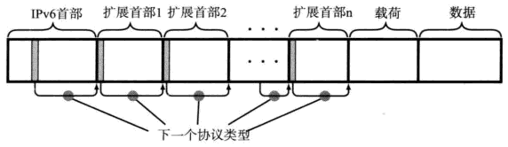

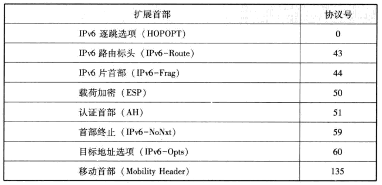

 

# IP 协议相关技术

## DNS

DNS(Domain Name System, 域名解析系统) 可以将**域名**解析成具体的 IP 地址。

域名是指，为了识别主机名称和组织机构名称的一种具有分层的名称。

DNS 查询：

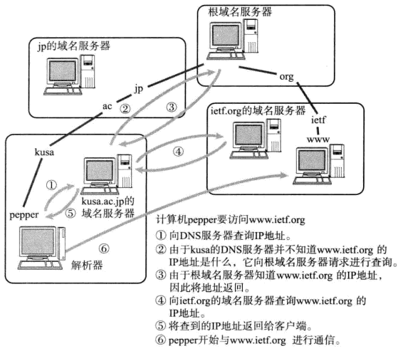

## ARP

ARP(Address Resolution Protocol) 是一种解决地址问题的协议。以目标 IP 地址位线索，用来定位下一个应该接收数据分包的网络设备对应的 MAC 地址。

只适用于 IPv4 ，但 IPv6 中有 **ICMPv6** 替代 ARP 发送邻居探索消息。

ARP 是借助 **ARP 请求**与 **ARP 响应**两种类型的包确定 MAC 地址的。流程大致如下：

1. A 主机要通过广播发送一个 ARP 请求包，包中包含了想要了解其 MAC 地址的主机 IP 地址。
2. ARP 请求包会被同一链路上的所有主机和路由器接收并解析。
3. 若 ARP 请求包中的目标 IP 地址与 本机 IP 地址相同，就将自己的 MAC 地址塞入 ARP 响应包，并返回给主机 A 。

ARP 包格式：

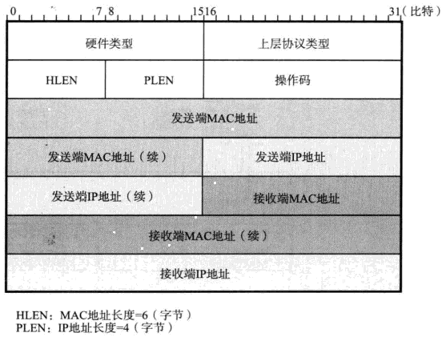

**RARP**(Reverse Address Resolution Protocol) 是将 ARP 反过来，从 MAC 地址定位 IP 地址的一种协议。例如将打印机服务器等小型嵌入式设备介入到网络时就经常会用到。

**代理 ARP**(Proxy ARP)：通常 ARP 包会被路由器隔离，但采用代理 ARP 的路由器可以将 ARP 请求转发给邻近的网段。由此，两个以上网段的节点之间就可以像在同一个网段中一样进行通信。

## ICMP

IPv4 中， ICMP(Internet Control Messages Protocol, 网间控制报文协议) 仅作为一个辅助作用支持 IPv4 。也就是说，即使没有 ICMP ，仍然可以实现 IP 通信。

ICMP 的主要功能包括：

- 确认 IP 包是否成功到达目标地址
- 通知再发送过程当中 IP 包被废弃的具体原因
- 改善网络设置
- ...

ICMP 的消息大致可以分为两类：

- 通知出错原因的错误消息
- 用于诊断的查询消息

在 IPv6 中， 如果没有 ICMPv6 就无法正常进行 IP 通信。

ICMPv6 大致分为两类：错误消息(类型值 0 ~ 127)；信息消息(类型值 128 ~ 255)。

## DHCP

DHCP(Dynamic Host Configuration Protocol) 实现自动设置 IP 地址、统一管理 IP 地址分配。

使用 DHCP 首先需要一台 DHCP 服务器，但一般路由器都能充当 DHCP 服务器。

DHCP 的工作原理：

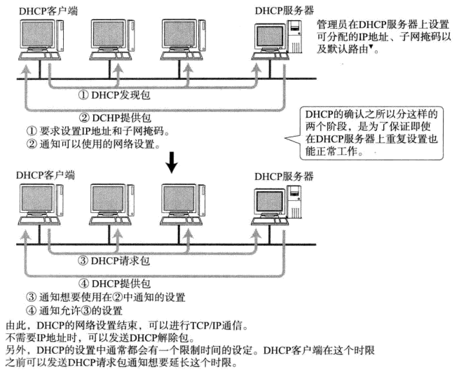

在家庭网络中，只要有一台 DHCP 服务器就足以应对 IP 地址分配的需求。相较之下，企业或学校等大规模组织机构的网络环境中，会有多个以太网(无线LAN)网段，这时就可以使用 DHCP 中继代理。

有了 DHCP 中继代理后，对把不同网段的 IP 地址分配也可以由一个 DHCP 服务器同一进行管理和运维。

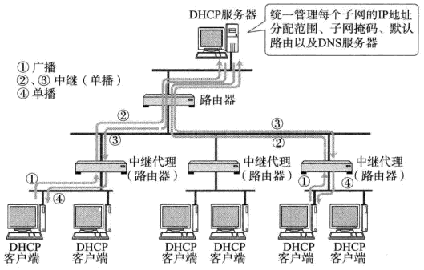

## NAT

NAT(Network Address Translator) 是用于在本地网络中使用私有地址，在连接互联网是转而使用全局 IP 地址的技术。

NAPT(Network Address Port Translator) 技术还能转换 TCP/UDP 端口号。

NAT(NAPT) 实际上是为了面临地址枯竭的 IPv4 而开发的技术。不过， 在 IPv6 中为了提高安全也在使用 NAT 。

NAT 的工作机制：

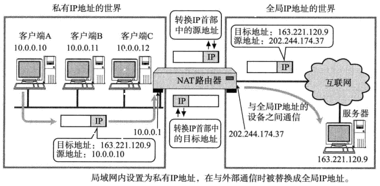

NAPT 的工作机制：

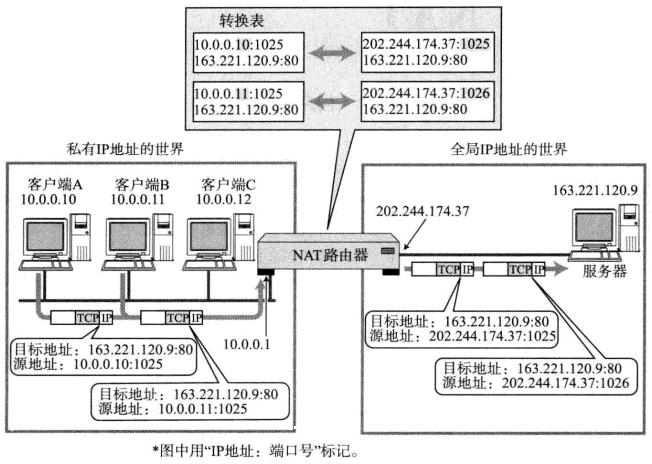

在 IPv4 和 IPv6 之间的相互通信中常常使用 NAT-PT(NAPT-PT) 。其工作机制：

T-PT的工作机制.png)

由于 NAT(NAPT) 都依赖于自己的转换表，因此由如下几点限制：

- 无法从 NAT 的外部像内部服务器建立连接。
- 转换表的生成与转换操作都会产生一定的开销。
- 通信过程中一旦 NAT 遇到异常需要重新启动时，所有的 TCP 连接都将被重置。
- 即使配备两台 NAT 做容灾备份， TCP 连接还是会被断开。

## IP 隧道

网络 A、B 使用 IPv6 ，如果处于中间位置的网络 C 支持 IPv4 的话，A、B 之间无法直接通信，这时候需要使用 **IP 隧道**。

IP 隧道中可以将那些从网络 A 发过来的 IPv6 的包统合为一个数据，再追加一个 IPv4 的首部，然后再转发给网络 C 。

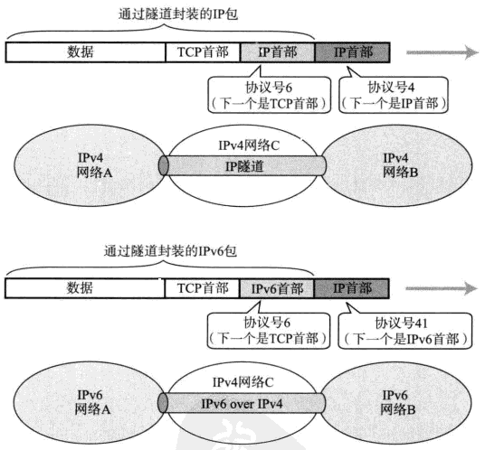

 

# TCP 与 UDP

在实际进行通信时，要实现确定端口号。确定端口号的方法有两种：

- 标准既定的端口号(静态方法)：是指每个应用程序都有其指定的端口号。
  - 应用程序应该避免使用知名端口号进行既定目的之外的通信，以免产生冲突。
  - 知名端口号的[参考网站](http://www.iana.orgassignments/port-numbers)。
- 时许分配法(动态方法)：客户端应用程序的端口号设置全权交给操作系统进行分配。服务端有必要确定监听端口号，但接受服务的客户端没必要确定端口号。
  - 动态分配的端口号取值范围在 49152 到 65535 之间。

## UDP

**UDP**(User Datagram Protocol) 是不具有可靠性的数据报协议。

UDP 不提供复杂的控制机制，利用 IP 提供面向无连接的通信服务。它无法避免网络拥塞的行为，也不负责重发，甚至当出现报的到达顺序乱掉也没有纠正的功能。

UDP 常用于以下几个方面：

- 包总量较少的通信 ( DNS、SNMP 等)
- 视频、音频等多媒体通信 (即时通信)
- 限定于 LAN 等特定网络中的应用通信
- 广播通信 (广播、多播)

UDP 的首部格式如下：

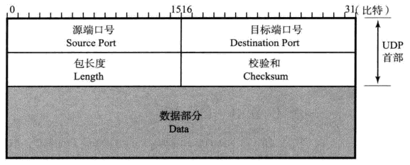

- 源端口号(Source Port)：表示发送端端口号。该字段是可选项，不用就全设为 0 ，用于不需要返回的通信中。

- 目标端口号(DesTination Port)：表示接收端端口号。

- 包长度(Length)：该字段保存了 UDP 首部与数据的长度值和。

- 校验和(Checksum)：与 IP 的校验和计算类似。

## TCP

**TCP**(Transmission Control Protocol) 是面向连接的、可靠的流协议。

TCP 充分地实现了数据传输时各种控制功能，可以进行丢包时的重发控制，还可以对次序乱掉的分包进行顺序控制。

TCP 通过校验和、序列号、确认应答、重发控制、连接管理以及窗口控制等机制实现可靠性传输。

在 TCP 中，当发送端的数据到达接收端时，接收端主机会返回一个已收到消息的通知，这个消息叫做**确认应答(ACK)**。

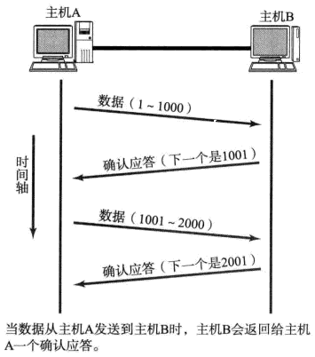

假如没有收到 ACK ，有两种可能：数据发送失败，接收端没有收到数据；数据发送成功，但接收端的 ACK 途中丢失。后者会导致接收端收到多份相同的数据。

### 重发超时

**重发超时**是指，在重发数据之前，等待 ACK 到来的那个特定时间间隔，若超出时间限制，发送端将进行数据重发。

如何确定"重发超时"的值：每次发包时都会计算**往返时间**(RTT, Round Trip Time)及其**偏差**(有时也叫抖动)，两者相加，重发超时的时间就是这个总和稍大一点的值。

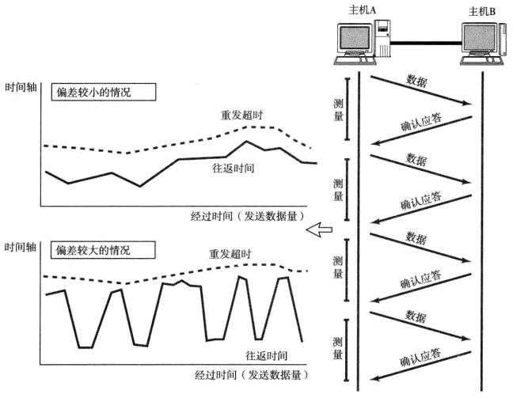

还有，数据不会被无线、反复的重发。重发到达一定次数后仍没有 ACK ，就会判断网络或对端发生故障，强制关闭连接。

### 连接管理

TCP 在数据通信之前，通过 TCP 首部发送一个 SYN 包作为建立连接的请求等待应答。若对端发来 ACK ，则认位可以进行数据通信。这过程也被称为"三次握手"。

在通信结束时，会进行断开连接的处理 (FIN 包)。

在建立 TCP 连接的同事，也可以确定发送数据包的单位，称之为"最大消息长度"(MSS, Maximum Segment Size)。 MSS 是在三次握手的时候，在两端主机之间被计算的出：

- 两端主机在发出建立连接请求时，会在 TCP 首部中写入 MSS 选项，告诉对方自己的接口能够适应的 MSS 的大小。
- 然后会在两者之间选择一个较小的值投入使用。

### 窗口控制

TCP 以 1 个段位单位，每发一个段进行一次确认应答的处理，这样的传输方式有个缺点，就是包的往返时间越长通信性能越低。

为了解决这个问题， TCP 引入了 **窗口** 这个概念。

**窗口大小**就是指，无需等待确认应答而可以继续发送数据的最大值。如下图中，窗口大小为 4 个段：

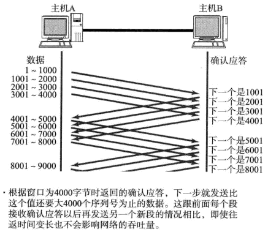

不过，在整个窗口的 ACK 没有到达之前，如果其中部分数据出现丢包，那么发送端仍然要负责重发。

收到确认应答的请款下，将窗口滑动到确认应答中的序列号的位置，这样的机制称为 **滑动窗口控制** 。如下图：

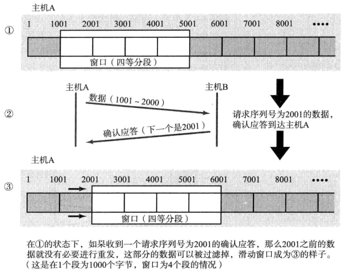

在使用窗口控制中，如果出现丢失，分两种情况考虑：

1. 数据已经到达对端，接收端没有收到 ACK 。这种情况下，某些应答即便丢失也无需重发。如下图所示：
    - 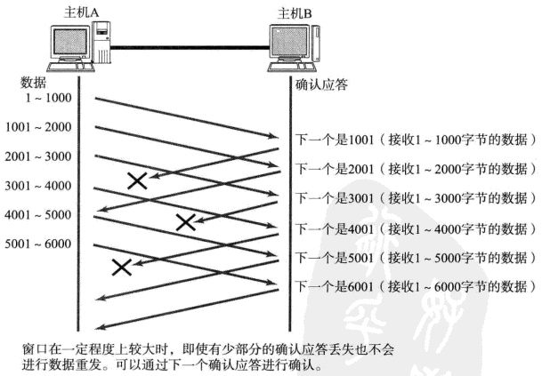

2. 某个报文段丢失。接收主机如果收到一个自己应该收到的序号以外的数据时，会针对当前为止收到数据返回 ACK 。如下图所示：
    - **高速重发控制**(Fast Retransmission)
    - 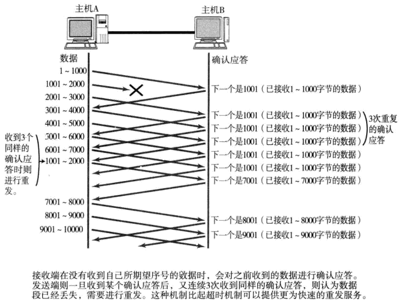
    - 如上图所示，当某一报文丢失后，发送端会一直收到序号为 1001 的确认应答。
    - 由于窗口较大，同意序号的确认应答将会被重复不断的返回。
    - 发送端主机如果连续 3 次收到同一个确认应答，就会将其所对应的数据进行重发。

### 提高网络利用率的规范

TCP 中为了提高网络利用率，经常使用 **Nagle 算法**。

该算法是指发送端即使还有应该发送的数据，但如果这部分数据很少的话，则进行延迟发送的一种处理机制。仅在下列一种跳间下才能发送数据，否则延迟发送：

- 已发送的数据都已经收到确认应答时
- 可以发送最大段长度(MSS)的数据时

Nagle 算法虽然可以提高网络利用率，但会造成延迟。为此，在窗口系统(X Windwo System)以及机械控制等领域中使用 TCP 时，往往会关闭。

**延迟确认应答**：收到数据以后不立即返回确认应答，而是延迟一段时间。绝大多数情况是，每两个数据段返回一次确认应答。

**捎带应答**(PiggyBack Acknowlegement)： TCP 的确认应答和回执数据通过一个包发送。

### TCP 首部

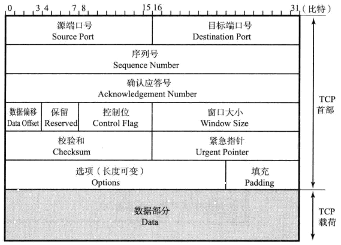

- 源端口号(Source Port)：表示发送端端口号。

- 目标端口号(DesTination Port)：表示接收端端口号。

- 序列号(Sequence Number)：表示发送数据的位置。有时也叫序号。

- 确认应答号(Acknowledgement Number)：表示下一次应该收到的数据的序列号。

- 数据偏移(Data Offset)：表示 TCP 所传输的数据部分应该从 TCP 包的哪个位开始计算，也可以把它当作 TCP 首部的长度。

- 保留(Reserved)：该字段主要为了以后扩展时使用，一般设为 0 。

- 控制位(Control Flag)：每一位从左到右分别是 CWR 、 ECE 、 URG 、 ACK 、 PSH 、 RST 、 SYN 、 FIN ，1 表示 true ； 0 表示 false 。
  - CWR(Congestion Window Reduced)：是否通知对方已将拥塞窗口缩小。
  - ECE(ECN-Echo)：是否通知对方，从对方到这边的网络有拥堵。
  - URG(Urgent Flag)：是否保重有需要紧急处理的数据。
  - ACK(Acknowledgement Flag)：确认应答的字段是否变为有效。
  - PSH(Push Flag)：是否需要将收到的数据立即传给上层应用协议。
  - RST(Rest Flag)：若 TCP 连接中出现异常，是否必须强制断开连接。
  - SYN(Synchronize Flag)：是否希望建立连接。(用于建立连接)
  - FIN(Fin Flag)：是否断开连接。

- 窗口大小(Window Size)：用于通知从相同 TCP 首部的确认应答号所指位置开始能够接收的数据大小。

- 校验和(Checksum)：略。

- 紧急指针(Urgent Pointer)：表示本报文中紧急数据的指针。

- 选项(Options)：用于提高 TCP 的传输性能。具有代表性的 TCP 选项如下：
  - 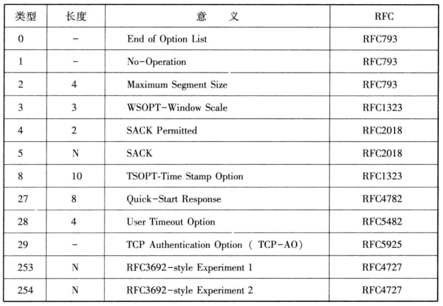

## 其他传输层协议

**UDP-Lite**(Lightweight User Datagram Protocol, 轻量级用户数据报协议) 是扩展 UDP 技能的一种传输协议。是 UDP 的修正版。

**SCTP**(Stream Control Transmission Protocol, 流控制传输协议) 与 TCP 一样，都是对一种提供数据到达与否相关可靠性检查的传输层协议，其主要特点如下：

- 以消息为单位收发：TCP 中收发端并不知道发送端应用所决定的消息大小。而 SCTP 中却可以。
- 支持多重宿主：在有多个 NIC 的主机中，即使其中能够使用的 NIC 发生变化，也仍然可以继续通信。(多重宿主是指同一台主机具备多种网络的接口)
- 支持多数据流通信：TCP 中建立多个连接以后才能进行通信的效果，在 SCTP 中一个连接就可以。
- 可以定义消息的生存期限：超过生存期限的消息，不会被重发。

SCTP 主要用于进行通信的应用之间发送众多较小消息的情况。

**DCCP**(Datagram Congestion Control Protocol, 数据报拥塞控制协议) 是一个辅助 UDP 的传输协议，它有如下几个特点：

- 与 UDP 一样，不能提供发送数据的可靠性传输。
- 它面向连接，具备建立连接和断开连接的处理。在建立和断开连接上是具有可靠性的。
- 能够根据网络拥堵情况进行拥塞控制。使用 DCCP(RFC4340) 应用可以根据自身特点选择两种方法进行拥塞控制：
  - 类似 TCP(TCP-Like) 拥塞控制
  - TCP 友好升级控制 (TCP-Friendly Rate Control)
- 为了进行拥塞控制，接收端收到包以后返回确认应答。该确认应答将被用于重发与否的判断。

 

# 路由协议

前面已经提及，路由控制分静态和动态两种类型。

**静态路由** 是指实现设置好路由器和主机中并将路由信息固定的一种方法。

**动态路由** 是指让路由协议在运行过程中自动地设置路由控制信息的一种方法。

**路由算法**中，最具代表性的有两种，分别是 **距离向量(Distance-Vector)算法** 和 **链路状态(Link-State)算法** 。

距离向量算法是指根据距离和方向决定目标网络或目标主机位置的一种方法。

链路状态算法是路由器在了解网络整体连接状态的基础上生成路由控制表的一种方法。该方法中，每个路由器必须保持同样的信息才能进行正确的路由选择。

主要的路由协议有以下几种：(其中，由于 EGP 不支持 CIDR ，限制已经不在用作互联网的对外连接协议了)

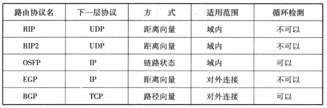

**RIP**(Routing Information Protocol) 是距离向量型的一种路由协议，广泛用于 LAN 。

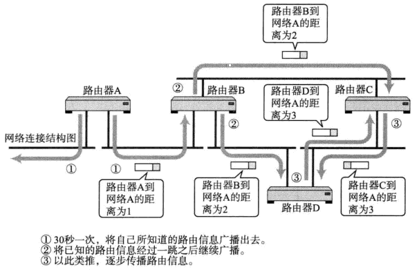

**OSPF**(Open Shortest Path First) 是根据 OSI 的 IS-IS 协议而提出的一种链路状态型路由协议。由于采用链路状态类型，所以即使网络中有环路，也能够进行稳定的路由控制。

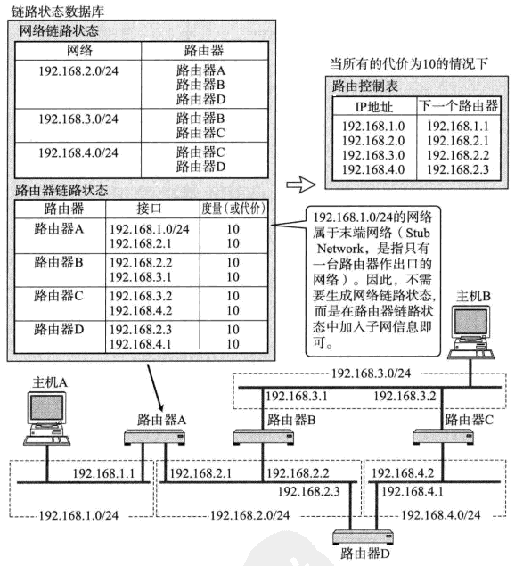

**BGP**(Border Gateway Protocol, 边界网关协议) 是连接不同组织机构的一种协议。它主要用于 ISP 之间相连的部分。只有 BGP、RIP、OSPF 共同进行路由控制，才能进行整个互联网的路由控制。

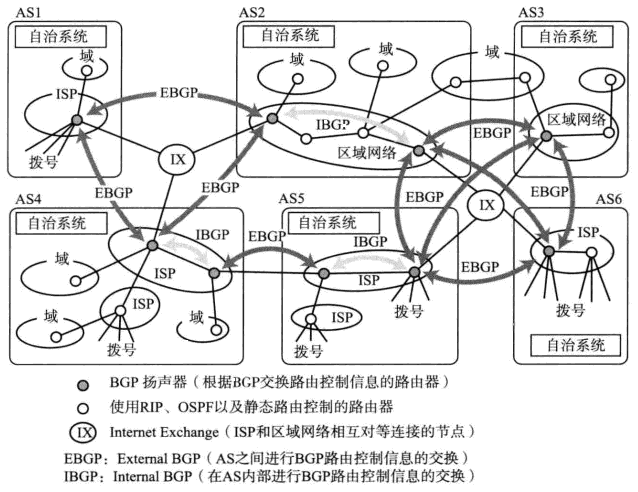

**MPLS**(Multi Protocol Label Switching) ：路由技术基于 IP 地址中最长匹配原则进行转发，而标记交换则对每个 IP 包都设定一个叫做"标记"的值，然后根据这个"标记"在进行转发。这协议就是标记交换技术中最具代表性的。

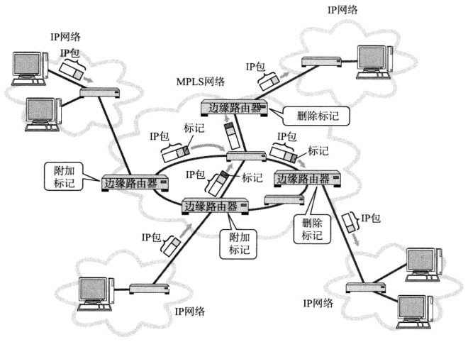

 

# 应用协议

远程登陆主要使用 TELNET 和 SSH 两种协议。

**TELNET** 利用 TCP 的一条连接，通过这条连接想主机发送文字命令并在主机上执行。

**SSH** 是加密的远程登陆系统。它还包括很多非常方便的功能：

- 可以使用更强的认证机制
- 可以转发文件
- 可以使用端口转发功能

**FTP** 是在两个相连的计算机之间进行文件传输时使用的协议。

- FTP 中也需要在登录到对方的计算机后才能进行响应的操作。
- 它使用两条 TCP 连接，分别用于 控制 和 数据(文件)的传输 。

**SMTP**(Simple Mail Transfer Protocol) 提供电子邮件服务的协议。

- 早期电子邮件是在发送端主机和接收端主机之间直接建立 TCP 连接进行邮件传输。
- 之后有了永远在线的邮件服务器，接收端可以用来发送邮件，接收端可以用来接收邮件。
- 接收端接收邮件时使用 POP3(Post Offset Protocol) 协议
- POP 与 SMTP 一样，也是在其客户端与服务器之间通过建立一个 TCP 连接完成相应的操作。
- 电子邮件的机制由三部分组成，分别是 邮件地址、数据格式、发送协议 。

**IMAP**(Internet Message Access Protocol) 与 POP 类似，也是接收电子邮件的协议。

- 在 POP 中邮件由客户端进行管理，而在 IMAP 中邮件则由服务器进行管理。
- 因此，在即使在不同的计算机上打开邮箱，也能保持同步，使用起来非常方便。

**WWW**(World Wide Web, 万维网) 是将互联网中的信息以长文本形式展现的系统，也叫做 Web 。可以显式 WWW 信息的客户端软件叫 Web 浏览器。它定义了三个重要的概念：

- 访问信息的手段与位置(URI, Uniform Resource Identifier)
- 信息的表现形式(HTML, HyperText Markup Language)
- 信息转发(HTTP, HyperText Transfer Protocol)

**URI** 用于标识资源。它被用于主页地址、电子邮件、电话号码等各种组合中。

- 一般主页地址，也被叫做 **URL**(Uniform Resource Locator)。它常被用来标识互联网中资源(文件)的具体位置。
- URI 所标识的组合叫 **方案(Scheme)** 。[URI Scheme 一览表](http://www.iana.org/assignments/uri-schemes.html)。
- 主要的 URI 方案：
- 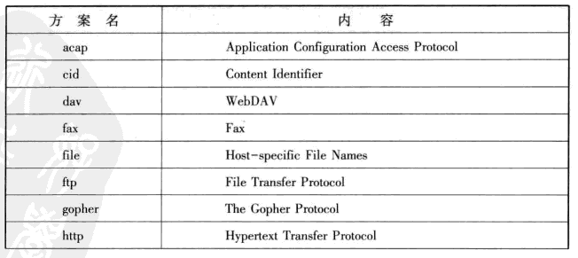
- 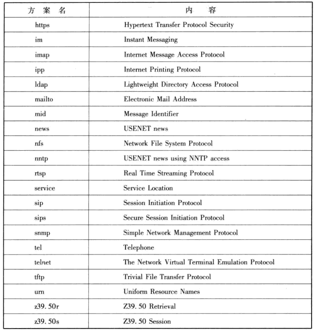

**HTML** 是记述 Web 页得一种语言(数据格式)。

**SNMP**(Simple Network Management Protocol) 在 TCP/IP 的网络管理中手机必要的信息。它是一款基于 UDP/IP 的协议。

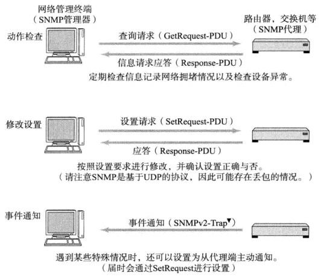

SNMP 中交互的信息是 **MIB**(Management Information Base) 。它是在树形结构的数据库中为每个项目附加编号的一种信息结构。
