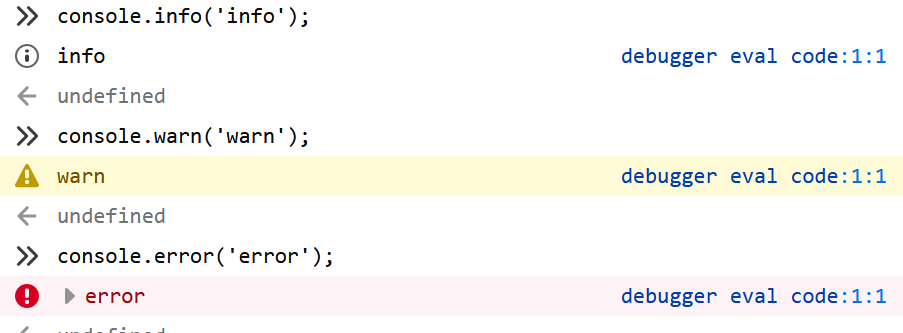
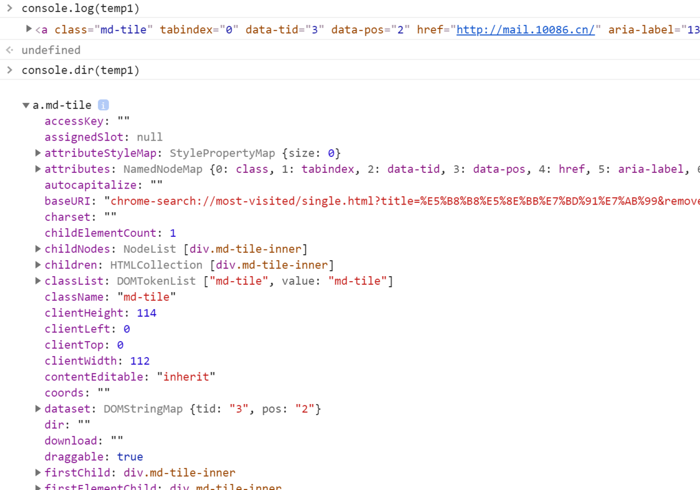
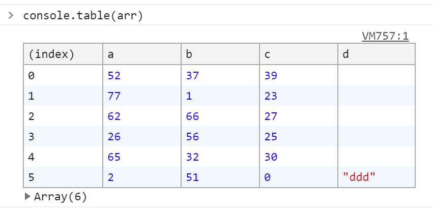
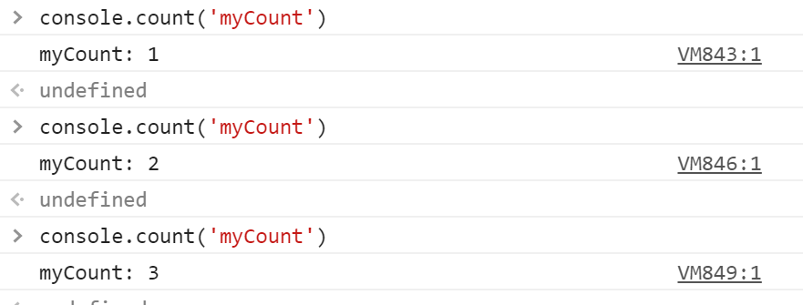
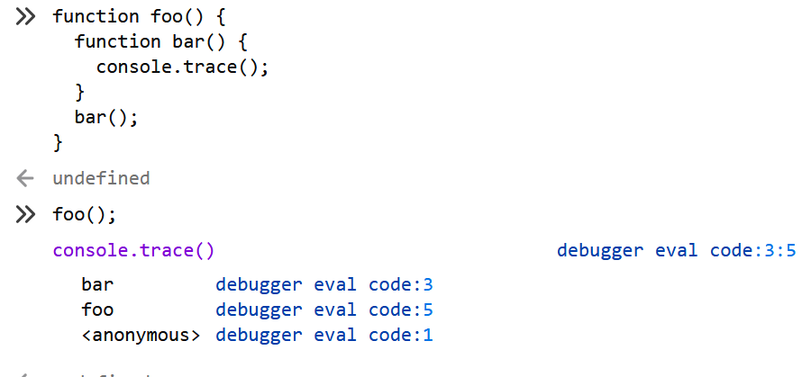
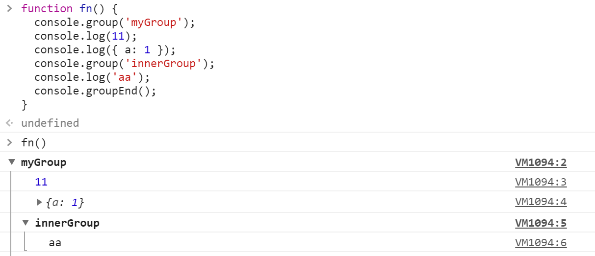

# BOM

## window 对象

[`window` 对象](https://developer.mozilla.org/zh-CN/docs/Web/API/Window) 既是通过 JavaScript 访问浏览器窗口的一个接口，又是 ECMAScript 规定的 `Global` 对象。

全局作用域下声明的变量均会成为 `window` 对象的属性/方法：

``` js
let str = 'foo';
alert(window.str);   // 'foo'
```

`window` 对象下的属性和方法，可以通过 `window.` 调用，也可省略直接调用，如 `window.screenLeft` 与 `screenLeft` 是调用同样的属性。

常用属性：

- `screenLeft` ：浏览器窗口左上角相对于屏幕左边的距离。
- `screenTop` ：浏览器窗口左上角相对于屏幕上方的距离。
- `innerHeight` ：浏览器视口高度。
- `innerWidth` ：浏览器视口宽度。

其中， `window.outerWidth` 和 `window.outerHeight` 各浏览器表现不一，实用性不大。

## 定时器

由于 JavaScript 是单线程缘故，两个定时器均不会在准确的时间执行，一般会稍迟于规定时间，而 `setInterval` 则部分可能会被跳过。（[定时器的详细描述及高级用法](../基础_JS/定时器高级用法.md)）

### `setTimeout`

`setTimeout(<function>,<timer>)`：`<function>`表示延迟执行的函数；`<timer>`表示过多久执行该函数，毫秒为单位。

``` js
setTimeout(function(){
  alert('timeout!');
}, 1000);    // 1秒后执行
```

### `setInterval`

`setInterval(<function>,<timer>)`：与 `setTimeout` 传入的参数一致，表示每隔一定时间执行该函数。

``` js
setInterval(function(){
  console.log('timeout!');
}, 1000);    // 每隔1秒后执行
```

## 弹出对话框

有三种系统对话框，用于向用户展示或获取特定信息，均为 `window` 对象的方法。

``` js
alert(<string>);    // 警告框，显示参数字符串
let bool = confirm(<string>);    // 确认框，显示参数字符，能返回一个布尔值
let str = prompt(<string>);    // 输入提示框，显示参数字符串，能返回用户输入的字符串
```

## `console` 对象

通过 [`console` 对象](https://developer.mozilla.org/zh-CN/docs/Web/API/Console) 内的方法可以向 JavaScript 控制台写入消息。下面介绍几个常用的。

### `console.log()`

就是最常用的一种向控制台打印内容的方法。除了一般用法 `console.log(value);` 外，还有另一种使用占位符的用法：

``` js
console.log('I like %s but I do not like %s.', 'Skittles', 'pus');
// I like Skittles but I do not like pus.
```

常见的占位符号：`%o`(字母o) 表示接受对象，`%s` 表示接受字符串，`%d` 表示接受数值。

类似的打印信息还有 `console.info();` 、 `console.warn();` 、 `console.error();` ，都是向控制台打印信息，只是显示的效果不一样，而且各浏览器可能会有差别。效果如下图：



### `console.dir()`

用法和 `console.log()` 一致，打印的内容也很相似，打印的内容类似文件树样式的交互列表，常用于对象。就我个人已知的，两者差别在于打印 HTML 元素， `console.log()` 打印元素的 HTML 文档， `console.dir()` 打印的是该元素对象的属性及方法，如下图：



### `console.table()`

打印出表格形式，常用于打印包含多个对象的数组。如 `arr = [{a:1, b:2, c:3}, ...]` 。效果如下图：



还可以传入第二个参数，用于控制展示的字段，如 `console.table(arr, ["a", "b"]);` 就只显示上图的 a 和 b 两列。

注意， `console.table()` 只能处理最多 1000 行，因此它可能不适合所有数据集。

### `console.count()`

打印计数器，用于统计该行命令执行的次数。传入的参数只有一个，就是计数器的名称，如 `console.count('myCount');` 。效果如下图：



还有，可以通过 `console.countReset('myCount');` 重置计数器。

### `console.assert()`

对输入的表达式进行断言，只有表达式为 `false` 时，才输出相应的信息到控制台。

``` js
console.assert(true, 1);    // 不会打印
console.assert(false, 1);   // Assertion failed: 1
```

### `console.trace()`

向控制台输出一个堆栈跟踪。效果如下：



### `console.time()`

打印计时器。必须配合 `console.timeEnd();` 使用。用于计算函数执行耗时。都接受一个参数，就是计时器的名称。示例如下：

``` js
function fn() {
  console.time('myTimer');
  for (let i = 0; i < 1000; i++) { }
  console.timeEnd('myTimer');
}
fn();   // myTimer: 1ms
```

### `console.group()`

将打印内容分组显示。必须配合 `console.groupEnd()` 使用。在控制台上创建一个新的分组，随后输出到控制台上的内容都会被添加一个缩进，表示该内容属于当前分组，直到调用 `console.groupEnd()` 之后，当前分组结束。分组内可以包含另外的分组。传入唯一参数，就是分组的名称。示例如下：



### `console.clear()`

这个没什么好说的，就是清除控制台的所有打印内容。

## `location` 对象

[`location` 对象](https://developer.mozilla.org/zh-CN/docs/Web/API/Location) 提供了与当前窗口中加载的文档有关的信息，还提供了一些导航功能。简言之跟URL有关。它既是 `window` 对象的属性，也是 `document` 对象的属性。

属性：

以下属性均为**可读写**，修改属性值时，页面会以新的 URL 刷新页面（ `hash` 除外）。

- `hash`: 哈希模式下，`"#"` 后面的字符串，无则返回空字符串。
- `host`: 服务器名称及端口号(如果有)，如 `"www.foo.com:80"` 。
- `hostname`: 服务器名称，如 `"www.foo.com"` 。
- `href`: 完整 URL。
- `pathname`: 路径名，如 `"/path"` 。
- `port`: 端口号。
- `protocol`: 协议，如 `"https:"` 。
- `search`: 查询字符串，如 `"?user=admin"` 。

方法：

- `assign(<url>)`: 打开该URL并生成一条浏览器历史纪录，如 `location.assign('https://www.baidu.com');` 。
- `replace(<url>)`: 同样是打开新 URL ，与 `assign` 不同的是，会替换当前浏览器记录。
- `reload()`: 无参数，重新加载本页面。

## `history` 对象

[`history` 对象](https://developer.mozilla.org/zh-CN/docs/Web/API/History) 是 `widow` 对象的属性之一，用于保存用户的上网记录，从窗口被打开的一刻算起。

属性：

- `length`: 获取历史记录的条数。

方法：

- `go(<number|string>)`: 传入正整数时，表示前进 n 条记录；负数则后退；传入字符串时，表示跳转到最近一条包含该字符串的历史纪录；无效信息则什么都不发生。
- `back()`: 无参数，后退一条记录。
- `forward()`: 无参数，前进一条记录。

"无刷新"路由的方法：

- `pushState(<data>, <title>, <url>)`: `<data>` 用于触发 `popstate` 事件时的数据，可以时任意类型； `<title>` 表示该路由的标题，一般路由器都将其忽略； `<url>` 只能使用同源的，可以使用相对路径。该方法会在 `history.state` 添加一条记录，但不会刷新页面，只改变路由地址，使用 `history.go(-1)` 能返回上一个路由，并清除 `history.state` 的相应记录，这方法是 Vue 框架的路由实现的原理。
- `replaceState(<data>, <title>, <url>)`: 与 `pushState()` 类似，有同样的参数，同样在history.state添加一条记录，不同的是会将当前路由替换，导致history.go(-1)不能返回当前路由。

上面两个方法还涉及一个事件: 当活动历史记录条目更改时，将触发 `popstate` 事件。在 `window` 对象上可以添加该事件，即 `window.addEventListener('popstate', <cb>);` ，其中，事件对象 `event` 中的 `state` 属性正是 `pushState` 或 `repalceState` 方法传入的第一个参数。

顺带一说，当 `history.state` 内有值， `history.go(-1)` 不会刷新页面，只改变路由地址；否则会刷新页面并跳转。

## `navigation` 对象

[`navigation` 对象](https://developer.mozilla.org/zh-CN/docs/Web/API/Navigator) 同样属于 `window` 的属性。通常用于检测浏览器的特性。
常用属性

- `geolocation`: 返回一个 [`Geolocation` 对象](https://developer.mozilla.org/zh-CN/docs/Web/API/Geolocation/getCurrentPosition) ，通过这个对象可以访问设备的位置信息，如 `navigator.geolocation.getCurrentPosition(e=>{console.log(e)});` 。
- [`connection`](https://developer.mozilla.org/zh-CN/docs/Web/API/Navigator/connection): 实验性 API ，到目前只有 chrome 浏览器实现。只读，返回一个包含设备的网络连接信息的对象。
- `cookieEnable`: 布尔值，浏览器不支持或者用户禁用了 `cookie` ，都会返回 `false` 。
- `onLine`: 布尔值，浏览器是否联网。

常用方法

- [`vibrate(pattern)`](https://developer.mozilla.org/zh-CN/docs/Web/API/Navigator/vibrate): 使设备（有震动硬件）产生有频率的震动。若设备不支持震动，该方法将无效（返回 `false` ）。若某震动方式已经在进行中（当该方法调用时），则前一个震动方式停止，新的取而代之。（[关于 `pattern` 参数的说明](https://developer.mozilla.org/zh-CN/docs/Web/API/Vibration_API)）
