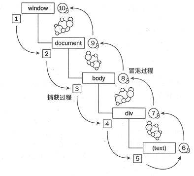
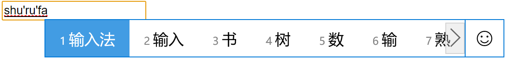
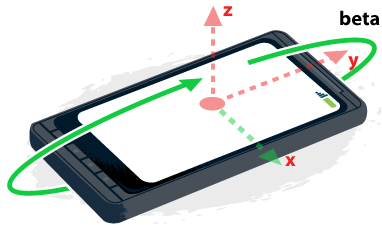

# DOM事件

## 基本概念

### 定义

事件就是用户或浏览器自身执行的某种动作，诸如 `click` 、 `load` 等。而相应某个事件的函数就叫事件处理程序（或事件侦听器），如 `onclick` 、 `onload` 等。

### 事件捕获 与 事件冒泡

**事件冒泡**，是指事件开始的时候由最具体的元素（文档中嵌套层次最深的那个点）接受，然后沿着 DOM 树逐级向上传播，直到 `window` 对象为止。

**事件捕获**，与"事件冒泡"相反，从 `window` 对象开始，沿着 DOM 树逐级向下传播，直到目标元素为止。

两者可以用下图表示：



其实两者之间还有一个阶段：**处于目标的发生阶段**。

</br>

## 添加和删除事件

添加和删除事件均有两种方法，均为 `Element` 类型的对象的方法。以下的 "`callback`" 表示事件处理的回调函数，如 `function callback(event){ }` ， "`event`" 为内部提供的参数，表示事件对象。

需要注意的是，DOM0 级与 DOM 2级 添加事件处理函数会被同时触发，互不干扰。

### DOM0 级

特点是带有 "`on`" 字眼。这种方法添加的事件处理函数会在**冒泡阶段**被处理。

这类方法的优点是使用简单，直接赋值一个函数（或匿名函数或箭头函数）；缺点是只能赋值一个函数，后赋值会覆盖前者，所以删除事件也会清除所有。

下面以 "`onclick`" 为例。

- 添加：`ele.onclick = callback`

- 删除：`ele.onclick = null`

### DOM2 级

这两个方法的优点是能对同一个元素依次添加多个事件处理函数，也能单独移除某个事件处理函数（必须提供函数的对象），而且能针对冒泡或捕获阶段处理。

`eventType` 表示事件的类型，如 "`click`" 等，是不带 "`on`" 字的；isBubbles 是可选参数，默认为 `false` ，表示在冒泡阶段处理函数， `true` 则表示是否在捕获阶段处理函数。

下面以 "`click`" 为例。

- 添加：`ele.addEventListener(eventType, callback, isCapture?)`

- 删除：`ele.removeEventListener(eventType, callback, isCapture?)`

### event 对象

浏览器会将 `event` 对象是传入到事件处理程序中。 `event` 对象有以下**属性/方法**：

|           属性/方法            |     类型     |                                              说明                                               |
|:------------------------------:|:------------:|:-----------------------------------------------------------------------------------------------:|
|          **bubbles**           |     Bool     |                                     表示事件**是否冒泡**。                                      |
|           cancelable           |     Bool     |                                表示是否可以取消事件的默认行为。                                 |
|       **currentTarget**        |     Elem     |                         其事件处理程序当前**正在处理事件的那个元素**。                          |
|        defaultPrevented        |     Bool     |                          为 `true` 表示已经调用了 `preventDefault()`。                          |
|             datail             |     Int      |                                     与事件相关的细节信息。                                      |
|         **eventPhase**         |     Int      |                 **调用事件程序的阶段**：1-捕获阶段；2-"处于目标"；3-冒泡阶段。                  |
|           **target**           |   Element    |                                    事件的**目标元素**对象。                                     |
|            trusted             |     Bool     |             为 true 表示事件是浏览器生成的；否则为开发人员通过 JavaScript 创建的。              |
|            **type**            |     Str      |                   被触发的**事件类型**。如， `"click"` 、 `"mouseover"` 等。                    |
|              view              | AbstractView |                      与事件关联的抽象视图。等同于发生事件的 window 对象。                       |
|      **preventDefault()**      |     Func     | **取消事件的默认行为**。如， `<a>` 标签的单击事件就是跳转链接。（ `cancelable` 必须为 `true` ） |
| **stopImmediatePropagation()** |     Func     |            **取消**事件的进一步**捕获或冒泡**，同时**阻止任何事件处理程序被调用**。             |
|     **stopPropagation()**      |     Func     |                              **取消**事件的进一步**捕获或冒泡**。                               |

下面再说说某些**常用的属性**：

- `currentTarget` 指向的是函数正在处理的元素对象，与处理程序内部的 "`this`" 对象相等。
  - 非"目标阶段"时， `currentTarget` 指向的就是冒泡或捕获经过的对象；
  - **"目标阶段"时， `currentTarget` 与 `target` 对象相同**。
- `type` 对象常用于一个函数处理多个事件。通过判断 `type` 的值区别处理。
- 取消元素的默认行为，请使用 **`preventDefault()`** 方法。
- 取消事件的冒泡或捕获，请使用 **`stopPropagation()`** 方法。
- `event` 对象只存在于处理程序执行期间。

</br>

## 事件类型

### UI 事件（UIEvent）

[UI 事件](https://developer.mozilla.org/zh-CN/docs/Web/API/UIEvent)是指，与用户操作不一定有关的事件。

- `load`: 当元素/对象完全加载后（包括所有的图像、JavaScript文件、CSS文件等外部资源）触发。
  - 除了 `window`、`document`、`<body>` 之外，所有能引用外部资源的元素都能使用本事件，如 `<object>`、`` 等。
  - 建议在 `document` 上添加事件判断 HTML 页面是否完全加载完成，如 `document.addEventListener('load', callback)` 。
- `unload`: 与 `load` 事件相对应，在文档被完全卸载后触发。
- `abort`: 加载外部资源期间终止下载时触发。
- `error`: JavaScript 错误、无法加载外部资源、无法嵌入内容时都会触发。
- `select`: 当用户选择文本框（`<input>`或`<textarea>`）中的字符时触发。
- `resize`: 当浏览器窗口的宽高被调整时触发。建议在 window 对象上添加该事件，即 `window.addEventListener('resize', callback)` 。
- `scroll`: 具有滚动条的元素滚动时触发。

### 焦点事件（FocusEvent）

[焦点事件](https://developer.mozilla.org/zh-CN/docs/Web/API/FocusEvent)会在页面元素获得或失去焦点时触发。默认情况下，只有input等元素才有焦点事件，但只要给 `<div>` 等元素添加 `tabindex` 特性，同样能触发焦点事件，要注意的是，在获得焦点时，某些浏览器可能会为该元素添加边框等样式。

通过 `document.hasFocus()` 可以判断用户是否与该页面互动（页面未进行任何操作或不在屏幕内显示则返回 `false` ）。

通过 `document.activeElement` 属性可以获取当前被聚焦的元素。

以下是焦点事件：(都**不会冒泡**)

- `blur`: 在元素失去焦点时触发。
- `focus`: 在元素获得焦点时触发。

### 鼠标事件（MouseEvent）

[鼠标事件](https://developer.mozilla.org/zh-CN/docs/Web/API/MouseEvent)继承自 UI Event 。鼠标事件包括左键、右键、滚轮。单击指代的是左键点击一下，双击则左键连续点击两下。所有元素都支持鼠标事件。

除了 `mouseenter` 和 `mouseleave` ，所有鼠标事件都冒泡。

只有在同一个元素上相继触发 `mousedown` 和 `mouseup` 事件，才会触发 `click` 事件；类似的，只有触发两次 `click` 事件才会触发一次 `dblclick` 事件。

事件列表如下：

- `click`: 鼠标单击时触发，最为常用的一个事件。
- `dblclick`: 鼠标双击时触发。移动端不支持，且双击只会放大页面。
- `mousedown`: 按下鼠标任意键时触发。
- `mouseup`: 释放鼠标按键时触发。
- `mouseenter`: 鼠标光标从元素外部移动到元素范围内时触发。
- `mouseleave`: 鼠标光标从元素内部移动到元素范围外时触发。
- `mousemove`: 鼠标光标在元素内部移动时重复触发。
- `mouseout`: 鼠标光标从事件元素移动到另一个元素(包括子元素)时触发。
- `mouseover`: 鼠标光标从事件元素的外部移动到事件元素的内部时触发。
- `contextmenu`: 右击鼠标或移动端长按时触发的事件，默认行为是打开"上下文菜单"，通过 `e.preventDefault()` 可以阻止"上下文菜单"的打开，然后通过获取鼠标位置，在指定位置显示自制的"菜单"。也可以用 `mousedown` 代替。

鼠标触发的事件，其 `event` 对象有几个属性是值得关注的：
|     属性      | 值类型  |          使用场景          |                                          说明                                           |
|:-------------:|:-------:|:--------------------------:|:---------------------------------------------------------------------------------------:|
|    clientX    | Integer |             *              |                  触发该事件时，鼠标光标相对于浏览器**视口的X轴**位置。                  |
|    clientY    | Integer |             *              |                  触发该事件时，鼠标光标相对于浏览器**视口的Y轴**位置。                  |
|     pageX     | Integer |        页面有滚动条        |               触发该事件时，鼠标光标相对于**浏览器页面（非视口）的X轴**位置。               |
|     pageY     | Integer |        页面有滚动条        |               触发该事件时，鼠标光标相对于**浏览器页面（非视口）的Y轴**位置。               |
|   shiftKey    | Boolean |        键盘组合鼠标        |        当按下"shift"键的同时触发鼠标事件，该属性值为 `true` ，否则为 `false` 。         |
|    ctrlKey    | Boolean |        键盘组合鼠标        |         当按下"ctrl"键的同时触发鼠标事件，该属性值为 `true` ，否则为 `false` 。         |
|    altKey     | Boolean |        键盘组合鼠标        |         当按下"alt"键的同时触发鼠标事件，该属性值为 `true` ，否则为 `false` 。          |
|    metaKey    | Boolean |        键盘组合鼠标        |         当按下"meta"键的同时触发鼠标事件，该属性值为 `true` ，否则为 `false` 。         |
| relatedTarget | Element |    与两个元素有关的事件    |  `mouseover` 、 `mouseout` 、 `mouseleave` 都与两个元素有关，本属性指向相关元素对象。   |
|    button     | Integer |   触发鼠标按键事件的按键   |        0:鼠标左键；1:鼠标滚轮按钮；2:鼠标右键；3:鼠标"后退"键；4:鼠标"前进"键。         |
|               |         |                            |                            注意，click事件触发的只会是 0 。                             |
|    buttons    | Integer | 获取当前按下的多个鼠标按键 | 0:无任何按键；1:鼠标左键；2:鼠标滚轮按钮；4:鼠标右键；8:鼠标"后退"键；16:鼠标"前进"键。 |
|               |         |                            |               注意，多个按键之间用"加法"表示，如，同时按下左右键则为 6 。               |

### 触摸事件（TouchEvent）

[触摸事件](https://developer.mozilla.org/zh-CN/docs/Web/API/TouchEvent)同样继承自 UI Event 。通常在移动端设备或可以触摸设备上使用该事件。上面提到的鼠标事件，如， `click` 、 `mousedown` 、 `mouseup` ，一般情况下都能使用。**触摸事件都是会冒泡的**。

- `touchstart`: 当手指触摸屏幕时触发；即使已经有手指在屏幕上。
- `touchmove`: 当手指在屏幕上滑动时连续触发。
- `touchend`: 当手指从屏幕上移开时触发。
- `touchcancel`: 当触点由于某些原因被中断时触发。例如，弹窗打断；触点离开文档窗口进入浏览器界面元素；产生的触摸点超过了设备所支持的。

这几个触摸事件对象除了继承 UI Event 事件的属性外，还包含如下属性，都是 `TouchList` ，由 [`Touch` 对象](https://developer.mozilla.org/zh-CN/docs/Web/API/Touch)组成的类数组。每个 `touch` 对象表示一个触摸点， `touch` 对象保存着跟触摸点相关的信息（如，id、位置信息、按压力度等）。

- `touches`: 当前屏幕上所有触摸点的列表，即使某些触摸点不在事件触发对象上。
- `targetTouches`: 当前对象上所有触摸点的列表。
- `changeTouches`: 表示自上次触摸以来发生变化的触摸点列表，简单说就是，当新增的触摸点时，本属性则包含新增的触摸点；当减少触摸点时，本属性则包含减少的触摸点；而前两个属性只获取当前存在的触摸点。

### 键盘事件（KeyboardEvent）

当用户按下键盘的按键就会触发[键盘事件](https://developer.mozilla.org/zh-CN/docs/Web/API/KeyboardEvent)。键盘的事件有 3 个：

- `keydown`: 当用户按下键盘上的任意按键时触发。按住不放会重复触发。
- `keypress`: 当用户按下键盘上的字符（即不包括 F*、功能键等）按键时触发。按住不放会重复触发。
- `keyup`: 当用户释放键盘按键时触发。
- `textInput`: 仅在文本框输入时触发。可以对用户输入的内容获取。

`keydown` 、 `keypress` 、 `keyup` 都是同类型的事件对象。都含有相同的属性，一般获取用户按下的按键再进行处理，详细请查看 [MDN 文档](https://developer.mozilla.org/zh-CN/docs/Web/API/KeyboardEvent#%E5%B1%9E%E6%80%A7)。

还有复合事件（composition Event）是与键盘输入有关的，其实就是我们常说的输入法。有三个复合事件：

- `compositionstart`: 当文本复合系统打开时触发，表示要开始输入。
- `compositionupdate`: 在向输入字段中插入新字符时触发。
- `compositionend`: 在文本复合系统关闭时触发。

这类事件对象中的 `data` 属性是值得关注的。 `compositionstart` 只表示启动了输入法， `data` 的值永远为空。 `compositionupdate` 表示正在向输入法输入字符，每次更新都会触发，如下图，当正在输入且未选择字符时， `data` 的值与文本框显示的相同，即 `shu'ru'fa` ；当选择字符后， `data` 值会更新为选择的字符，即输入法。 `compositionend` 在关闭输入法时触发，所以 `data` 属性的值就是留在输入框内的值。



### 拖放事件（DragEvent）

拖放事件是 [`DragEvent`](https://developer.mozilla.org/zh-CN/docs/Web/API/DragEvent) 类型。

用户通过将指针设备（例如鼠标）放置在触摸表面上并且然后将指针拖动到新位置（诸如另一个 DOM 元素）来发起拖动。

"拖放"实际是有两部分：拖（drag）和放（drop）。文本和图片是默认可以拖放的，而其他的 DOM 元素可以通过设置特性 `draggable="true"` 达到可以拖放。

有如下拖放事件：

- `drag`: 当拖动元素或选择文本时触发。
- `dragstart`: 当用户开始拖动元素或选择文本时触发。
- `dragend`: 当拖动操作结束时（释放鼠标按钮或按下退出键）触发。
- `dragenter`: 当拖动的元素或选择文本进入有效的放置目标时触发。
- `dragleave`:  当拖动的元素或文本选择离开有效的放置目标时触发。
- `dragexit`: 当元素不再是拖动操作的选择目标时触发。
- `dragover`: 当将元素或文本选择拖动到有效放置目标（每几百毫秒）上时触发。注意，必须先添加此事件的处理函数， `drop` 事件才会触发。
- `drop`: 当在有效放置目标上放置元素或选择文本时触发。

可以参考 MDN 文档的一个[拖放例子](https://developer.mozilla.org/en-US/docs/Web/API/Document/drag_event)。简单总结几点：

- 非文本或图片的元素，必须添加特性 `draggable="true"` 才能拖放。
- 拖放元素的实现依赖于节点的删除和添加方法，如 `removeChild` 、 `appendChild` 等。
- 通过 `event.target` 的样式设置，可以增强拖放时给用户的感受。
- `dragover` 事件是 `drop` 事件的前提，所以，不添加 `dragover` 事件处理函数则无法触发 `drop` 事件。
- `drop` 事件的默认行为是打开链接，通过 `event.preventDefault()` 可以禁用其行为。

### 设备事件

设备事件通常包含两种：设备方向改变、设备被移动。通常用于手机和平板。都是 `window` 对象上的事件。

事件对象的属性中关于方向的 x、y、z 轴如下图。事件对象的属性中关于面的 `alpha` 对应的 xy 组成的面； `bata` 对应的是yz组成的面； `gamma` 对应的是 zx 组成的面。



具体事件如下：

- `orientationchange`: 当设备向左或向右旋转时触发。事件对象是 `Event` 对象。
  - 注意，设备设定了"锁定旋转"将不会触发该事件。但事件对象本身并没有太多可用信息，需要配合 `window.orientation` 对象使用，用于获取设备的方向。
  - `window.orientation` 可能有三个值: 0 表示"垂直模式"，即设备底部指向地面；90 表示左转的"横屏模式"，即设备的左侧指向地面；-90 表示右转的"横屏模式"，即设备的右侧指向地面。
- `deviceorientation`: 当设备在空间上移动时触发，页面显示时(最小化后显示;切换标签后显示)也会触发。（苹果设备不能触发该事件）。事件对象是 `DeviceOrientationEvent` 对象。是一个实验中的功能。
  - `alpha`: 围绕 z 轴旋转时，y 轴的角度差；是一个 0~360 的浮点数。
  - `beta`: 围绕 y 轴旋转时，z 轴的角度差；是一个 -180~180 的浮点数。
  - `gamma`: 围绕 x 轴旋转时，z 轴的角度差；是一个 -90~90 的浮点数。
  - `absolute`: 布尔值，表示设备返回的是否为一个绝对值。
  - `compassCalibrated`: 布尔值，表示设备的指南针是否校准过。
- `devicemotion`: 当设备在空间上受到的加速度时触发（包括重力）。即该事件会不断触发。事件对象是 `DeviceMotionEvent` 对象。是一个实验中的功能。
  - `acceleration`: 包含 x、y、z 属性的对象，每个方向上的加速度（不考虑重力）。读取不到为 `null` 。
  - `accelerationIncludingGravity`: 包含 x、y、z 属性的对象，每个方向上的加速度（考虑重力）。读取不到为 `null` 。
  - `interval`: 获取事件触发的间隔时间，毫秒为单位。
  - `rotationRate`: 包含表示面 alpha 、 beta 、 gamma 受力的属性的对象。读取不到为 `null` 。

### 其他事件

以下未写明的均为 `Event` 类型的事件。

- `load`: 当文档所有资源（包括链接外部资源）加载完成后触发。必须添加到 `window` 对象上。
- `DOMContentLoaded`: 在形成完整的 DOM 树后就会触发。可以添加到 `window` 或 `document` 对象上。
- `beforeunload`: 当页面卸载前弹窗让用户确认关闭。必须添加到 `window` 对象上。不冒泡。使用该事件需要两个条件: 鼠标焦点必须在该文档上； `event.returnValue` 必须赋值。

  ``` js
  window.addEventListener('beforeunload', (e) => {
    // 原意是显示 returnValue 作为提示内容，但实际并没显示
    // 但赋值是必须的，可以是任何值，否则不会触发事件
    e.returnValue = ''
  })
  ```

- `readystatechange`: 当 `document.readyState` 属性发生改变， `readystatechange` 事件会被触发。
  - 只能用在 `document` 对象上。
  - 用途不大，一般我们只关心加载完成的状态，使用 `DOMContentLoaded` 事件即可。
- `hashchange`: 当 URL 的参数列表（及 URL 中 "#" 号后面的所有字符串）发生变化时触发。
  - 有两个属性: `oldURL` 和 `newURL` 。但还是建议使用 `location` 对象确定当前地址的参数列表。是 `HashChangeEvent` 类型的事件。
- `pageshow` 和 `pagehide`: 当网页在加载完成或卸载后会触发页面传输事件。并不常用，事件对象必须是 `window` 。事件对象中的 `persisted` 属性值得关注，表示页面是否保存在内存中或是否从内存中加载（要注意两点: 当页面从内存中加载，load事件不会触发；当设置了 `unload` 事件，页面不会保存在内存中）。是 `PageTransitionEvent` 类型的事件。
- `submit`: 当表单提交时触发。但 `form.submit()` 例外，不会触发该事件。
- `reset`: 当表单重置时触发。
- `focus`: 当元素获得焦点时触发。是 `FocusEvent` 类型的对象。
- `blur`: 当元素失去焦点时触发。是 `FocusEvent` 类型的对象。
- `change`: 当表单控件元素的值发生变化时触发。（[更多关于表单介绍](./操作表单.md)）
- `select`: 在文本框中选择了文本时（鼠标释放时）触发。
  - 但方法内不包含已选择文本的信息，需要通过 `target` 对象上的两个属性间接获取: `selectionStart` 、 `selectionEnd` 。
  - 例子： `e.target.value.substring(e.target.selectionStart,e.target.selectionEnd)` 。

</br>

## 模拟事件

开发者可以创建自定义事件，刻意触发特定事件，在测试 Web 应用时极其有用。

### 创建

创建 `Event` 对象需要使用 `new` 关键字： `event = new Event(typeArg, eventInit?);` 。

其中， `typeArg` 表示自定义事件的名称； `eventInit` 是可选参数，是一个对象，包含三个字段 `"bubbles"` 、 `"cancelable"` 、 `"composed"` 中的任意多个。

``` js
// 创建一个 名为look，支持冒泡，不能被取消的 事件
let ev = new Event("look", {"bubbles":true, "cancelable":false});
```

### 触发

每个 `Element` 对象都有一个 `dispatch(event)` 方法，用于触发开发者创建的模拟事件，前提是已经给该元素添加事件监听函数， `event` 表示模拟事件对象。下面给出一个完成的例子：

``` html
<button id="btn1">按钮1</button>
```

``` js
// 创建模拟事件对象
let myEvent = new Event("eventName", {"bubbles":true, "cancelable":false});
// 获取元素对象，并添加事件监听
let btn =  document.getElementById('btn1');
btn.addEventListener('eventName', e => console.log(e));
// 触发"eventName"事件
btn.dispatchEvent(myEvent);
```

### by the way

上面提及到的[事件类型](#事件类型)均可以作为构造函数。如，要创建 `DeviceMotionEvent` 类型的事件对象，则 `let ev = new DeviceMotionEvent('evnetName', {});` 即可，其他类型同理。

</br>

## 内存和性能

关于这部分，要说的只有两点：列表中使用的事件绑定，建议使用**事件委托**，如 `<li>` 均不添加事件处理函数，只在外层的 `<ul>` 添加，通过 `target` 判断是哪个 `<li>` 再处理；删除元素前，先把绑定的**事件函数移除**。

过多事件导致性能下降的原因：每个函数都是对象，都会占用内存，对象越多性能越差；必须事先指定所有的事件处理函数而导致 DOM 访问次数过多，会延迟整个页面的交互就绪事件。
