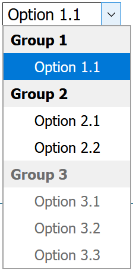
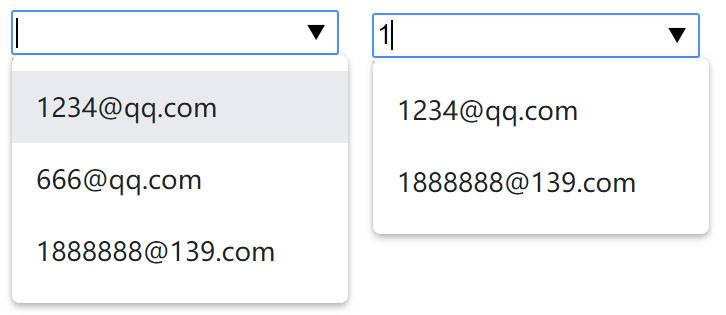

# 操作表单

`<form>` 元素对应的时 `HTMLFormElement` 类型，继承自 `HTMLElement` ，因而拥有与 `HTMLElement` 相同的默认属性。

`<form>` 元素内部还需要"内容"，而填充"内容"的元素有 `<input>` 、 `<button>` 、 `<textarea>` 、 `<select>` 、 `<option>` 等，这些成为表单控件，表单控件都有 `name` 特性。

## 表单基础知识

``` html
<form action="" method="post">
  <input type="text" name="username">
  // ...
</form>
```

上述例子是一个简单的 `<form>` 表单， `action` 、 `method` 等为 `<form>` 元素的 HTML 特性（[MDN文档](https://developer.mozilla.org/zh-CN/docs/Web/HTML/Element/form)）。通过 JavaScript 也能操作指定特性。

### 表单对象的属性

- `acceptChartset`: 服务器能够处理的字符集。对应 `accept-chartset` 特性。
- `action`: 接收表单请求的 URL 。对应 `action` 特性。
- `elements`: 表单中所有控件的集合（`HTMLCollection`）。
- `length`: 表单中控件的数量。
- `enctype`: 请求的编码类型。对应 `enctype` 特性。
- `method`: 要发送的 HTTP 请求类型，通常 `get` 或 `post` ，默认 `get` 。对应 `method` 特性。
- `name`: 表单的名称。对应 `name` 特性。
- `target`: 用于发送请求和接收响应的窗口名称。对应 `target` 特性。

### 表单对象的方法

方法只有两个，提交和重置。

关于提交：在相应的表单控件拥有焦点时，点击回车键能提交表单；使用"表单提交按钮"或回车键提交表单，都能触发 `submit` 事件。

关于重置：使用"表单重置按钮"或表单对象的 `reset()` 方法都能重置表单，都能触发 `reset` 事件。重置的值为控件 `value` 特性指定的值，如 `<input type="text" value="first">` 被重置后则显示 `"first"` 。

- `submit()`: 提交表单。不会触发 `submit` 事件。
- `reset()`: 将所有表单域重置为默认值。

### 获取表单对象

最简单常见的方法就是和获取普通元素一样的方法获取。下面列出两种获取的方法：

``` html
<form name="form1" id="myForm"></form>
<form name="form2"></form>
```

``` js
// 通过元素获取的方法
let form1 = document.getElementById('myForm')
// document.forms可以获取页面所有form元素
let form2 = document.forms.form2
```

</br>

## 表单控件(字段)

表单字段指的是，表单中的表单控件（字段）。表单字段组成的集合是一个有序列表，就是表单对象的 `elements` 属性。通过该集合可以获取到任意表单字段。下面给出简单例子介绍：

``` html
<form name="form1" action="#" id="form1" target="">
  <!-- div不是表单控件，所以elements不包含该对象 -->
  <div name="div1">div1</div>
  <ul>
    <!-- 即使是嵌套的表单控件，elements也同样能获取 -->
    <li><input type="text" name="input1" value="inputText"></li>
    <li><input type="text" name="input2" value="inputText"></li>
    <!-- name可以相同，elements对象将相同name特性的对象归于同一个RadioNodeList中 -->
    <li><input type="text" name="input2" value="inputText"></li>
  </ul>
</form>
```

``` js
let form1 = document.getElementById('form1');
// 获取elements对象
console.log(form1.elements);    // HTMLFormControlsCollection(3)[...]
// 通过序号获取
console.log(form1.elements[1]);    // <input type="text" name="input2" value="inputText">
// 通过"name"获取
console.log(form1.elements['input2']);    // RadioNodeList(2)[...]
```

上述例子中，有几点要注意的：

- 获取表单控件的方法有两个：根据顺序，用索引号获取，如 `form1.elements[1]` ；根据 `name` 特性获取，如 `form1.elements['input2']` 。
- 根据 `name` 特性获取表单控件，可能有三种值：
  - 当不存在指定 `name` 特性的控件，返回 `undefined` ；
  - 当指定的 `name` 特性的控件只有一个，返回控件元素对象；
  - 当指定的 `name` 特性的控件多于一个，返回 `RadioNodeList` 类型的类数组，存放多个控件元素对象。
- 表单控件未指定 `name` 特性时，仍然在 `elements` 对象内，即能用索引号获取，只是无法通过 `name` 特性获取。

### 控件对象的属性

除 `<fieldset>` 元素外，所有表单控件对象都拥有相同的一组属性。

- `disabled`: 表示当前字段是否被禁用。布尔值，默认为 `false` 。被禁用的字段不会被提交。
- `form`: 指向当前字段所属表单的指针。只读。
- `name`: 当前字段的字段名称。
- `readOnly`: 表示当前字段是否只读。布尔值，默认为 `false` 。
- `tabIndex`: 当前字段的切换（tab）序号。（注意，非控件元素也能设置 `tab-index` 特性，拥有该特性的元素也能"获得焦点"，能触发焦点事件）
- `type`: 当前字段的类型，如`"checkbox"`、`"radio"`等。
- `value`: 当前字段将提交给服务器的值。对于文件字段，该属性是只读的，包含文件路径。

### 控件对象的方法

表单字段的方法主要是关于焦点控制的。

- `focus()`: 使该表单字段获得焦点。
- `blur()`: 使该表单字段失去焦点。

HTML5 为表单字段新增了一个 `autofocus` 属性，如 `<input type="text" autofocus>` 。

也可以通过 `window.onload` 事件函数给某个表单字段获得焦点，如 `window.addEventListener('load', e => {document.forms[0].elements[0].focus()});` 。

### 控件对象的事件

事件只有三个:  `blur` 、 `focus` 、 `change` 。都是比较简单的事件，不过多描述，要注意的只有 `change` ，当"单选"或"多选"发生改变也会触发该事件。更多关于事件的介绍请点击[链接](./DOM事件.md)。

</br>

## 表单控件的类型

### input

[`<input>`](https://developer.mozilla.org/en-US/docs/Web/HTML/Element/input) 是表单中最常用的一个，根据 `type` 特性的值不同，生成不同的控件。常用的 `type` 值如下。更详细的 `type` 值介绍请查看[文档](https://developer.mozilla.org/en-US/docs/Web/HTML/Element/input#Form_%3Cinput%3E_types)。

- `text`: 文本输入框。
- `password`: 密码输入框，字段中的字符会被遮蔽。
- `number`: 数字输入框，非数字无法输入到框内。还支持最值和步长的设置
- `email`: 邮箱输入框，自带邮箱验证。
- `checkbox`: 勾选框，通常搭配 `<label>` 使用。
- `radio`: 单选框，通过相同的 `name` 特性划分同一组单选框，通常搭配 `<label>` 使用。
- `file`: 文件上传框。
- `image`: 图片上传框。
- `color`: 颜色选择框。
- ......

除了 `type` 特性值外，还有几个特性是需要注意的：

- `required`: 表示必填字段。
- `placeholder`: 针对输入框，表示输入前的占位显示符。
- `pattern`: 针对输入框，表示用于验证输入的正则表达式，如 `pattern="\d+"` 。
- `value`: 对于输入框，表示初始的值；对于选择框，表示该选项的值。
- `maxlength`: 针对输入框，表示能接受的最大字符数。
- `size`: 针对输入框，表示能显示的字符数。
- `min`: 针对数字输入框，表示数字输入框能输入的最小值。
- `max`: 针对数字输入框，表示数字输入框能输入的最大值。

控件对象的常用属性和方法：

- `value`: 获取控件对象当前的值。
- `stepUp()` 和 `stepDown()`: 针对数字输入框（`type="number"`），接收一个参数，表示在当前值的基础上增加或减少的值。
- `checkValidity()`: 当输入框设置了验证条件（如`type="email"`等自带验证的或带有`required`、`pattern`等特性的控件），使用该方法可以获取控件的输入是否通过验证，布尔值。更多请查看 [InputElement API的文档](https://developer.mozilla.org/zh-CN/docs/Web/API/HTMLInputElement)。
- [**`validity`**](https://developer.mozilla.org/zh-CN/docs/Web/API/ValidityState): 比 `checkValidity()` 更详细，该属性中包含多个属性，都是布尔值，可得到表单字段无效的原因。
- `select()`: 针对输入框，使该控件获得焦点，并选择输入框内所有文本。
- `setSelectionRange(startIndex, endIndex)`: 同样针对输入框，选择输入框内部分文本，但不会使控件获得焦点，所以使用前需要使用 `focus()` 取得焦点。 `startIndex` 和 `endIndex` 分别表示字符的索引。

注意，无论是使用鼠标选择文本，还是使用 `select()` 或 `setSelectionRange()` 方法，都会触发输入框的 `select` 事件。

关于禁用验证：通过设置 `<form>` 的 `novalidite` 特性可以禁用整个表单的验证；通过 `<input type="submit">` 的 `formvalidate` 特性，可以使该按钮提示时禁用表单验证。

### textarea

与 `<input type="text">` 类似，都是文本输入框，不同的是， [`<textarea>`](https://developer.mozilla.org/en-US/docs/Web/HTML/Element/textarea) 可以输入多行文字。

关于本文输入的知识，上面已经提及，不再赘述。

默认状态， `<textarea>` 可以调节宽高，若想禁用，请设置 CSS 样式：`style="resize:none;"`。

通过设置 `rows` 和 `cols` 特性，可以限制 `<textarea>` 的行数和列数。

初始值必须放在起始和结束标签的中间，即 `<textarea>defaultValue</textarea>` 。

### select

[`<select>`](https://developer.mozilla.org/en-US/docs/Web/HTML/Element/select) 是一个提供选项菜单的控件，而 [`<option>`](https://developer.mozilla.org/zh-CN/docs/Web/HTML/Element/option) 为选项菜单的项，还能用 [`<optgroup>`](https://developer.mozilla.org/zh-CN/docs/Web/HTML/Element/optgroup) 包裹多个 `<option>` 组成一个分组，并为分组提供命名。

以上三个元素的特性请点击各自的链接查看详细，这里只做简单介绍。

简单例子：

``` html
<select name="mySelect">
  <optgroup label="Group 1">
    <option>Option 1.1</option>
  </optgroup> 
  <optgroup label="Group 2">
    <option>Option 2.1</option>
    <option>Option 2.2</option>
  </optgroup>
  <optgroup label="Group 3" disabled>
    <option>Option 3.1</option>
    <option>Option 3.2</option>
    <option>Option 3.3</option>
  </optgroup>
</select>
```

效果如下图：



上述例子看出：

`<select>` 中的 `multiple` 特性为 `true` 时，列表可以多选，默认为 `false` ；通过该控件对象上的 `value` 属性可以访问当前已选择的值。

`<optgroup>` 的 `label` 特性表示该分组的名字，仅用于显示，对 `<select>` 的 `value` 不影响。

`<option>` 的 `value` 值可以省略，当其省略时取标签内的值； `selected` 特性表示该项是否被选中，非多选情况下只能有一个。

选择框控件 `<select>` 是 `HTMLSelectElement` 类型的对象，有以下属性和方法：

- `add(newOption, relOption)`: 向选择框控件中插入新 `<option>` 元素，其位置在相关项(`relOption`)之前。
- `remove(index)`: 移除指定索引的选项。
- `options`: 选择框控件中所有 `<option>` 元素的 `HTMLCollection` 。
- `multiple`: 布尔值，选择框控件是否可以多选。等价于 `multiple` 特性。
- `selectedIndex`: 整型值，获取被选中的选项的索引值(0开始)。对于未选择任何项，值为 -1；对于已选择多项，只获取较前的选项的索引值。
- `size`: 选择框控件中可见的行数。等价于 `size` 特性。
- `value`: 表示已选择的项的值。有三种可能：当无选中项，值为空字符串；当有一个选中项，值为该选项的值；当有多个选中项，值为较前的选项的值。

### datalist

[`<datalist id="datalistName">`](https://developer.mozilla.org/en-US/docs/Web/HTML/Element/datalist) 并不算是表单控件，必须配合 `<input list="datalistName">` 使用，为输入框提供可选列表。上面已对 `<option>` 的使用有简单描述，不多赘述。

简单例子：

``` html
<input type="email" list="emails" name="myEmail"/>
<!-- 必须通过ID关联 -->
<datalist id="emails">
  <option value="1234@qq.com">
  <option value="666@qq.com">
  <option value="1888888@139.com">
</datalist>
```

效果图如下：


