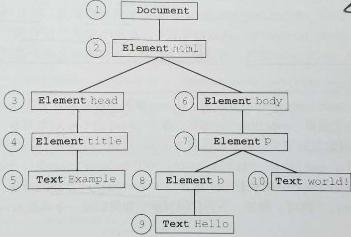

# 遍历与范围

## 遍历（Iterator）

"DOM2 级遍历和范围"模块定义了两个方法用于辅助完成顺序遍历 DOM 结构的类型： `NodeIterator` 和 `TreeWalker` 。这两个类型能够基于给定的起点对 DOM 结构执行**深度优先**（depth-first）的遍历操作。

### 基本概念

任何节点都可以作为遍历的根节点。引用《JavaScript高级程序设计(第3版)》的插图，表示以 document 对象为根节点：



### NodeIterator

使用 `document.createNodeIterator(rootNode, whatToShow, filter, isEntrityReferenceExpansion?)` 方法可以创建 `NodeIterator` 的实例。 4 个参数的意思：

- `rootNode` ：表示作为遍历起点的根节点。

- `whatToShow` ：表示要访问的节点的 "SHOW" 常量。 "SHOW" 常量是**位掩码**，位于 `NodeFilter` 对象内，除了 "SHOW_ALL" 外可以使用按位或操作符来组合多个选项。数字代码如下(省略 HTML 以外的值)：
  - `NodeFilter.SHOW_ALL`: 所有节点。
  - `NodeFilter.SHOW_ELEMENT`: 元素节点。
  - `NodeFilter.SHOW_ATTRIBUTE`: 特性节点(由于 DOM 结构,实际上不能使用该值)。
  - `NodeFilter.SHOW_TEXT`: 文本节点。
  - `NodeFilter.SHOW_COMMENT`: 注释节点。
  - `NodeFilter.SHOW_DOCUMENT`: 文档节点。
  - `NodeFilter.SHOW_DOCUMENT_TYPE`: 文档类型节点。
  - ...

- `filter` ：传入一个能返回 "FILTER" 常量的过滤函数；或传入一个包含名为 `acceptNode` 的过滤函数的对象。
  - "FILTER" 常量也是 `NodeFilter` 内的属性，有 3 个：
    - `NodeFilter.FILTER_ACCEPT`: 表示通过，即添加该节点对象到迭代器中。
    - `NodeFilter.FILTER_SKIP`: 表示忽略，即忽略该节点继续遍历。
    - `NodeFilter.FILTER_REJECT`: 表示拒绝，与 "FILTER_SKIP" 效果相同。
  - 过滤函数的格式：

    ``` js
    // node 为每次遍历的节点对象
    function acceptNode(node) {
      // 过滤除了 div 以外的元素
      return node.nodeName.toLowerCase() === 'div'
        ? NodeFilter.FILTER_ACCEPT
        : NodeFilter.FILTER_SKIP
    }
    ```

- `isEntrityReferenceExpansion` ：布尔值，表示是否要扩展实体引用(在 HTML 中无效)。

函数 `createNodeIterator()` 执行后，返回一个 `NodeIterator` 的实例，该对象主要有两个方法：

- `nextNode()`: 获取迭代器的下一个节点对象，超出范围则返回 `null` 。
- `previousNode()`: 获取迭代器的前一个节点对象，超出范围同样返回 `null` 。

完整实例如下：

``` html
<body>
  <div class="div1">div1</div>
  <div class="div2">
    <p>pppppp</p>
    text
  </div>
</body>
```

``` js
// 过滤的类型选择
let whatToShow = NodeFilter.SHOW_ALL;
// 过滤器（传入函数）
let filter = function (node) {
  return node.nodeName.toLowerCase() === 'div' ? NodeFilter.FILTER_ACCEPT : NodeFilter.FILTER_SKIP
}
// 过滤器2（传入对象）
let filter2 = {
  acceptNode: filter
}
// 创建迭代器
let iterator = document.createNodeIterator(document.body, whatToShow, filter, false);
// 测试
console.log(iterator.nextNode());   // "<div class="div1">div1</div>"
console.log(iterator.previousNode());   // "<div class="div2">...</div>"
console.log(iterator.nextNode());   // "<div class="div1">div1</div>"
console.log(iterator.nextNode());   // null
```

### TreeWalker

使用 `document.createTreeWalker()` 方法可以创建 `TreeWalker` 对象，参数与 `createNodeIterator()` 方法一致。

`TreeWalker` 是 `NodeIterator` 的一个高级版本，使用方法也基本一致，有一点除外，过滤函数的返回值如果是 `NodeFilter.FILTER_REJECT` ，该节点的子节点都会被跳过。

除了包含 `nextNode()` 和 `previousNode()` 方法之外，还提供了如下属性/方法：

- `parentNode()` ：遍历到当前节点的父节点。
- `firstChild()` ：遍历到当前节点的第一个子节点。
- `lasterChild()` ：遍历到当前节点的最后一个子节点。
- `nextSibling()` ：遍历到当前节点的下一个同辈节点。
- `previousSibling()` ：遍历到当前节点的上一个同辈节点。
- `currentNode` ：表示 "walker" 当前位置，可读写属性。

``` html
<body>
  <div id="div1">
    div1
    <div id="div1_1">&nbsp;&nbsp;div1.1</div>
    <div id="div1_2">&nbsp;&nbsp;div1.2</div>
  </div>
  <div id="div2">
    div2
    <p>&nbsp;&nbsp;div2-p</p>
  </div>
</body>
```

``` js
let filter = function (node) {
  return node.nodeName.toLowerCase() === 'div' ? NodeFilter.FILTER_ACCEPT : NodeFilter.FILTER_SKIP
}
let walker = document.createTreeWalker(document.body, NodeFilter.SHOW_ALL, filter, false)
// 测试
console.log(walker.nextNode());         // "<div id="div1">...</div>"
console.log(walker.nextSibling());      // "<div id="div2">...</div>"
console.log(walker.previousSibling());  // "<div id="div1">...</div>"
console.log(walker.firstChild());       // "<div id="div1_1">...</div>"
console.log(walker.parentNode());       // "<div id="div1">...</div>"
console.log(walker.lastChild());        // "<div id="div1_2">...</div>"
console.log(walker.nextNode());         // "<div id="div2">...</div>"
```

需要注意的是， "walker" 只能在 `TreeWalker` 对象内"游走"，上面几个方法也是针对已过滤的结果的相对位置"游走"，即使 "div" 内有 "Text" 类型的节点。

除非创建 `TreeWalker` 对象的第一第二个参数分别传入 `document` 和 `null` ，就可以在 DOM 树内随意"游走"。

</br>

## 范围（Range）

"DOM2 级遍历和范围"模块定义"范围"（range）接口。通过范围可以选择文档中的一个区域，而不必考虑节点的界限。使用 `document.createRange()` 方法可以创建 `range` 对象。

### 属性

Range 对象的属性提供了当前范围在文档中的位置信息。

- `startContainer` ：包含范围起点的节点（即选区中起点节点的父节点）。

- `startOffset` ：起点节点在 `startContainer` 中的偏移量。
  - 当 `startContainer` 是文本、注释、CDATA节点，表示起点跳过的字符数量，即 `<p>hello</p>` 中被选择了 `"llo"` ，本属性值为 3 ；
  - 否则，表示起点节点在父节点的 `childNodes` 是第几个，即通过 `range.startContainer.childNodes[range.startOffset - 1]` 可访问起点节点。

- `endContainer` ：包含范围终点的节点（即选区中结尾节点的父节点）。

- `endOffset` ：终点节点在 `endContainer` 中的偏移量。（与 `startOffset` 的规则相同）

- `commonAncestorContainer` `：startContainer` 和 `endContainer` 共同的最近的祖先节点。

### 从 DOM 中选择范围（方法）

以下方法均用于**修改** Range 对象的**范围**，无返回值。

- `selectNode(node)` ：选择整个节点，包括其子节点。

- `selectNodeContents(node)` ：只选择节点的子节点，不包括自身。

- `setStartBefore(refNode)` ：将范围的起点设置在 `refNode` 之前，即 `refNode` 是范围选区中的起始节点。

- `setStartAfter(refNode)` ：将范围的起点设置在 `refNode` 之后，即 `refNode` 的下一个同辈节点是范围选区中的起始节点。

- `setEndBefore(refNode)` ：将范围的终点设置在 `refNode` 之前，即 `refNode` 是的前一个同辈节点范围选区中的终点节点。

- `setStartAfter(refNode)` ：将范围的起点设置在 `refNode` 之后，即 `refNode` 是范围选区中的终点节点。

- `setStart(startContainer , startOffset)` ：设置起点，当 `startContainer` 为文本、注释、CDATA节点时，可以选择其中的一部分作为起点节点
  - 例如 `<p>hello</p>` 选择了 `"llo</p>"` 时，会自动将其补全，即起点节点为 `<p>llo</p>` 。可以看成快速设置指定属性。

- `setEnd(endContainer , endOffset)` ：设置终点，与 `setStart` 方法类似。

### 操作 DOM 范围中的内容（方法）

使用以下方法，可以对 DOM **删除或插入**。

- `deleteContents()` ：从文档中删除该范围所包含的内容。由于范围选区在修改底层 DOM 结构时能够保证格式良好，所以即使内容被删除，DOM 结构依然是良好的。若范围包含部分的文本、注释、CDATA节点，则剩下的节点会被"包裹"成完成的节点，即 `<p>hello</p>` 被删除了 `"llo</p>"` ，则剩下的节点会变成 `<p>he</p>` ，还是完整的节点。

- `extractContents()` ：与 `deleteContents()` 类似，但返回被删除的范围，即剪切该范围，用于插入到文档的其他地方。

- `cloneContents()` ：复制 `Range` 对象的内容，返回 DOM 对象，可用于插入到文档的其他地方。

- `insertNode(node)` ：向范围选区的开始处插入一个节点，对 DOM 产生相同影响。

- `surroundContents(node)` ：向范围选区环绕插入节点，对 DOM 产生相同影响。
  - 举个例，有 `<div>hello <b>world</b></div>` 的 HTML 文档片段，范围选择 `"llo <b>world</b>"` ；
  - 使用 `document.createElement('p')` 创建一个用于环绕的 `node` 节点对象；
  - 然后使用本方法，原 HTML 文档片段将变为 `<div>he<p>llo <b>world</b></p></div>` 。
  - 需要注意的是，在使用本方法前，对 "node" 对象插入其他节点是不会有效果的；但为 "node" 对象添加特性是有效果的。本方法执行时，后台会执行如下步骤：
    - 提取出范围中的内容（ 类似执行 `extractContent()` ）；
    - 将给定节点插入到文档中原来范围所在的位置上（忽略节点内容）；
    - 将提取的文档片段的内容添加到给定节点中。

- `collapse(isStart)` ：将范围折叠， `isStart` 表示是否折叠到起点。不会对 DOM 产生影响，属于一个没啥用的方法。折叠后的范围，起点和终点处于同一个位置。与此有关系的一个 `Range` 对象的属性：
  - `collapsed` ：是否折叠完成。用于判断两个节点是否紧密相邻。
    - 举个例，有这样一个 HTML 文档片段 `<p id="p1">p1</p><p id="p2">p2</p>`；
    - 分别获取 "p1" 、 "p2" 节点对象；
    - 创建 `range` 对象设定起点终点 `range.setStartAfter(p1); range.setEndBefore(p2)` ；
    - 因为 "p1" 和 "p2" 是相邻节点，所以 `range.collapsed` 的值为 `true` 。

- `compareBoundaryPoints(type, range)` ：比较与 `range` 范围是否有公共边界（起点或终点），用于**判断两个范围的位置关系**。
  - 方法有 3 种可能的返回值，0 表示两者位置相同；-1 表示自身的点在前；1 则表示自身的点在后。 `range` 表示与自身比较的范围对象； `type` 表示比较方式的常量，常量值如下：
    - `Range.START_TO_START`: 0，比较两者的起点位置。
    - `Range.START_TO_END`: 1，比较自身的起点和目标的终点位置。
    - `Range.END_TO_END`: 2，比较两者的终点位置。
    - `Range.END_TO_START`: 3，比较自身的终点和目标的起点位置。

- `cloneRange()` ：复制范围副本，返回的对象仍然是 `Range` 对象。要与 `cloneContents()` 方法区分。

- `detach()` ：将 `Range` 对象从创建范围的文档中分离出该范围。（实测测试，该方法并没有什么用，之后调用 `deleteContents()` 方法仍然会删除 DOM 。）
