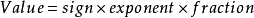

# Number

对于数字，我们再熟悉不过了。通过 `let num = 123;` 可以创建一个数字。

通过 `Number(thing)` 可以将任何类型的数据**转化成数字**。

通过 `new Number(thing)` 可以将任何类型的数据**转化成 `Number` 类型的对象**。

数字直接量能直接使用 `Number` 对象上的属性和方法，如 `100['toFixed'](1)` 。其实语言内部会临时将 `100` 封装成对象，再执行相应的方法。可以看成是 `Number(100).toFixed(1)` 。

数字直接量也能通过**点运算(`.`)**使用 `Number` 对象上的属性和方法，但是数字后要**加上空格**，如 `100 .toFixed(1)` ，因为编译器不了解 `.` 表示小数点还是运算符，必须加上空格表示 `.` 前面是一个完整的数字。

除了常见的数字外， `NaN` 和 `Infinity` 也属于 `Number` 类型。除了十进制，JavaScript 还支持二进制(如,`0b111`)、八进制(如,`0o777`,`0`开头也能表示八进制,但不推荐)、十六进制(如,`0xfff`)的数字表示方式，还有科学计数法(如,`2.345e+3`)表示方式。

</br>

## 静态属性

这些静态属性很少会用到，一般用于检测是否超过精度。（[文章最后](#精度问题)提及**精度问题**）

- `EPSILON`: 两个可表示(representable)数之间的最小间隔。`2⁻⁵²`。
- `MAX_SAFE_INTEGER`: 最大的安全整数。`2⁵³-1`。
- `MIN_SAFE_INTEGER`: 最小的安全整数。`-2⁻⁵³+1`。
- `MAX_VALUE`: 能表示的最大正数。`2¹⁰²³[2⁵³-1/2⁵²]`。
- `MIN_VALUE`: 能表示的最小正数即最接近 `0` 的正数。`2⁻¹⁰²²(1/2⁵²)=2⁻¹⁰⁷⁴`。
- `NaN`: 特殊的"非数字"值。
- `POSITIVE_INFINITY`: 特殊的正无穷大值，在溢出时返回改值。溢出的正数均为该值。
- `NEGATIVE_INFINITY`: 特殊的负无穷大值，在溢出时返回该值。溢出的负数均为该值。

需要单独说一下，**安全整数指**的是能做正确运算的整数。

在整数相加时，需要将指数位换算成相同的值，如 `2⁵² + 1 = 2⁵² + 2⁵²*2⁻⁵²` ，然后对分数位加减运算。

当超出安全范围时，如 `2⁵³+1` ，发现 `1` 无法转化成 `2⁵³*2⁻⁵³` ，因为分数位的位数只有 `52` 位。

（其实计算 `Number.MAX_SAFE_INTEGER + 1` 和 `Number.MIN_SAFE_INTEGER - 1` 是可以得到正确的结果）

</br>

## 静态方法

第一个和最后两个方法比较常用。其中 `Number.isNaN(value)` 是比较实用的，因为我们无法通过 `value === NaN` 判断 `value` 是否为 `NaN` 。

- `isNaN(value)`: 判断 `value` 是否为 `NaN` 。

- `isFinite(value)`: 判断 `value` 是否为有限数，非数字类型返回 `false` 。

- `isInteger(value)`: 判断 `value` 是否为整数，非数字类型返回 `false` 。

- `isSafeInteger(value)`: 判断 `value` 是否为安全整数（ `-(2⁵³-1)` 至 `2⁵³-1` 之间 ）。

- `parseFloat(string)`: 把一个字符串解析成**浮点数**。
  - 传入数值会返回原值；非字符串和数字会返回 `NaN` ；
  - 其他情况请[查看文档](https://developer.mozilla.org/zh-CN/docs/Web/JavaScript/Reference/Global_Objects/parseFloat)。

- `parseInt(string[, radix])`: 指定**特定进制**数把一个字符串解析成**整数**。
  - `radix` 默认为 `10` ，即十进制。
  - 传入非字符串和数字会返回 `NaN` ；
  - 其他情况[请查看文档](https://developer.mozilla.org/zh-CN/docs/Web/JavaScript/Reference/Global_Objects/parseInt)。

</br>

## 实例方法

- `toExponential(fractionDigits?)`: 返回一个用幂的形式(**科学记数法**)来表示 `Number` 对象的**字符串**。
  - `fractionDigits` 默认为小数点后的将尽可能用最多的位数来表示该数值。
  - 例子: `100 .toExponential();  // "1e+2"、2.345 .toExponential(2);  // "2.35e+0"` 。

- `toFixed(digits?)`: 返回所给数值的定点数表示法的**字符串**形式，即**保留 digits 位小数**。
  - `digits` 默认为 `0` 。一般用于减少小数点的经度，例如 `2.345 .toFixed(2);  // "2.35"` 。

- `toLocale​String([locales [, options]])`: 返回这个数字在特定语言环境下的表示**字符串**。

- `toPrecision(precision?)`: 返回**以定点表示法或指数表示法**表示的一个数值对象的**字符串**。
  - `precision` 表示有效数个数的整数，省略则返回原数值。例子: `100 .toPrecision(2); // "1.0e+2"、2.345 .toPrecision(3); // "2.35"` 。

- `toString(radix?)`: 返回指定 `Number` 对象的**字符串**表示形式。
  - `radix` 表示转换的基数(从`2`到`36`)，默认为 `10` 。

- `valueOf()`: 返回一个被 `Number` 对象包装的原始值。

</br>

## `Math` 对象

与其它全局对象不同的是， `Math` 不是一个构造器。

**`Math` 的所有属性和方法都是静态的**。你用到的常数 `pi` 可以用 `Math.PI` 表示，用x作参数 `Math.sin(x)` 调用 `sin` 函数。

JavaScript 中的常数，是以全精度的实数定义的。

### 属性

一般用于得到数学常量。

- `E`: **欧拉常数**，也是自然对数的底数，约等于 `2.718` 。
- `LN2`: **2 的自然对数**，约等于 `0.693` 。
- `LN10`: **10 的自然对数**，约等于 `2.303` 。
- `LOG2E`: **以 2 为底 E 的对数**，约等于 `1.443` 。
- `LOG10E`: **以 10 为底 E 的对数**，约等于 `0.434` 。
- `PI`: **圆周率**，约等于 3.14159 。
- `SQRT1_2`: **1/2 的平方根**，约等于 `0.707` 。
- `SQRT2`: **2 的平方根**，约等于 `1.414` 。

### 方法

普通运算：

- `abs(x)`: 返回 `x` 的**绝对值**。
- `sign(x)`: 返回 `x` 的**符号**函数，5 种可能返回的值:
  - `±0` ，返回原值；
  - 其他正数返回 `1` ；
  - 其他负数返回 `-1` ；
  - 其他参数返回 `NaN` 。
- `ceil(x)`:  返回 `x` **向上取整**后的值。
- `floor(x)`: 返回 `x` **向下取整后**的值。
- `round(x)`: 返回**四舍五入后**的整数。
- `trunc(x)`: 返回 `x` 的**整数部分**，去除小数。
- `random()`: 返回 `0` 到 `1` 之间的**伪随机数**。

开方：

- `sqrt(x)`:  返回 `x` 的**平方根**。
- `hypot(...[x1,x2,...]?)`: 返回它的**所有参数的"平方之和"的平方根**，如 `Math.hypot(3,4); // 输出5`。
- `cbrt(x)`:  返回 `x` 的**立方根**。

幂运算：

- `exp(x)`: 返回 **`Eˣ`** ，E 为欧拉常数。
- `expm1(x)`: 返回 **`exp(x) - 1`** 的值。
- `pow(x,y)`: 返回 **`x` 的 `y` 次幂**。这里还有另一种写法，使用 `**` 运算符，即 `x**y` 。

对数运算：

- `log(x)`: 返回 `x` 的自然对数。**`logₑX`**， 即 `lnX` 。
- `log1p(x)`: 返回 `x+1` 的自然对数，等效于 `Math.log(x+1)` 。
- `log10(x)`: 返回以 `10` 为底数的 x 的对数。**`log₁₀X`**，即 `lgX` 。
- `log2(x)`: 返回以 `2` 为底数的 x 的对数。**`log₂X`**。

三角函数：

- `sin(x)`: 返回 `x` 的**正弦**值。
- `cos(x)`:  返回 `x` 的**余弦**值。
- `tan(x)`:  返回 `x` 的**正切**值。
- `asin(x)`: 返回 `x` 的**反正弦**值。
- `acos(x)`: 返回 `x` 的**反余弦**值。
- `atan(x)`: 以介于 `-PI/2` 与 `PI/2` 弧度之间的数值来返回 `x` 的反正切值。
- `sinh(x)`: 返回 `x` 的**双曲正弦**值。
- `cosh(x)`: 返回 `x` 的**双曲余弦**值。
- `tanh(x)`: 返回 `x` 的**双曲正切**值。
- `asinh(x)`:  返回 `x` 的**反双曲正弦**值。
- `acosh(x)`: 返回 `x` 的**反双曲余弦**值。
- `atanh(x)`:  返回 `x` 的**反双曲正切**值。
- `atan2(y, x)`: 返回 `y/x` 的**反正切**值。

求最值：

- `max(...[x1,x2,…]?)`: 返回所有参数中的**最大值**。
- `min(...[x1,x2,…]?)`: 返回所有参数中的**最小值**。

精度：

- `clz32(x)`: 返回 `x` 转化成 32 位无符号整形的数的二进制的前导零的数量。
- `fround(x)`:  返回数字 `x` 的最接近的单精度浮点型表示。
- `imul(x1, x2)`: 两个参数分别转换为 32 位整数，相乘后返回 32 位结果。（即计算结果绝对值小于 `2³¹-1` 能得到正确的结果）

</br>

## 精度问题

### `0.1+0.2!==0.3`

关于精度问题，从一个简单的加法开始。

``` js
console.log(0.1 + 0.2);   // 0.30000000000000004
```

这是由于 JavaScript 采用 [**IEEE 754**](https://baike.baidu.com/item/IEEE%20754) 标准，所以上述问题并非 JavaScript 特有，是使用该标准的的编程语言都存在的问题。下面简单讲解问题发生的原因。（相关专业知识请查阅书本或文档）

### 浮点数的组成

IEEE 754 规定了包括：单精度（32位）、双精度（64位）、延伸单精度（43比特以上，很少使用）与延伸双精度（79比特以上，通常以80位实现）。而 **JavaScript 使用的是双精度**。

一个浮点数(value)可以这样表示：



一个浮点数的存储方式如下图：


总共分为三部分：

1. **符号位**（sign），只占 1 位， `0` 表示 `+` ， `1` 表示 `-` 。
2. **指数位**（exponent），单精度占 8 位；双精度占 11 位。
    - 要注意的是，这部分表示的是 **`2` 的指数**。
    - 指数位的值为真实的指数值加上**指数偏移值**。
    - 例如对于单精度，指数位存储 `2` ，需要加上 `2⁷-1` ，即 `131` ，用二进制表示为 `1000 0011` 。下面介绍指数位的范围。
3. **分数位**（fraction），占余下的的位。下面介绍二进制分数位的转换。

### 规约形式的浮点数

如果浮点数中指数部分的编码值在 `0 < exponent ≤ 2ᵉ-2` 之间，且在科学表示法的表示方式下，**分数 (fraction) 部分最高有效位（即整数字）是 `1` （并不会存储）**，那么这个浮点数将被称为 **规约形式的浮点数** 。

简单说就是，**指数部分**用二进制为 `000...001` 到 `111...110` 之间；**分数部分**的实际值大于等于 `0.5` ，小于 `1` 。

关于换算，下面会说。

### 非规约形式的浮点数

如果浮点数的指数部分的编码值是 `0` ，即实际指数值为 `-126` ；分数部分非零，那么这个浮点数将被称为非规约形式的浮点数。

IEEE 754 标准规定: **非规约形式的浮点数的指数偏移值比规约形式的浮点数的指数偏移值小 `1`** ，即 **`2ᵉ⁻¹-2`** 。

主要是用于解决填补绝对值意义下最小规格数与零的距离。

### 指数偏移值

(下面用 `e` 表示指数位的位数)

对于**规约形式的浮点数**，指数偏移值为 **`2ᵉ⁻¹-1`** 。由于该值不能为 `0` ，所以实际的指数范围为 `-126` 到 `127` 。

对于**非规约形式的浮点数**，指数偏移值为 **`2ᵉ⁻¹-2`** ，即比规约形式的浮点数的偏移值要小 `1` 。由于该值**只能为 `0`** ，所以实际的指数值为 **`-126`** 。

总的来说就是，实际的**指数值范围**为 `-126` 到 `127` 。 `000...001` 是规约形式的浮点数的指数位的最小值； `000...000` 是非规约形式的浮点数的指数位的最小值，两者表示的实际指数值都是
-126 。

### 特殊值

这里有三个特殊值需要指出：

如果指数是 `0` 并且尾数的小数部分是 `0` ，这个数 `±0` （和符号位相关）

如果指数 = `2ᵉ⁻¹-1` 并且尾数的小数部分是 `0` ，这个数是 `±∞` （同样和符号位相关）

如果指数 = `2ᵉ⁻¹-1` 并且尾数的小数部分非 `0` ，这个数表示为不是一个数（`NaN`）。

### 分数位的转换

要明确的是，**分数位的十进制值必须是大于 `1` 小于 `2` 的数**。下面以 `1.625` 为例。

我们并不能直接看成 `1625` 转成二进制。需要使用如下方法：

1. 先把数值减 `1` 得到新的数值，第一位取 `1` 。
2. 新的数值 `*2` ，若整数部分得到 `1` ，则该位为 `1` ，否则为 `0` 。
3. 然后继续取小数部分同上操作，得到后面位的值，直到数刚好为 `0` 或达到规定位数的最大值（最大精度）。

举个实际例子，对于 `1.625` :

1. 初始值 `1.625` ，整数位为 `1` ，则第一位取 `1` ，用 `0.625` 继续操作；
2. `0.625 * 2 = 1.250` ，整数位为 `1` ，则第二位取 `1` ，用 `0.25` 继续操作；
3. `0.25* 2 = 0.5` ，整数位为 `0` ，则第三位取 `0` ，用 `0.5` 继续操作；
4. `0.5 * 2 = 1.0` ，整数位为 `1` ，则第四位取 `1` ，小数点后为 `0` ，转换结束；

后面用 `0` 补全位数即可。

所以，**在二进制，第一个有效数字必定是 `1` ，因此这个 `1` 并不会存储**。

（如何从二进制的值得到十进制？对于上面的例子是: `"1101"/2³=13/8=1.625` ）

### 格式化浮点数

对于那些大于 `1` 或小于 `0.5` 的浮点数来说，需要格式化后才能看出"三部分"分别的值是多少。（因为要保证二进制的分数位的实际第一位是 `1` ）简单说就是要**使得 `1≤fraction<2`** 。

以 `6.625` 为例，需要换算成 `1.65625 * 22` 。然后我们用上面的方法，把 `1.65625` 换算成二进制就是 `110101 00...` 。

但是，最高位的 `1` 并不会存储，所以得到的**分数位**的二进制值为 `10101 00...` （尾数用`0`补全）。

**指数位**为 `3` ，加上偏移值得到的二进制值为 `100...011` （中间都是`0`）。

上面演示了 `fraction≥2` 的情况，就是乘以 `2n`（`n>0`）；而 `fraction<1` 也一样乘以 `2n` ，不同的是 `n<0` 。

### 更直观的换算方法

同样以 `6.625` 为例：

1. 把小数点前后**分成两部分**看，分别是 `6` 和 `0.625` 。
2. 我们对*整数部分* `6` 的进制转换比较熟悉，结果是 `110` 。
3. 而**小数点后的部分** `0.625` 按照类似于上面的分数位的转换规则，但忽略第一步，得到的结果是 `101` 。
4. 两者组合起来就是 `110.101` 。
5. 转换成 `1.xxxx` 的形式，即 `1.10101` ，最高位省略，得**分数位**为 `10101` 。
6. 对比于原值110.101的小数点向前左移动了 2 位，则得到**指数位**的值为 `2` ，加上指数偏移值得到 `100...001` （省略的是`0`）。
7. 最后组合成 `0 100...001 101010...` （省略的是`0`）。

而对于 `0.2` 这种小于 `1` 的数，也是类似的做法，区别在于第 6 步，"向左移动"变为"向右移动"，得到的指数位的值为负数，即 `-3` ，加上指数偏移值得到的是 `011...100` （省略的是`1`）。

### 回到问题本身

所以对于 0.1 和 0.2 来说，根据上面的方法得到的二进制的值都是 `11001100...` ，都是以 `1100` 不断重复。

计算机存储的位数是有限的，必须把超出的位数舍去。

所以对于这种，在有限精度内不能完全表示的，就会造成精度缺失。

就是 `11001100...` 从二进制转换回十进制后总会比原来的值小那么一点。


