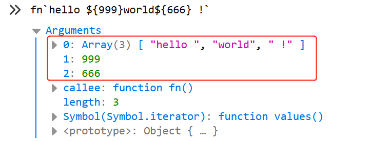

# String

我们对字符串类型的数据并不会陌生。 `let str = 'value'` 就是一个最简单的生成字符串例子。

我们还可以通过 `String(thing)` 和 `new String(thing)` 将任何类型的数据转化成字符串。注意， `new String(thing)` 会生成一个 `String` 类型的对象将字符串包裹。

例如，把一个空对象传入， `String({})` 返回的值为 `"[object Object]"` ，这里不得不提的就是，其他类型默认的 `toString()` 方法本质就是调用 `String({})` 。

字符串量能直接使用 `String` 的属性和方法，如 `'string'.toLowerCase()` 。

其实语言内部会将 `'string'` 封装成对象，再执行相应的方法，最后字符串对象使用 `valueOf()` 或 `toString()` 方法得到字符串的值。

</br>

## 属性

常用属性只有一个: `length` ，返回**字符串的长度**。

### 方法

以下介绍的，除了 `String​.raw()` 为静态方法，其他都是字符串对象的方法。

**所有的字符串方法都不会对原字符串修改**，都是返回一个新的字符串或结果。

#### 拼接/补全

- `concat(string2, string3[, ..., stringN])`: 将一个或多个字符串与原字符串**依次拼接**，形成一个新的字符串并返回。

- `pad​Start(targetLength [, padString])`: 返回用给定的字符串**填充到**原字符串的**末尾**，以达到指定长度。
  - `padString` 表示用于填充的字符串，默认为 `" "` 。

- `padEnd(targetLength [, padString])`: 返回用给定的字符串**填充到**原字符串的**开头**，以达到指定长度。
  - `padString` 表示用于填充的字符串，默认为 `" "` 。

- `repeat(count)`: 返回一个用**原字符串重复**拼接而成的新字符串。
  - `count` 表示重复的次数。

#### 查询

- `starts​With(searchString [, position])`: 布尔值，判断原字符串是否是**以**另外一个给定的子字符串"**开头**"。
  - `position` 表示开始查找的索引，默认为 `0` 。

- `ends​With(searchString [, position])`: 布尔值，判断原字符串是否是**以**另外一个给定的子字符串"**结尾**"。
  - `position` 表示开始查找的索引，默认为 `0` 。

- `includes(searchString[, position])`: 布尔值，判断原字符串是否包**含给**定的字符串。
  - `position` 表示开始查找的索引，默认为 `0` 。

- `indexOf(searchValue[, fromIndex])`: 返回给定的字符串在原字符串的**第一次出现的索引值**，未找到返回 `-1` 。
  - `fromIndex` 表示开始查找的索引。

- `last​IndexOf(searchValue[, fromIndex])`: 与 `indexOf()` 类似，不同的是，返回给定的字符串在原字符串的**最后一次**出现的索引值。

- `search(regexp)`: 返回匹配给定正则表达式的**索引值**，未找到返回 `-1` 。

- `match(regexp)`: 检索返回原字符串**匹配**正则表达式的**结果**。

- `matchAll(regexp)`: 返回一个包含所有匹配正则表达式及分组捕获结果的**迭代器**。

#### 截取

- `slice(beginSlice[, endSlice])`: 返回从原字符串**截取**指定索引的片段。
  - `beginSlice` 表示作为开始字符的索引，
  - `endSlice` 表示结束位置的索引，负数表示从后数起。

- `substring(indexStart[, indexEnd])`: 与 `slice()` 基本一致，但 `indexEnd` 不能为负数。

- `split([separator[, limit]])`: 使用指定的分隔符字符串将原字符串**分割成字符串数组**。
  - `separator` 表示作为分隔符的字符串或正则表达式；
  - `limit` 表示字符串数组的最大长度。

- `trim()`: 返回一个将原字符的**两端删除空白字符**。

- `trim​Right()`: 返回一个将原字符的右端删除空白字符。

- `trim​Left()`: 返回一个将原字符的左端删除空白字符。

- `chartAt(index)`: 从原字符串中返回**指定索引的字符**。

- `replace(regexp|substr, newSubStr|function)`: 返回原字符串以特定规则被**替换**后的字符串。当前字符串不变。

#### 转换大小写

- `toLower​Case()`: 返回一个将原字符串转化成**小写**的字符串。
- `toUpper​Case()`: 返回一个将原字符串转化成**大写**的字符串。

#### 字符码点

- `normalize([form])`: 按照指定的一种 Unicode 正规形式将当前字符串正规化。
  - `form` 默认为 "NFC" 。
  - 例子: `'\u01D1'.normalize() === '\u004F\u030C'.normalize();  // true` 。

- `charCodeAt(index)`: 返回指定索引的 UTF-16 代码单元值的数字；如果索引超出范围，则返回 `NaN` 。
  - 对于都是"基本平面"的字符串，索引值与其所在位置相同；
  - 但对于含有"辅助平面"的字符串来说就要注意，如 `𝌆` 为 4 字节字符，
    - 需要两个 UTF-16 代码单元表示， `'𝌆a'.charCodeAt(2)` 的值为 `97` ，而非 `NaN` ，
    - 而索引 1 和 2 的值分别为 `𝌆` 的高位和低位的码点数值。

- `codePointAt(index)`: 就我个人测试来看，与 `charCodeAt()` 方法返回的结果一致，除了索引超出范围返回的是 `undefined` 。

#### 内置迭代器（[Symbol.iterator]）

String 对象内置 `Iterator` 对象，通过属性 `[Symbol.iterator]` 获取，在遍历时调用，如 `for...of` 运算、展开运算符（`...`）等。

获取迭代器：

``` js
let strIterator = 'abcde'[Symbol.iterator]();
console.log(strIterator.next().value);  // 'a'
console.log(strIterator.next().value);  // 'b'
console.log(strIterator.next().value);  // 'c'
```

修改迭代器：

``` js
// 必须创建字符串对象
let str = new String('abcde');
// 原生迭代器效果
for (let i of str) {
  console.log(i);
}
// 打印结果： a  b  c  d  e
// 自定义迭代器函数
str[Symbol.iterator] = function* () {
  yield 1;
  yield 2;
  yield 3;
}
// 测试自定义迭代器
console.log(...str);  // 1 2 3
```

</br>

## 字符串模板（Template literals）

[字符串模板](https://developer.mozilla.org/en-US/docs/Web/JavaScript/Reference/Template_literals)用"**反引号**"表示，即 **`` ` ` ``** 。

### 基本用法

模板字符串内，字符串量可以直接写， **`${ }` 内执行 JavaScrip 代码**。用于生成一个带运算的字符串结果。

``` js
let num1 = 123,
  num2 = 456;
let temp = `hello ${num1 + num2} world !`;
console.log(temp);    // "hello 579 world !"
```

### 标签模板（Tagged templates）用法

我们一般调用函数的方式是 `fn(['hello ', 'world'], 999)` ，函数名后用括号包裹参数。

而标签模板可以这样写: `` fn`hello ${args}world` `` ，函数名后直接跟 `` ` ` ``。注意，这两种方式的参数是一致的。

分解:

带 `${ }` 的模板字符串，内部其实是被 `${` 和 `}` 分割成多份。以 `hello ${999}world${666} !` 为例：

``` js
`
hello
${999}
world
${666}
!
`
```

`${ }` 的外面是字符串直接量，而 `${ }` 之间是 JavaScript 代码。

如此看来，字符串模板被分成了 5 份，而字符串直接量会组成字符串数组，所以传入函数时是 3 个参数，分别是 `['hello ', 'world', ' !']`、`999`、`666` 。下面给出简单例子说明:

``` js
// 用于查看传参情况的函数
function fn() {
  console.log(arguments[0])
}
fn`hello ${999}world${666} !`;
// 下图看结果
```



### `String​.raw()`

谈到模板字符串，不得不谈 String 对象的一个静态方法: `String​.raw()` 。

一般都是以标签函数的方式调用它，即 `` String​.raw` ` `` ，当然，你可以使用普通函数的 `()` 方式传参，只不过要按照上面额规则手动转化一下。

它的用途是**获取一个模板字符串的原始字面量值**，简单说就是把所有的反斜杠（`\`）转义。

``` js
String.raw `Hi\u000A!`;      // "Hi\\u000A!"
String.raw `Hi\n${999}!`;    // "Hi\\n999!"
String.raw`\\`;              // "\\\\"
```

</br>

## 字符编码与字符集

### 基本概念

1. **字符**，是各种文字和符号的总称，包括各国家文字、标点符号、图形符号、数字等。
2. **字库表**，是一个相当于所有可读或者可显示字符的数据库，字库表决定了整个字符集能够展现表示的所有字符的范围。其实就是**字符的集合**。
3. **编码字符集**，简称字符集，用一个编码值 `code point` （又称码点）来表示一个字符（即该字符在子库表中的位置），这个值称为字符对应于编码字符集（如：Unicode、ASCII）的序号。
4. **字符编码**，是编码字符集和实际存储数值之间的转换关系。

用商场储物柜为例子:

- **字符**，等于单个柜箱，存放着我们想看的内容。
- 整个储物柜就是**字库表**。
- 为每个柜箱按顺序贴上标签后，整个储物柜就是**编码字符集**，每个数字（码点）对应一个柜箱（字符）。
- 我们手上有一份查询表格，但表格上只能写二进制或十六进制的数字。以什么样的方式把储物柜上的数字对应到表格上（映射），就是**字符编码**。

### ASCII

ASCII 既是字符集，也是字符编码。用一个字节的长度存储字符。自行百度，不多介绍。

### Unicode

Unicode 是一个**字符集**，为每个符号指定一个编号，即 **"码点"（code point）** 。其目标是将全世界所有的字符包含在一个集合里，计算机只要支持这一个字符集，就能显示所有的字符。

每个区可以存放 `65536` 个（`2¹⁶`）字符，称为一个**平面**（plane）。

目前，一共有 `17` 个（`2⁵`）平面，也就是说，整个 Unicode 字符集的大小现在是 `221` 。

最前面的 `65536` 个字符位，称为**基本平面**（缩写 BMP ），它的码点范围是从 `0` 一直到 `2¹⁶-1` ，写成 16 进制就是从 `U+0000` ~ `U+FFFF` 。

剩下的字符都放在**辅助平面**（缩写 SMP ），码点范围为 `U+010000` ~ `U+10FFFF` 。

### UTF-32

UTF-32 是字符编码方式，用**固定长度的 4 字节**表示一个字符，与 Unicode 字节内容一一对应码点。例如：

``` js
U+597D = 0x0000 597D
```

但缺点很明显，浪费空间。 HTML5 标准就明文规定，网页不得编码成 UTF-32 。

### UTF-8

UTF-8 是一种变长的编码方法，字符长度从 `1` 个字节到 `4` 个字节不等。

越是常用的字符，字节越短，最前面的 `128` 个字符，只使用 `1` 个字节表示，与 ASCII 码完全相同。

如，编码范围在 `0x0000` - `0x007F` 只占用 `1` 字节，而 `0x010000` - `0x10FFFF` 要占用 `4` 字节。是最常见的网页编码。

由于 UTF-8 是变长的，若不直到其长度，连续的字符则无法解析。如何判断其长度，这就涉及它的编码规则：

1. 对于单字节的符号，第一位为 `0` ，用二进制表示为 `0xxx xxxx` 。
2. 对于 `n` 字节的符号（`n>1`），第一个字节的前 `n` 位都设为 `1` ，第 `n+1` 位设为 `0` ，后面字节的前两位一律设为 `10` 。剩下的没有提及的二进制位，全部为这个符号的 unicode 码。

用[阮一峰的博文](http://www.ruanyifeng.com/blog/2007/10/ascii_unicode_and_utf-8.html)的图表展示：

| Unicode 符号范围 (十六进制) | UTF-8 编码方式 (二进制)                 | 字节 |
|-----------------------------|-----------------------------------------|------|
| 0000 0000-0000 007F         | 0xxxxxxx                                | 1    |
| 0000 0080-0000 07FF         | **11**0xxxxx 10xxxxxx                   | 2    |
| 0000 0800-0000 FFFF         | **111**0xxxx 10xxxxxx 10xxxxxx          | 3    |
| 0001 0000-0010 FFFF         | **1111**0xxx 10xxxxxx 10xxxxxx 10xxxxxx | 4    |

图表中 `x` 组合而成的就是实际的 Unicode 码点。

### UTF-16

UTF-16 编码介于 UTF-32 与 UTF-8 之间，同时结合了定长和变长两种编码方法的特点。

**编码规则**就是，**基本平面**的字符占用 **`2` 个字节**，**辅助平面**的字符占用 **`4` 个字节**。

因为在基本平面内，从 `U+D800` ~ `U+DFFF` 是一个空段，空间为 `2¹¹` ，即 `2` 个 `2¹⁰` 。

而一个辅助平面的字符需要的空间为 `2²⁰` ，刚好可以拆分成两个空段内的字符，高位（H）映射在 `U+D800` ~ `U+DBFF` ；低位（L）映射在 `U+DC00` ~ `U+DFFF` 。因此解决了 `4` 字节的字符的识别问题。

所以，对于基本平面， Unicode 与 UTF-16 码相同。

对于辅助平面，Unicode 与 UTF-16 的转化公式如下：

``` js
H = Math.floor((c-0x10000) / 0x400) + 0xD800
L = (c - 0x10000) % 0x400 + 0xDC00
```

不难理解，辅助平面的码点是从 `U+10000` 开始，则减去 `0x10000` ；上面提到高低位各占 `10` 位，则除以 `0x400` 得到的商和余数则分别位高低位的起点值，最后高位加上基础值 `0xD800` ，低位加上 `0xDC00` 得到目标值。（内容总结[自阮一峰的博文](http://www.ruanyifeng.com/blog/2014/12/unicode.html)）

### JavaScript 使用的编码方式

JavaScript 语言采用 Unicode 字符集，但是只支持一种编码方法，就是 **UCS-2** 。

由于历史原因（[自阮一峰的博文](http://www.ruanyifeng.com/blog/2014/12/unicode.html)有介绍），UCS-2 只支持 2 字节的字符，4 字节的字符被当成 2 个 2 字节的字符解析。现在已经没有 UCS-2 。

ES6 增强对 Unicode 的支持：

1. ES6 可以自动识别 `4` 字节的码点，如 `console.log('\ud834\udf06');  // 𝌆` 。

2. 允许直接用码点表示 Unicode 字符，如 `'𝌆' === '\u{1d306}';  // true` 。
    - `2` 字节的字符可以省略 `{}` 。

3. ES6 新增了几个专门处理 `4` 字节码点的函数（[看上方介绍](#字符码点)）。

4. ES6 的正则表达式提供了 `u` 修饰符，对正则表达式添加 `4` 字节码点的支持。
    - 例子: `/^.$/.test('𝌆');  // false，/^.$/u.test('𝌆'); // true` 。
