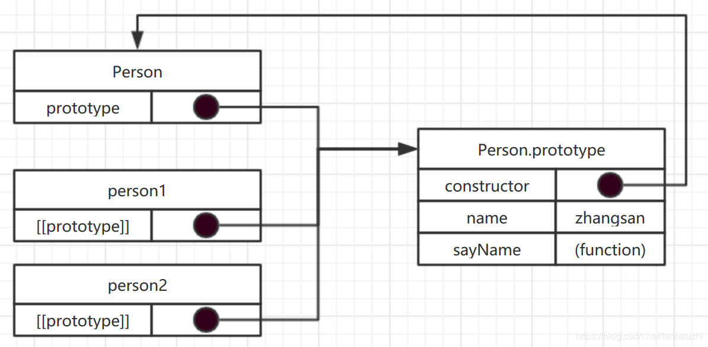
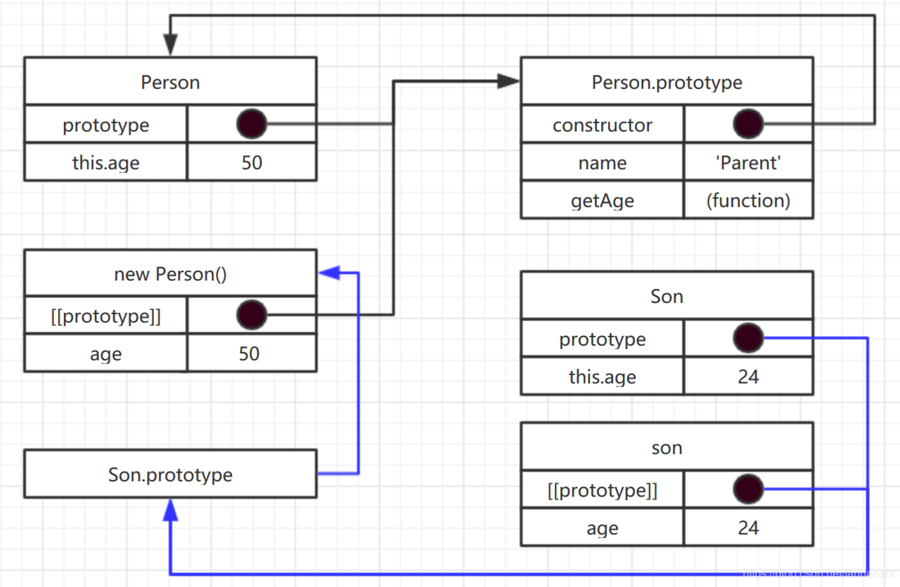

# 原 型 链

首先要明确的是， JavaScript 是**面向对象**的语言，但与 Java 、 C# 等语言有别，没有类的概念，而是**基于原型链** (即使是ES6的 `class` 也是基于原型链的一种语法糖)。

## 理解原型对象

只要创建一个新函数，系统默认为其创建一个 `prototype` 属性，指向函数的原型对象。默认情况下，所有原型对象都自动获得一个 `constructor` 属性，指向 `prototype` 属性所在函数得指针。举个简单例子：

``` js
function Person(){
  this.prop = 'myProp'
}
Person.prototype.name = 'zhangsan';
Person.prototype.sayName = function(){
  return this.name
}
var person1 = new Person();    // {prop:myProp}
var person2 = new Person();    // {prop:myProp}
console.log(person1.sayName);      // 'zhangsan'
person1.sayName = 'lisi';          // 修改原型对象上属性
console.log(person1.sayName);      // 'lisi'  证明变量是共享的
console.log(Person.prototype.constructor === Person);    // true
console.log(person1.__proto__ === Person.prototype);     // true
```

上述例子简单证明了原型链内的一些规则：

- 使用 `new` 运算符时，实际有几步操作：
  1. 创建一个空对象；
  2. 为对象添加 `prop` 属性；
  3. 为对象的 `[[prototype]]` 属性指向 `Person.prototype`

- `Person.prototype` 为实例对象 `person1` 和 `person2` 提供了属性和方法，且实例对象能对原型上的属性方法做修改；

- `Person.prototype` 的 `constructor` 属性指向原型函数；

- 实例对象的 `[[prototype]]` 属性(即 `__proto__` )指向 `Person.prototype` 。用一个图表示：

  

</br>

## 更简单的原型语法

上述例子中，如果要对 `Person.prototype` 添加多个属性方法，大可不必一个个列出，因为 `prototype` 属性指向的就是一个对象，可用如下语法写：

``` js
function Person(){}
Person.prototype = {
  name: 'zhangsan',
  age: 24,
  job: 'dazha',
  // ...
}
// 直接赋值方式会导致 prototype 中默认提供的 constructor 属性消失，可显示指定
Person.prototype.constructor = Person
```

但这种方式设定的 `constructor` 值的 `[[Enumrable]]` 为 `true` ，建议使用 `Object.defineProperty()` 。

</br>

## 判断/获取对象的原型对象

继续以上面例子，有两种方法可以判断对象的原型：

- Object 静态方法：**`getPrototypeOf()`**

  ``` js
  var Person_prototype = Object.getPrototypeOf(person1);
  console.log(Person.prototype === Person_prototype);        // true
  ```

- **`instanceof`** 运算符

  ``` js
  console.log(person1 instanceof Person);    // true
  ```

- 实例对象的方法： **`isPrototypeOf()`**

  ``` js
  // 创建原型链
  function Foo() {}
  function Bar() {}
  function Baz() {}
  Bar.prototype = Object.create(Foo.prototype);
  Baz.prototype = Object.create(Bar.prototype);
  var baz = new Baz();
  // 验证，父对象调用该方法，传入子对象，返回总是true
  console.log(Baz.prototype.isPrototypeOf(baz)); // true
  console.log(Bar.prototype.isPrototypeOf(baz)); // true
  console.log(Foo.prototype.isPrototypeOf(baz)); // true
  console.log(Object.prototype.isPrototypeOf(baz)); // true
  ```

</br>

## 原型链

关于原型链的定义不多说，大概就是子对象能从父对象读取到属性和方法。先看一个简单例子：

``` js
function Parent(){
  this.age = 50;
}
Parent.prototype.name = 'Parent';
Parent.prototype.getAge = function(){
  return this.age
}
function Son(){
  this.age = 24;
}
// 创建匿名对象用于继承
Son.prototype = new Parent()
let son = new Son();
console.log(parent.getAge());        // 24
```

上述例子中， `son` 从 `parent` 获取 `getAge` 方法，用于返回自身 `age` 属性的值，期间大概经历了如下几步：

- 从自身寻找 `getAge` 方法，未找到则从 `__proto__` 往上找， `__proto__` 指向匿名对象 `new Parent()` ；
- 从匿名对象中找 `getAge` 方法，未找到则从 `__proto__` 往上找， `__proto__` 指向 `Parent.prototype` ；
- 从 `Parent.prototype` 找 `getAge` 方法，找到并执行，函数作用域是 `son` 对象，所以返回 `24` 。

上述例子的关系图如下：



如果是"更长"的原型链，是同样的原理，直到最后指向 `null` 后停止。

</br>

## 原型链的简单创造

### `Object.create(, ?)`

此方法可简化上例子，传入参数有两个：[(具体用法查看MDN文档)](https://developer.mozilla.org/zh-CN/docs/Web/JavaScript/Reference/Global_Objects/Object/create)

- `proto`：新创建对象的原型对象。
- `propertiesObject`：可选。如果没有指定为 `undefined` ，则是要添加到新创建对象的可枚举属性（即其自身定义的属性，而不是其原型链上的枚举属性）对象的属性描述符以及相应的属性名称。

``` js
let parent = {
  age: 50,
  getAge() {
    return this.age
  }
}
let son = Object.create(parent, {
  // 属性构造
  age: {
    value: 24
  }
});
console.log(son.age);    // 24
```

## `Object.setPrototypeOf(obj, prototype)`

- `obj`：作为"子"的对象
- `prototype`：作为"父"的对象

``` js
let obj1 = { a: 1 }
let obj2 = { b: 2 }
Object.setPrototypeOf(obj1, obj2);    // {a:1}
console.log(obj1.b);                  // 2
```

</br>

## ES6 的 "class" 关键字

ES6的 `class` 关键字本质是ES5原型链的语法糖，更详细介绍请看 [阮一峰的 ES6](es6.ruanyifeng.com/#docs/class) 。

``` js
class Parent {
  // 父类构造函数
  constructor(firstname, lastname) {
    this.firstname = firstname;
    this.lastname = lastname
  }
  say() {
    return 'my name is '+this.lastname + this.firstname
  }
  // 静态方法
  static toString() {
    console.log('Parent static method')
  }
}
// 子类，使用"extents"关键字继承
class Son extends Parent{
  constructor(firstname, lastname, age){
    // 调用"super"方法前无法使用"this"
    super(firstname, lastname)
    this._age = age;
  }
  say(){
    // "super"可获取父类的方法
    let result = super.say()
    return result + '. my age is ' + this._age
  }
  // getter方法,setter同理
  get age(){
    return this._age
  }
  // 同名静态方法，当此方法未定义时，会调用父类的静态方法
  static toString() {
    console.log('Son static method')
  }
}
let parent = new Parent('san', 'zhang');    // "new"创建实例对象
console.log(parent.say());    // 'my name is zhangsan'
Parent.toString();            // 'Parent static method'
let son = new Son('ergou','zhang',16);      // 子类的实例
console.log(son.say());       // 'my name is zhangergou. my age is 16'
Son.toString();               // 'Son static method'
console.log(son.age);         // 16
```

<!-- TODO: -->

`class` 有如下特征：

- `class` **必须使用 `new`** 运算符创建实例，直接调用(如 `Parent()` )会报错；
- `constructor` **构造函数**，在创建实例对象时提供属性/方法；
- 构造函数外部(如 `sayName` )是实例对象的**原型方法**，即所有继承自 `Parent` 的实例对象都可以访问的方法；
- 可以创建 **`getter` 和 `setter`** ；
- 和函数一样，具有 **`name` 属性**，可以获取**类名**；
- 和函数一样，**可以使用表达式形式定义**，如 `const MyClass = class Me {...}` ；
- 内部**可以定义 Generator 方法**；
- **`static` 定义静态方法**，可以**被**子类**继承**，该方法不会被实例继承，而是直接通过类来调用；
- **`extends` 实现继承**，子类可以获得父类的所有属性和方法；
- **构造函数内必须调用 `super()` 方法，否则无法使用 `this` 关键字**；
- 除了构造函数内，其他**函数均可调用 `super` 属性，指向父类**；
- ......

</br>

## 原型链存在的问题

上例子可以看出，实例对象`person1` 和 `person2` 均能访问原型对象上的属性方法，但是实例对象却能对其修改，导致所有实例对象均产生影响。解决办法是，在实例对象上定义同名属性，则会优先调用实例对象上的属性。

</br>

## 关于 `typeof` 和 `instanceof`

`typeof` 和 `instanceof` 常用来判断一个变量是否为空，或者是什么类型的。

区别：

- `typeof` 返回值是一个字符串，一般只能返回这几个结果： `"number"`, `"boolean"`, `"string"`, `"function"`, `"object"`, `"undefined"` 。但对于 `Array`, `Null` 等特殊对象使用 `typeof` 一律返回 `"object"` 。

  ``` js
  let obj = {};
  console.log(typeof obj);    // 'object'  注意是小写开头
  ```

- `instanceof` 用于判断一个变量是否某个对象的实例，返回布尔值。

  ``` js
  let obj = {};
  console.log(obj instanceof Objcet);    // true
  ```

最常见的用途：

若 `a` 变量未声明， `if(a)` 会报错。正确做法是：

``` js
if (typeof a !== 'undefined') { ... }
```
