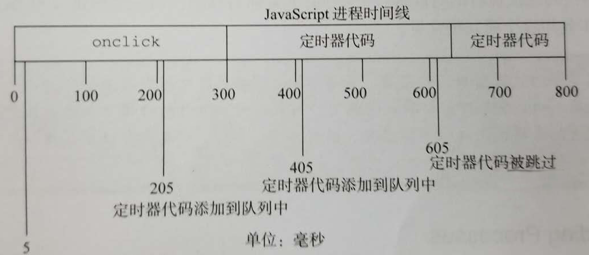

# 定时器高级用法

## `setTimeout()`

创建定时器，程序会被挂起，时间结束时把任务添加到 JavaScript 进程栈中，又因为 JavaScript 是单线程，必须等待前面的代码执行结束，所以定时器执行函数总会比设定时间要晚。

基本用法：

``` js
setTimeout(() => {
  // 处理代码 ...
}, timeout);
```

</br>

## `setInterval()`

与 `setTimeout` 类似，区别在于 `setInterval` 会定期向 JavaScript 进程栈添加任务，但会有几个问题发生。

1. 某些间隔会被跳过；

2. 多个定时器的代码执行之间的间隔可能比设定值要小。

3. 前一个定时器代码未执行，当前定时器代码则被跳过。

先介绍基本用法：

``` js
setInterval(() => {
  // 每隔一段时间执行 ...
}, interval);
```

引用《JavaScript高级编程》的一个图：



`onclick` 时间处理函数内添加一个 `setInterval` 重复定时器，且给定了 200ms 的间隔，而定时器代码需要 300ms+ 才能执行完，但 `onclick` 处理函数内还有其他代码需要执行，耗时 300ms。

那么第一个定时器代码执行与 300ms 处，第二个则执行与 600ms+ 处，而 605ms 处本该被添加的定时器则被跳过，因为第二个定时器代码被添加却未被执行。

</br>

## 使用递归 `setTimeout` 代替 `setInterval`

代码如下：

``` js
setTimeout(() => {
  // 处理代码 ....
  setTimeout(arguments.callee, interval);
}, interval);
```

但上述代码存在一定问题，因为严格模式下，无法使用 `arguments.callee` 获得函数本身。建议把处理函数具名化，如下：

``` js
setTimeout(function process() {
  // 处理代码 ...
  setTimeout(process, 1000);
}, 1000);
```

</br>

## 定时器妙用

Yielding Processes:

运行在浏览器中的 JavaScript 都被分配了一个确定数量的资源。如果代码运行超过特定时间或者特定语句数量就不会继续执行。过长、嵌套过深的函数调用或者是进行大量处理的循环都是造成脚本时间运行过长的主要原因。

如以下代码，假设 `process` 处理需要时间过长，数组长度也较长，该函数则会阻塞进程。

``` js
for (let i = 0, len = data.length; i < len; i++) {
  // 假设处理需要 200ms
  process(data[i])
}
```

要改善上述情况，先要符合两个以下条件，则可以使用 "**数组分块**" 技术：

- 该处理不需要同步完成；
- 数据可以不按顺序完成。

``` js
setTimeout(function timeoutProcess() {
  // 取出下一个条目并处理，data:<Array>
  let item = data.shift();
  process(item);
  // 判断是否还有条目，有则设置另一个定时器
  if (arr.length > 0) {
    setTimeout(timeoutProcess, 100);
  }
}, 100);
```

</br>

## 函数防抖（debounce）

某些高频操作是没必要的，如用户连续点击某个开关，导致请求多次发送。则可以使用 "函数防抖" ，等待用户操作停下后片刻再发送请求。

"函数防抖" 的原理是利用定时器延迟执行，当重复执行时，先把原本定时器清除，再添加延迟执行代码，那么总是最后一次操作后延时执行代码。

核心代码：

``` js
// 防抖函数，两个参数：被防抖的函数，函数执行的上下文(忽略则为全局)
function debounce(methods, context){
  clearTimeout(methods.timerId);
  // 对方法添加一个属性 timerId ，存放定时器
  methods.timerId = setTimeout(() => {
    methods.call(context);
  }, 100);
}
```

完整实例：（以 `click` 事件为例）

``` js
// <button id="btn">test</button>  // 按钮
// 代码：
function debounce(fn, delay) {
  // 通过闭包形式，与定时器对象关联
  let timer = null;
  return function () {
    // 将参数和上下文传递给实际执行的函数
    let context = this,
      args = arguments;
    if (timer) {
      clearTimeout(timer);
      timer = null
    }
    timer = setTimeout(() => {
      fn.call(this, args, '给防抖函数的额外参数')
    }, delay);
  }
}
// 实际处理函数，以打印为例
function printFn(args, myArgs) {
  console.log('do it!', ...args, myArgs)
}
// 以click事件为例，只有最后一次单击才生效
document.getElementById('btn').addEventListener('click', debounce(printFn, 1000))
```

</br>

## 函数节流（throttle）

当我们以一定频率处理某些频发事件，我们可以使用"函数节流"。

"函数节流" 的原理是利用定时器延迟执行，当重复执行时，忽略新添加的处理函数。

核心代码：

``` js
// 节流函数，两个参数：被节流的函数，函数执行的上下文(忽略则为全局)
function throttle(methods, context) {
  // 函数不含 timerId 时添加定时器对象，定时器对象存在期间不重复添加
  if (!methods.timerId) {
    methods.timerId = setTimeout(() => {
      methods.timerId = null;
      methods.call(context);
    }, 1000);
  }
}
```

完整实例：（以 `click` 事件为例）

``` js
// <button id="btn">test</button>  // 按钮
// 代码：
function throttle(fn, delay) {
  // 通过闭包形式，与定时器对象关联
  let timer = null;
  return function () {
    let context = this,
      args = arguments;
    // 当定时器存在时，则不操作，否则添加延时函数
    if (!timer) {
      timer = setTimeout(() => {
        timer = null
        fn.call(this, args, '给防抖函数的额外参数')
      }, delay);
    }
  }
}
// 实际处理函数，以打印为例
function printFn(args, myArgs) {
  console.log('do it!', ...args, myArgs)
}
// 以click事件为例，连续点击的情况下，每隔一秒生效一次
document.getElementById('btn').addEventListener('click', throttle(printFn, 1000))
```

</br>

## `window.requestAnimationFrame()`

`requestAnimationFrame` 是 HTML5 新增的定时器。用法与 `setTimeout` 类似，都是在一段时间后执行回调函数，区别在于不用传第二个时间参数。

执行回调函数的时延是根据显示器刷新率决定的，例如刷新率为 60Hz 的显示器，时延为 1000ms/60 ，约等于 16.6ms 。执行回调函数的时间是比较准确的（众所周知， `setTimeout` 和 `setInterval` 的执行回调函数时间并不准确）。

使用 `cancelAnimationFrame()` 方法可以取消 `requestAnimationFrame()` 定时器。

引用其他博主的一个例子：（进度条动画）

``` html
<div id="myDiv" style="background:lightblue;width:0;height:20px;line-height:20px;">0%</div>
<button id="btn">run</button>
```

``` js
let btn = document.getElementById('btn'),
  myDiv = document.getElementById('myDiv'),
  timer;
btn.onclick = function () {
  myDiv.style.width = '0'; cancelAnimationFrame(timer);
  timer = requestAnimationFrame(function fn() {
    if (parseInt(myDiv.style.width) < 500) {
      myDiv.style.width = parseInt(myDiv.style.width) + 5 + 'px';
      myDiv.innerHTML = parseInt(myDiv.style.width) / 5 + '%';
      timer = requestAnimationFrame(fn);
    } else {
      cancelAnimationFrame(timer);
    }
  });
}
```
