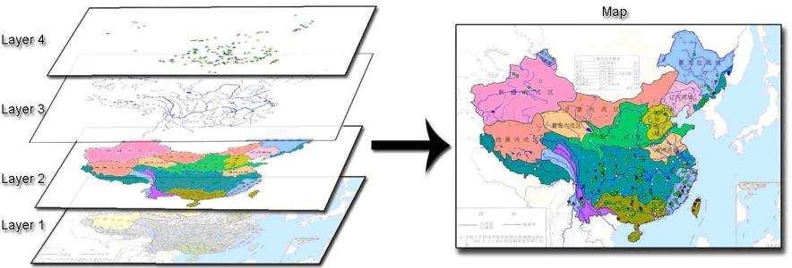
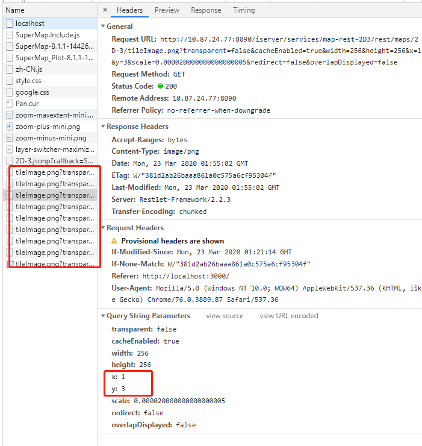
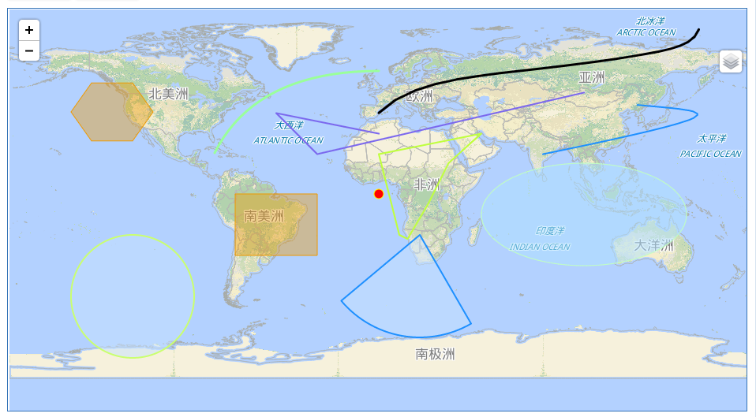
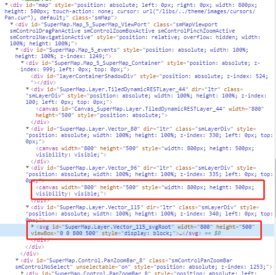
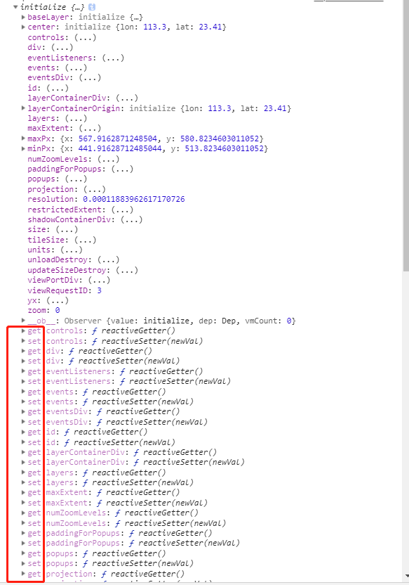
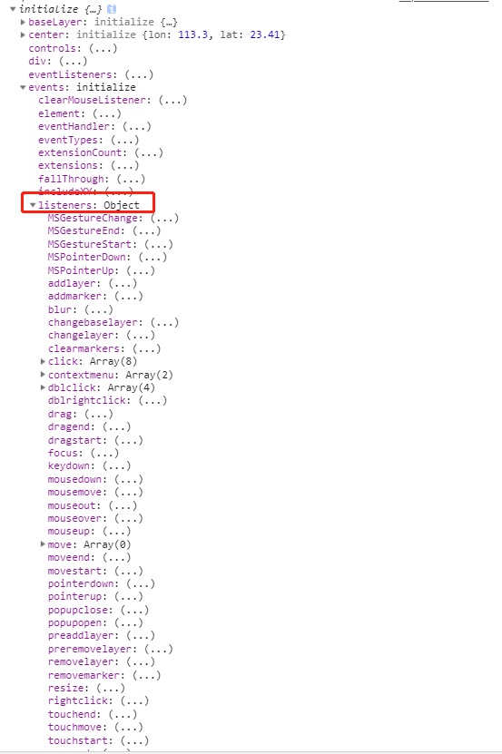
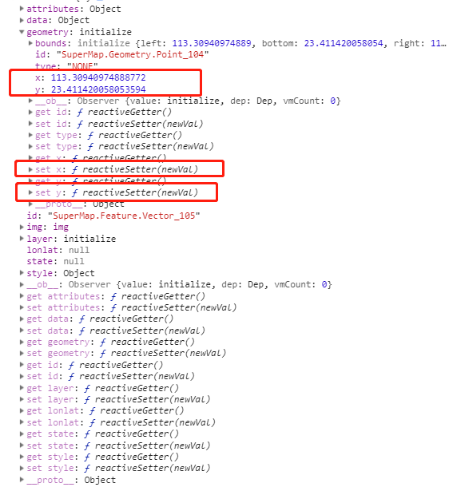

# 图层的概念



和 PS 一样，多个图层叠加组成一个画面。它们之间也会有**覆盖顺序**，也能设置**显隐性**。

(展示图层显隐性)...

一般会有至少一个的"底图"。该图层有可能用矢量数据生成，也可以用"瓦片图"组装而成。

</br>
</br>

# 瓦片图

瓦片图层，一般作为地图的底图。

是否使用"瓦片图"可以在浏览器的 Network 面板查看：



瓦片图的查询会带有位置信息，如图片中的 x 、 y 。

</br>
</br>

# 矢量要素

矢量要素大致可以分为 点、线、面 。如下图：



点可以表示单个物体、地点等。

线可以表示路线、路径等。

面可以表示地方性的区域。也可以用于圈选范围。

</br>
</br>

# 渲染

地图引擎的渲染可能会基于 SVG ， canvas 的 "2d" 或者 "webgl" 等。



SVG 的缺点：DOM 节点与要素数量成正比，当要素数量过多时，会导致页面卡顿。 （根据经验，"点"要素超过 1000 个可能就会变得很卡）

</br>
</br>

# 坐标系

常用的坐标系有：

- **EPSG:4326** (WGS84) ，目前最流行的地理坐标系统，也叫 GPS 坐标。这也是 superMap 默认使用的。

- EPSG:3857 ，Web 墨卡托投影坐标系。

- GCJ-02 ，相对于 WGS84 会有一点偏移。

- BD09 ，只有百度在用的坐标系。

什么情况需要转换坐标系？

- 用户通过**其他途径获取到的坐标点**，需要录入 GIS 系统时；

- 用户需要**导出**特定坐标系的数据；

- **图层之间**使用的坐标系不同；

- ...

</br>
</br>

# SuperMap API 简单介绍

## 实例化地图

``` js
// 实例对象
let map = new SuperMap.Map("map", {
  // 限定地图缩放范围
  restrictedExtent: new SuperMap.Bounds(-180, -90, 180, 90),
  // 默认缩放级别
  numZoomLevels: 20,
  // 地图单位
  units: "degrees",
  // 坐标系
  projection: "EPSG:4326",
  // 控件
  controls: [
    new SuperMap.Control.Navigation(),
    new SuperMap.Control.PanZoomBar(),
    new SuperMap.Control.ScaleLine(),
    new SuperMap.Control.LayerSwitcher(),
    new SuperMap.Control.Attribution(),
    new SuperMap.Control.MousePosition()
  ],
  // 事件监听
  eventListeners: {
    changelayer: layer => { /** */ }
  }
});
```

(看示例)...

关于**控件**：就是提供与地图的交互。

</br>

## 瓦片图层

``` js
new SuperMap.Layer.TiledDynamicRESTLayer(
  "T2航站楼一层PZ",
  "http://10.87.24.77:8090/iserver/services/map-rest-T2HangZhanLouYiCengPZ/rest/maps/T2航站楼一层PZ"
).events.on({
  layerInitialized: layer => {
    map.addLayer(layer);
  }
});
```

该图层需要指定一个 URL ，用于获取特定缩放级别、范围的多张图片，然后拼接在一起。


示例中使用了这两个瓦片图地址：

- "http://10.87.24.77:8090/iserver/services/map-rest-2D3/rest/maps/2D-3"
- "http://10.87.24.77:8090/iserver/services/map-rest-T2HangZhanLouYiCengPZ/rest/maps/T2航站楼一层PZ"

瓦片图层一般用作"底图"。

关于"**底图**"： SuperMap 中默认只能有一个瓦片图作为底图，但可以修改参数 `allOverlays: true` 可以把所有瓦片图都作为普通图层，即可以使用**多张**"底图"。


什么情况需要多张底图？

例如，一个底图提供航拍信息，另一个底图提供道路信息，两者组合起来就能显示更多的信息。而对于只关心航拍信息的用户来说，就可以把道路信息隐藏，以减少干扰。

</br>

## 矢量图层

``` js
// 创建矢量图层
let vectorLayer = new SuperMap.Layer.Vector("point_layer", {
  renderers: ["Canvas"]
});
// 创建几何对象
let point = new SuperMap.Geometry.Point(113.3, 23,4)
// 生成矢量对象
let pointVector = new SuperMap.Feature.Vector(point);
// 样式
pointVector.style = {
  externalGraphic: "/images/car.png",
  allowRotate: true,
  graphicWidth: 32,
  graphicHeight: 32
};
// 在矢量图层上添加矢量对象
vectorLayer.addFeatures(pointVector);
// 把矢量图层添加到地图对象上
map.addLayer(vectorLayer);
```

矢量就是上面说过的 点、线、面 。矢量图层就是存放这类要素的。

(看示例)...

示例中的"车"就是通过 **样式** 提供。

</br>

## 与"点"要素的交互

(看示例)...

单击"点"要素弹出信息窗口。

</br>

## 实时更新"点"数据

(看示例)...

</br>

## 关于"点"的重叠问题

(看示例)...

在超图中，通过 `SuperMap.Layer.ClusterLayer` 构造函数可以创建 **聚合**图层 。

所谓的聚合，就是多个"点"重叠时，用其他方式去表示它们，如整数、颜色等。

但超图的聚合图层有个**缺点**，就是只能用 SVG 的方式渲染。上面已经提到，使用 SVG 可能会导致 DOM 节点过多而卡顿。当然，数据量少就无所谓了。

</br>

## 关于 GeoJSON

GeoJSON 就是一种特殊的针对地理数据的 JSON 数据结构。大概长这样：

``` json
{
  "type": "Feature",
  "geometry": {
    "type": "Point",
    "coordinates": [125.6, 10.1]
  },
  "properties": {
    "name": "Dinagat Islands"
  }
}
```

超图也提供了 GeoJSON 解析器，用于快速生成"矢量对象"。代码如下：

``` js
// 创建 GeoJSON 解析器
let geoJSONParse = new SuperMap.Format.GeoJSON();
// 将 GeoJSON 对象转成"要素数组"
let features = geoJSONParse.read(geojson);
// 使用 GeoJSON 数据的依然是 矢量图层
let layer = new SuperMap.Layer.Vector("GeoJSON_layer");
// @@@ 若每个点的样式不一样，仍然需要单独修改 @@@
for (let feature of features) {
  feature.style = {
    externalGraphic: feature.attributes.externalGraphic,
    allowRotate: true,
    graphicWidth: 30,
    graphicHeight: 30
  };
}
layer.addFeatures(features);
map.addLayer(layer);
layer.setVisibility(false);
```

要注意，超图的 GeoJSON 解析器并没有针对"样式"部分的处理，仍然需要我们额外的代码去添加。

</br>

## 前后端交互的数据格式

如果使用 GeoJSON ，例如对于"点"：

``` json
{
  "type": "FeatureCollection",
  "features": [
    {
      "type": "Feature",
      "geometry": {
        "type": "Point",
        "coordinates": [125.6, 10.1]
      },
      "properties": {
        // 属性部分可以任意添加字段，用于描述"点"的信息
        "name": "zhangsan",
        "age": 66,
        "img": ""
      }
    },
    {
      "type": "Feature",
      "geometry": {
        "type": "Point",
        "coordinates": [123.4, 24.5]
      },
      "properties": { }
    },
    // ...
  ]
}
```

当然，如果觉得 GeoJSON 太麻烦，也可以不用，前端也能生成数据。只需要给出关键字段即可。例如：

``` json
{
  "id": 0,
  // 坐标点
  "coordinates": [123.4, 24.5],
  // 样式
  "style": {
    "img": ""
  },
  "property": {
    "age": 12,
    "name" "zhangsan"
  }
  // ...
}
```

</br>

## 轨迹回放功能

使用 `SuperMap.Layer.AnimatorVector` 构造函数可以创建 **动画图层** ，可以用于回放点的轨迹。

(看示例)...

</br>
</br>

# 补充一下

[**热点图**](./forJavaScript/examples/heatmapLayer.html)：一般用于统计数据时使用，如统计人口密集程度、地方降雨量等。

[**选顶区域查询数据**](./forJavaScript/examples/queryByBounds.html)：示例的效果是通过把前端画的"矩形"的坐标范围传给后台计算，返回数据后，再在前端渲染一个显示结果的图层。

[**距离测算**](./forJavaScript/examples/distanceMeasure.html)：用于测量两点(或路线)的长度。

</br>
</br>

# 近期使用 SuperMap API 的一些小技巧总结

由于 API 文档内容不够详尽，超图的实例对象中。可以把需要了解的对象打印出来，从中找"线索"。如下图：



例如 API 文档中并未描述 `events` 包含可注册的事件，从 SuperMap.Map.prototype.events.listeners 中寻找。如下图：



</br>

超图的实例对象中，属性基本上都使用了"访问器"，很多情况下可以直接修改属性的值。

例如我们需要更新一个点的位置信息，可以直接对实例对象中的 `x`、`y` 赋值。



``` js
temp1.geometry.x = 113.31
```


``` text
886
```
