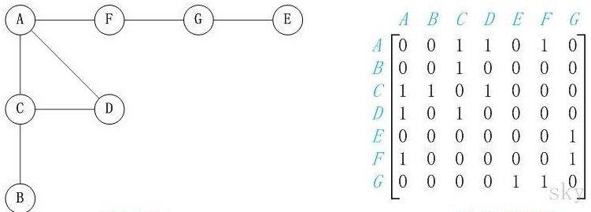
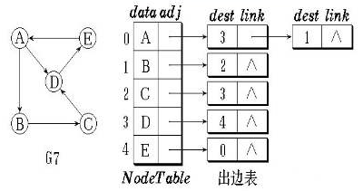
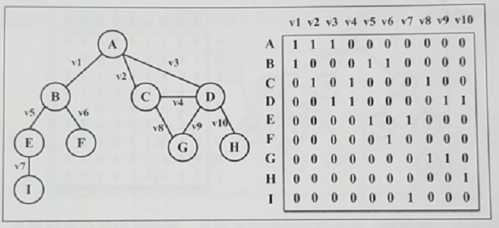

# 数组(Array)

数组存储一系列同一种数据类型的值。

略......

 

# 栈(Stack)

栈是一种遵循**后进先出**（LIFO）原则的有序集合。

栈可以解决的问题：

- 进制转换，如十进制转二进制。
- 平衡圆括号
- 汉诺塔
- ...

 

# 队列(Queue)

队列是遵循**先进先出**（FIFO）原则的有序集合。

**双端队列**（deque ，或称 double-ended queue）是一种允许同时从前端和后端添加或移除元素的特殊队列。

双端队列可以解决的问题：

- 回文检测器。两边同时移除一个元素并对比。

 

# 链表(LinkedList)

链表存储有序的元素集合。链表的每个元素由一个存储本身的节点和一个指向下一个元素的引用(指针)组成。

与数组相比，它的好处是删除或添加元素时，不需要移动其他元素。

**双向链表**(DoubleLinkedList)提供了两种迭代方法，分别是从头到尾，或从尾到头。每个节点都有两个引用(指针)，分别指向前一个元素和后一个元素。

**循环链表**(CirculrLinkedList)就是最后一个元素指向第一元素的链表。循环链表中也有双向循环链表。

 

## 集合(Set)

集合是由一组无序且唯一的项组成的。

**空集**是不包含任何元素的集合。**集合的运算**有并集、交集、差集、子集等。

 

# 字典(Dictionary)

字典以`[键, 值]`的形式来存储元素，因此也称做**映射**、**符号表**或**关联数组**。在 JavaScript 中就是 Map 。

 

# 散列表(HashTable)

散列表也叫 HashMap 类，是 Dictionary 类的一种散列表实现方式。

**散列算法**的作用是尽可能快的在数据结构中找到一个值。在 JavaScript 中就是对象。

 

# 递归

递归函数就是该函数内部调用了函数自身。

每个递归函数都必须有**基线条件**，即一个不再递归调用的条件（**停止点**），以防止无限递归。

每当一个函数被一个算法调用时，该函数会进入**调用栈**的顶部。当使用递归的时候，每个函数调用都会堆叠在调用栈的顶部。

调用栈也是有容量限制的，当超出时，就会抛出错误，也就是**栈溢出错误**（stack overflow error）。

**尾调用优化**（tail call optimization）

 

# 树

树的优势在于**快速查找**数据。

一个树结构包含一系列存在父子关系的节点。每个节点都有一个父节点（除了顶部的根节点）以及零个或多个子节点。

位于树顶部的节点叫作**根节点**。没有子元素的节点称为**外部节点**或**叶节点**。

节点的一个属性是**深度**，节点的深度取决于它的组件节点的数量。

## 二叉树

**二叉树**中的节点最多只能有两个节点，分别是左侧子节点和右侧子节点。这个定义有助于我们写处更高效地在数中插入、查找和删除节点的算法。

### 二叉搜索树

**二叉搜索树**(BST, BinarySearchTree) 是二叉树的一种，但只允许在**左侧**节点存储(比父节点)**小**的值，在**右侧**节点存储(比父节点)**大**的值。

二叉搜索树的具体代码请看 [BinarySearchTree.js](./BinarySearchTree.js) 。

### 自平衡树

二叉搜索树有个缺点，树的一边可能会非常深，这导致搜索效率会变低。

因此诞生了 **自平衡二叉搜索树**(AVL树, Adelson-Velskii-Landi tree) ，任何一个节点的左右两侧字数的高度之差最多为 1 。

AVL 树的插入或移除节点与 BST 完全相同，不同之处在于我们需要检验它的**平衡因子**。平衡因子标识树是否失衡，失衡时调整节点顺序。

具体代码请看 [AVLTree.js](./AVLTree.js) 。

 

# 图

图是一组由边连接的节点(或顶点)。

图可以用来表示道路、航班以及通信。

一个图 `G = (V, E)` 由以下元素组成：

- `V`: 一组**顶点**。
- `E`: 一组**边**，连接 `V` 中的顶点。

由一条边连接在一起的顶点称为**相邻顶点**。

如果边包含数值，则是**加权的**；否则是**未加权的**。

一个顶点的**度**是其相邻顶点的数量。

**路径**是顶点 `v_1, v_2, v_3 ... v_k` 的一组连续序列，其中 `v_i` 和 `v_i+1` 是相邻的。

**简单路径**要求不包含重复的顶点。

**环**也是一个简单路径，如 `A-B-C-D-A` 。

如果图中不存在环，则称该图为**无环的**。

如果图中每两个顶点间都存在路径，则该图是**连通的**。

如果图中每两个顶点间在双向上都存在路径，则该图是**强连通的**。

代码： [Graph](./Graph.js) 。

## 邻接矩阵

这是图最常见的实现，如下图。

缺点是矩阵中包含很多的 `0` ，会造成存储空间的浪费。

## 邻接表

邻接表由图中每个顶点的相邻顶点列表所组成。如下图。

## 关联矩阵

关联矩阵常用于边的数量比顶点的数量多的情况。

## 最短路径算法

一般用于地图中求出两地的最短路线。

**Dijkstra 算法**是一种计算机从单个源到所有其他源的最短路径的贪心算法。

**Floyd-Warshall 算法**是一个计算图中所有最短路径的动态规划算法。

## 最小生成树(MST)

最小生成树问题是网络设计中常见的问题。例如以最低成本实现办公室电话线路相互连通。

**Kruskal 算法**和 **Prim 算法**都是是求解加权无向连通图的 MST 问题的贪心算法。

 

# 排序算法

[Sort_algorithms](./Sort_algorithms.js)

 

# 搜索算法

[Search_algorithms](./Search_algorithms.js)

 

# 算法设计与技巧

- **分而治之**：
  - 思路
    1. **分解**原问题为多个子问题（原问题的多个小实例）。（子问题之间**相互独立**）
    2. **解决**子问题，用返回解决子问题的方式的**递归**算法。
    3. **组合**这些子问题的解决办法，得到原问题的解。

- **动态规划**：
  - 思路：
    1. **定义**子问题。（子问题之间**相互依赖**）
    2. 找到子问题的**解**。
    3. 找到**结束条件**。
  - 著名问题：
    - 背包问题：给出一组项，各自有值和容量，目标是找出总值最大的项的集合。
    - 最长公共子序列：找出一组序列的最长公共子序列。
    - 矩阵链相乘：给出一系列矩阵，目标是找到这些矩阵相乘的最高效办法（计算次数尽可能少）。
    - 硬币找零：给出特定面额的一定数量的硬币和要找零的钱数，找出有多少种找零方法。
    - 图的全源最短路径：对所有顶点对`(u,v)`，找出从顶点`u`到顶点`v`的最短路径。如 Floyd-Warshall 算法。

- **贪心算法**：遵循一种近似解决问题的计数，期盼通过每个阶段的**局部最优解**，从而达到**全局最优解**。
  - 如， Dijkstra 算法、 Prim 算法、 Kruskal 算法。
  - 著名问题：
    - 最少硬币找零问题。
    - 背包问题（装入总价值最高的解）。

- **回溯算法**：是一种渐进式寻找并构建问题解决办法的策略。
  - 思路：
    - 从一个可能的选项开始并试着用这个选项解决问题；
    - 若不能解决，就回溯并选择另一个选线直到将问题解决。或把所有选项用完，无解。
  - 著名问题：
    - 骑士巡逻问题。
    - N 皇后问题。
    - 迷宫老鼠问题。
    - 数独解题器。
